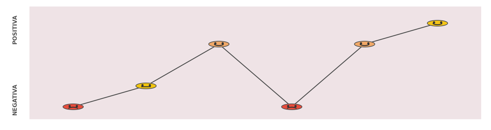
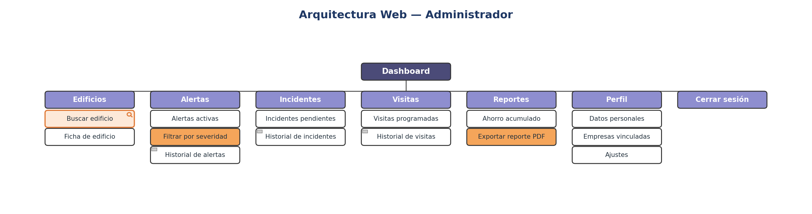
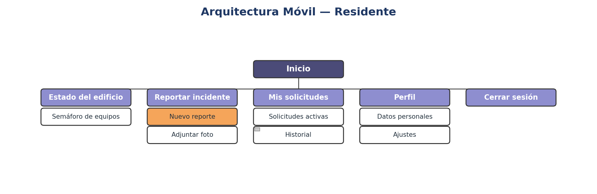
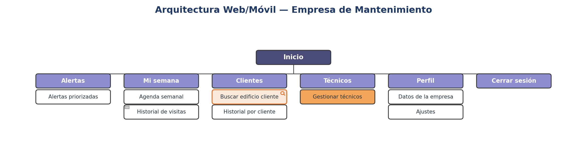
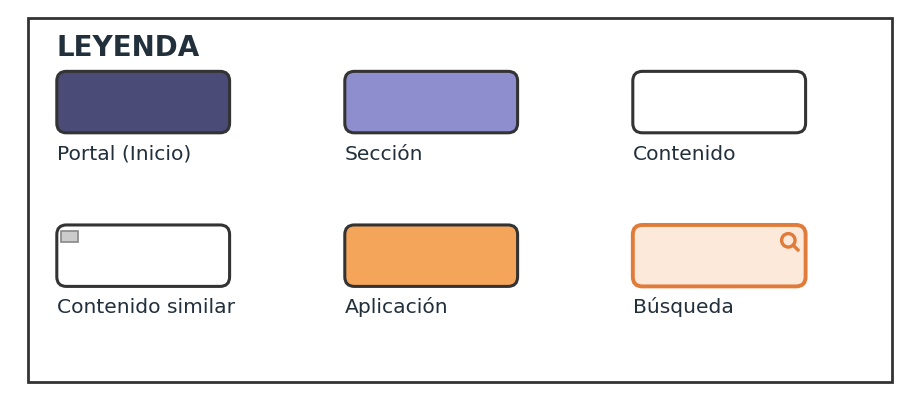

<p align="center">
  
</p>

# Informe de Trabajo Final

## Universidad Peruana de Ciencias Aplicadas

**Facultad:** Ingeniería  
**Carrera:** Ingeniería de Software  
**Ciclo académico:** 202620  

**Curso:** 1ASI0729 - Desarrollo de Aplicaciones Open Source  
**NRC:** 16692  
**Docente:** Velásquez Núñez, Ángel Augusto  

**Startup:** CodeNova  
**Producto:** [Pendiente]  

## Integrantes

| Código | Apellidos y nombres |
|---|---|
| u202411843 | Diaz Vargas, Fernanda Ysabella |
| [Pendiente: agregar código] | Domenack Angeles, Miguel |
| u20241b178 | Romero Veliz, Matthias Alonso |
| u202315171 | Salazar Miranda, Mateo Paolo |
| u202420147 | Valladolid Jiménez, Arturo Fernando |

**Período:** 202620  
**Fecha:** Septiembre de 2026  

---

## Registro de Versiones del Informe

| Versión | Fecha | Autor | Descripción de modificación |
|---|---|---|---|
| 0.1.0 | 2026-09-05 | Valladolid Jiménez, Arturo | Creación de la estructura inicial del repositorio |

---

## Project Report Collaboration Insights

**URL del repositorio:** https://github.com/code-nova-1asi0729/project-report

El informe se elabora colaborativamente en este repositorio mediante ramas, commits y pull requests. La distribución inicial asigna a cada integrante una parte definida del análisis, diseño o gestión del proyecto.

| Integrante | Aporte principal para el primer avance |
|---|---|
| Arturo Fernando Valladolid Jiménez | Organización del repositorio, documentación de gestión, perfil de la startup, problemática y configuración de la gestión de software |
| Fernanda Ysabella Diaz Vargas | Lean UX, User Stories, Impact Mapping y Product Backlog |
| Matthias Alonso Romero Veliz | Entrevistas, análisis de hallazgos y artefactos de Needfinding |
| Miguel Domenack Angeles | Sistema visual, arquitectura de información y diseño del Landing Page |
| Mateo Paolo Salazar Miranda | Segmentos objetivo, análisis competitivo, EventStorming, lenguaje ubicuo y Landing Page |
---

## Contenido

[Tabla de contenido (indice) pendiente]

---

## Capítulo I: Introducción

### 1.1. Startup Profile

#### 1.1.1. Descripción de la Startup

CodeNova es una startup de tecnología dedicada al mantenimiento preventivo de edificios de departamentos y condominios mediante sensores IoT. El equipo crítico de un edificio, como los aires acondicionados, las bombas de agua o los tableros eléctricos, suele revisarse solo cuando falla. Para entonces la reparación ya es una urgencia: cuesta más que una intervención planificada, interrumpe a los residentes y, en el peor de los casos, compromete la estructura. CodeNova nace para invertir ese orden y detectar el desgaste mientras todavía es corregible.

Nuestro producto es una plataforma web que concentra el monitoreo y la gestión del mantenimiento de un edificio. Sensores instalados en los equipos miden vibración, temperatura de componentes, humedad y consumo eléctrico; cuando una lectura se sale del rango esperado, la plataforma genera una alerta temprana con su severidad. Sobre esa base se organiza el trabajo del operador: recepción de solicitudes, planificación de visitas, agenda y control de materiales. Los administradores acceden a un dashboard con el estado del edificio y el ahorro acumulado frente al mantenimiento correctivo; los residentes reportan incidentes y siguen el avance de sus solicitudes; las empresas de mantenimiento reciben las alertas priorizadas y ordenan su semana de trabajo. El servicio se oferta bajo una cuota fija mensual por edificio, de modo que los costos de mantenimiento se mantienen en un rango predecible y se reduce el riesgo de fallas graves.

#### 1.1.2. Perfiles de integrantes del equipo

**Valladolid Jiménez, Arturo Fernando** — Team Leader. Coordina los sprints, organiza el repositorio y el flujo de trabajo en Git, y consolida los informes de cada entrega. Formación en Algoritmos y Estructura de Datos, Diseño y Patrones de Software, Especificación y Análisis de Requerimientos, Diseño de Base de Datos y Arquitectura de Computadoras. Maneja HTML, CSS y C++. Busca dominar Spring Boot y Angular para aportar también en la implementación.

**Romero Veliz, Matthias Alonso**

**Diaz Vargas, Fernanda Ysabella**

**Salazar Miranda, Mateo Paolo** — Estudiante responsable y comprometido, con interés en el desarrollo de soluciones tecnológicas innovadoras. Habilidades de trabajo en equipo, pensamiento analítico y resolución de problemas.

**Domenack Angeles, Miguel**

### 1.2. Solution Profile

#### 1.2.1. Antecedentes y problemática

El mercado de vivienda de Lima Metropolitana atraviesa su mejor momento en más de una década: las ventas crecieron 23.3% en 2024, el mejor resultado en once años y el cuarto mejor en los veintinueve años que CAPECO lleva realizando esa investigación (CAPECO, 2025). La oferta se concentra en viviendas multifamiliares, al punto de que el propio Estado justificó la actualización de su marco normativo en las "nuevas necesidades de las viviendas multifamiliares" (Decreto Legislativo 1568, 2023). Cada uno de esos inmuebles funciona porque una serie de equipos críticos opera todos los días: bombas hidroneumáticas que suben el agua a los pisos altos, ascensores, aires acondicionados y tableros eléctricos. Esa convivencia se rige por el Decreto Legislativo 1568, publicado en mayo de 2023 y vigente desde enero de 2025 tras la aprobación de su reglamento: los propietarios están obligados a aportar las cuotas necesarias para el mantenimiento y conservación de los bienes comunes, incluidas las instalaciones sanitarias y eléctricas de uso común, y el administrador que designa la junta de propietarios se encarga de cobrar y recaudar esas cuotas de los gastos comunes (Decreto Legislativo 1568, 2023).

En la práctica, ese dinero se gasta casi siempre después del daño. La diferencia entre prevenir y corregir ya está dimensionada en la normativa peruana de inversión pública: para estimar costos, el MEF asigna al mantenimiento preventivo entre 1% y 3% del valor del equipo por año, y al correctivo 8% (Ministerio de Economía y Finanzas, 2022). En el sector privado limeño la regla es similar; las empresas de mantenimiento de bombas describen la secuencia típica cuando no hay prevención: el tanque hidroneumático falla, la bomba entra en ciclo corto, el consumo eléctrico se dispara y el motor termina quemado. Antes de eso, la presión ya se había perdido en los pisos altos y las quejas de los residentes ya habían llegado a la administración (Samiria Soluciones, 2025). El chequeo mensual que evita esa cadena existe, y consiste justamente en medir vibraciones y amperaje.

El riesgo eléctrico es la otra cara del problema. INDECI registró 11,854 incendios urbanos e industriales en el país entre 2015 y 2024 (INDECI, 2025). A eso se suma un consumo que nadie examina: la Guía de Orientación del Uso Eficiente de la Energía del MINEM estima que una vivienda en multifamiliar consume en promedio 7,859 kWh al año, que la refrigeración concentra alrededor del 41% del consumo final de electricidad del sector residencial y que la iluminación le sigue con 17% (MINEM, 2022). Para los multifamiliares, la propia guía indica que además del consumo de cada vivienda debe considerarse el consumo eléctrico de las áreas comunes. Hoy, la boleta mensual es la única señal que tiene un administrador sobre el comportamiento de los equipos del edificio.

La gestión del mantenimiento en edificios de departamentos de Lima se hace a ciegas. El administrador no conoce el estado de los equipos, solo el monto facturado del último mes. El residente descubre los problemas cuando el agua no sube o el aire acondicionado deja de enfriar. La empresa de mantenimiento se entera por llamada de emergencia, cuando la reparación ya es la opción más cara. No existe un canal que conecte el estado real de los equipos con las decisiones de mantenimiento, y las cuotas que la ley obliga a pagar terminan financiando emergencias en lugar de prevenirlas.

#### 1.2.2. Lean UX Process

##### 1.2.2.1. Lean UX Problem Statements

CodeNova busca construir una plataforma de mantenimiento preventivo basada en sensores IoT para edificios de departamentos y condominios en Lima Metropolitana, con el fin de que administradores, residentes y empresas de mantenimiento dejen de operar a ciegas frente al desgaste de los equipos críticos del edificio. La idea central es reemplazar la lógica "se revisa cuando falla" por una de detección temprana, en la que cada bomba hidroneumática, tablero eléctrico, ascensor o unidad de aire acondicionado transmita su propio estado de salud antes de que el problema se convierta en una emergencia costosa.

El problema que abordamos es que la gestión del mantenimiento en edificios multifamiliares de Lima carece de información objetiva sobre el estado real de sus equipos, una situación agravada por el auge inmobiliario que atraviesa la ciudad: las ventas de vivienda crecieron 23.3% en 2024, el mejor resultado en once años (CAPECO, 2025), concentradas principalmente en proyectos multifamiliares (Decreto Legislativo 1568, 2023). Desde enero de 2025, dicho decreto obliga a los propietarios a aportar cuotas para el mantenimiento de los bienes comunes, y encarga al administrador su cobro y ejecución (Decreto Legislativo 1568, 2023); sin embargo, esa obligación legal no viene acompañada de ninguna herramienta que le diga al administrador en qué estado están realmente esos equipos.

Hemos identificado que esta falta de visibilidad tiene un costo cuantificable: el propio Estado reconoce que el mantenimiento correctivo cuesta hasta 8% del valor del equipo por año, frente a un 1%-3% del preventivo (Ministerio de Economía y Finanzas, 2022), y las empresas de mantenimiento de bombas en Lima describen una secuencia recurrente —ciclo corto, sobreconsumo eléctrico, motor quemado— que un chequeo mensual básico podría evitar (Samiria Soluciones, 2025). A esto se suma un riesgo eléctrico invisibilizado: 11,854 incendios urbanos e industriales registrados en el país entre 2015 y 2024 (INDECI, 2025) y un consumo eléctrico residencial concentrado en refrigeración e iluminación que hoy nadie monitorea a nivel de edificio (MINEM, 2022).

Las alternativas actuales —hojas de cálculo, llamadas de emergencia, la boleta mensual como único indicador— resultan insuficientes porque no anticipan nada: informan del gasto después de ocurrido, no de la falla antes de que ocurra. Frente a este escenario, nuestra propuesta busca responder a la siguiente interrogante: **¿Cómo podríamos diseñar una plataforma que conecte el estado real de los equipos críticos de un edificio con las decisiones de mantenimiento de administradores, residentes y empresas de mantenimiento, para prevenir fallas antes de que se conviertan en emergencias?**

##### 1.2.2.2. Lean UX Assumptions

Para afrontar el problema del mantenimiento reactivo en edificios multifamiliares, partimos de un conjunto de supuestos sobre nuestros tres tipos de usuario y su contexto, los cuales deben validarse antes de construir la solución completa.

Nuestro análisis del contexto de administración de edificios en Lima muestra que los administradores cuentan con la obligación legal de gestionar el mantenimiento (Decreto Legislativo 1568, 2023), pero no con herramientas para hacerlo de forma anticipada. Suponemos que existe un vacío entre lo que la ley les exige y lo que hoy pueden realmente monitorear, y que valorarán información objetiva que les permita justificar gastos ante la junta de propietarios. Consideramos que los residentes, por su parte, no necesitan ni quieren visibilidad técnica detallada de los equipos, pero sí un canal simple para reportar incidentes y ver que su cuota se traduce en prevención real, no solo en reparaciones tras la queja.

Asimismo, identificamos que la desconfianza hacia el destino de las cuotas de mantenimiento es un factor clave: los residentes no siempre saben en qué se gasta su dinero, y los administradores enfrentan reclamos cuando una falla "se pudo haber evitado". En cuanto a las empresas de mantenimiento, creemos que no rechazan trabajar con datos de sensores de terceros si eso les permite priorizar su semana y llegar con contexto técnico a cada visita, reduciendo el tiempo de diagnóstico en campo.

Al evaluar las alternativas actuales, observamos que la mayoría de administradores usa hojas de cálculo, cuadernos de bitácora o el criterio de la empresa de mantenimiento de turno, sin ningún sistema que centralice lecturas de vibración, temperatura, humedad o consumo eléctrico. Suponemos que esta falta de datos genera decisiones basadas en la última queja recibida y no en el desgaste real del equipo.

Nuestra propuesta se diferenciará al ofrecer una plataforma que traduce lecturas de sensores IoT en alertas priorizadas por severidad, conectando a los tres actores (administrador, residente, empresa de mantenimiento) en un mismo flujo de trabajo.

**Assumptions Worksheet**

*¿Quién es el usuario?*
- **El Administrador:** persona responsable de coordinar el mantenimiento del edificio, con poco tiempo disponible y bajo presión constante de la junta de propietarios y de los residentes.
- **El Residente/Propietario:** quiere que los servicios comunes funcionen y que su cuota se sienta justificada, sin interés en el detalle técnico.
- **La Empresa de Mantenimiento:** equipo técnico que hoy trabaja mayormente de forma reactiva y valoraría llegar a cada visita con información previa del equipo a revisar.

*¿Dónde encaja nuestro producto en su vida o actividades?* El administrador revisará la plataforma como parte de su rutina semanal de gestión, el residente la usará puntualmente cuando detecte un problema, y la empresa de mantenimiento la consultará antes de salir a cada visita para priorizar su ruta.

*¿Qué problemas busca resolver nuestro producto?*
- **Problema de visibilidad:** la principal barrera del administrador es no saber en qué estado están los equipos hasta que fallan.
- **Problema de justificación:** los administradores se frustran al no poder sustentar ante la junta en qué se invierten las cuotas.
- **Problema de priorización:** las empresas de mantenimiento pierden eficiencia al no poder distinguir una emergencia real de una revisión rutinaria antes de llegar al edificio.

*¿Cuándo y cómo se utiliza el producto?* Su uso se intensifica cuando se acerca la fecha de revisión de cuotas o tras un incidente reciente. Los administradores prefieren un dashboard simple que muestre alertas por severidad, sin tener que interpretar datos técnicos crudos.

*¿Qué características son clave?*
- **Confiabilidad de las alertas:** que una alerta "crítica" realmente lo sea, para no generar fatiga de notificaciones.
- **Trazabilidad:** un historial de intervenciones y ahorro acumulado es fundamental para justificar decisiones ante la junta.
- **Simplicidad para el residente:** el reporte de incidentes debe tomar segundos, sin fricciones ni formularios largos.

*¿Cómo debe ser el producto?* La experiencia debe transmitir control y prevención, no alarma constante. Debe sentirse como una herramienta de gestión seria y confiable, no como una app de quejas.

**Business outcomes**
- Reducir la proporción de mantenimiento correctivo frente al preventivo en los edificios afiliados.
- Consolidarse como la plataforma de referencia en mantenimiento preventivo IoT para condominios en Lima.
- Generar ingresos recurrentes y predecibles mediante el modelo de cuota fija mensual por edificio.
- Construir relaciones sostenidas con empresas de mantenimiento como canal de adopción.
- Reducir la siniestralidad eléctrica y de equipos críticos en los edificios afiliados.

**User outcomes**
- Los administradores reducen gastos imprevistos y sustentan mejor las cuotas ante la junta.
- Los residentes recuperan confianza en que su cuota previene fallas, no solo las repara.
- Las empresas de mantenimiento optimizan su semana de trabajo priorizando por severidad real.
- Todos los actores acceden a un historial centralizado del estado del edificio.

**Features**
- Sensores IoT de vibración, temperatura, humedad y consumo eléctrico instalados en equipos críticos.
- Motor de alertas tempranas con niveles de severidad.
- Dashboard administrativo con estado del edificio y ahorro acumulado.
- Módulo de reporte de incidentes para residentes con seguimiento de estado.
- Agenda y control de materiales para las visitas de mantenimiento.
- Historial de intervenciones y lecturas por equipo.

##### 1.2.2.3. Lean UX Hypothesis Statements

**Hipótesis de Negocio**

Creemos que, al mostrarle al administrador un dashboard con el ahorro acumulado frente al mantenimiento correctivo, lograremos que apruebe la suscripción mensual de CodeNova para su edificio. Validaremos esta hipótesis si el 70% de los administradores que prueban una demo solicita continuar con la suscripción, y si el 50% de los edificios activos renueva su suscripción después de los primeros tres meses.

Consideramos que, al conectar a las empresas de mantenimiento con alertas priorizadas por severidad, aumentaremos la proporción de visitas programadas frente a las de emergencia. Confirmaremos esto si, tras seis meses de uso, los edificios afiliados registran una reducción de al menos 30% en las visitas de emergencia respecto a su historial previo.

Asimismo, creemos que al centralizar el historial de mantenimiento por equipo, facilitaremos que el administrador sustente el gasto de las cuotas ante la junta de propietarios, incrementando la retención del servicio. Esta hipótesis será válida si más del 60% de los administradores reporta, en encuestas trimestrales, que la plataforma les facilitó justificar los gastos de mantenimiento.

**Hipótesis de Usuario**

Creemos que, al ofrecer un canal simple de reporte de incidentes a los residentes, estos reportarán problemas más temprano en lugar de esperar a que el daño sea evidente. Sabremos que esto es cierto si el 60% de los incidentes reportados en la plataforma corresponde a etapas tempranas de falla y no a fallas ya consumadas.

Consideramos que, al recibir alertas con severidad y contexto técnico previo, las empresas de mantenimiento reducirán su tiempo de diagnóstico en campo. Validaremos esta hipótesis si el 75% de los técnicos reporta, en encuestas posteriores a la visita, que la información previa aceleró su diagnóstico.

Creemos que, al mostrarle al residente el estado y las acciones tomadas frente a su reporte, aumentará su percepción de que la cuota de mantenimiento se usa de forma efectiva. Confirmaremos esto si el 65% de los residentes encuestados percibe una mejora en la transparencia del uso de sus cuotas tras tres meses de uso de la plataforma.

Finalmente, pensamos que al automatizar la priorización de visitas para el administrador, se reducirá el tiempo que dedica semanalmente a coordinar el mantenimiento. Esta hipótesis será válida si el tiempo reportado de gestión semanal disminuye en al menos 30% según encuestas comparativas antes/después de la adopción.

##### 1.2.2.4. Lean UX Canvas

> *Insertar aquí la captura del Lean UX Canvas consolidado del equipo.*

### 1.3. Segmentos objetivo

**Segmento objetivo #1: Administradores de edificios y condominios**

Está conformado por administradores de propiedad horizontal en Lima Metropolitana, designados por la junta de propietarios para gestionar el edificio, según lo establece el Decreto Legislativo 1568 (2023). Suelen administrar uno o varios edificios a la vez, combinando tareas de cobranza, coordinación de proveedores y atención a reclamos de residentes, con poco tiempo disponible para supervisar en detalle el estado técnico de los equipos comunes. Su principal presión proviene de dos frentes: la obligación legal de recaudar y ejecutar las cuotas de mantenimiento de los bienes comunes (Decreto Legislativo 1568, 2023), y la exigencia de la junta de propietarios de justificar en qué se gasta ese dinero. Este segmento opera hoy con información limitada —normalmente solo la boleta eléctrica del mes o la llamada de un residente— y toma decisiones de mantenimiento de forma reactiva, lo que los expone a que un mismo equipo (bomba, tablero, ascensor) termine en falla total antes de que se autorice una revisión preventiva.

**Segmento objetivo #2: Propietarios y residentes**

Este segmento incluye a los propietarios y residentes que habitan las unidades del edificio y que, según el Decreto Legislativo 1568 (2023), están obligados a aportar las cuotas destinadas al mantenimiento de las instalaciones y bienes comunes. Se ven directamente beneficiados por el auge de vivienda multifamiliar que atraviesa Lima, con un crecimiento de ventas de 23.3% en 2024 (CAPECO, 2025), lo que hace que este segmento crezca junto con la oferta de nuevos edificios. En la práctica, su experiencia con el mantenimiento es casi siempre negativa: notan el problema cuando el agua no sube, el ascensor se detiene o el aire acondicionado deja de enfriar, y no cuentan con un canal claro para reportarlo ni con visibilidad de si la cuota que pagan mensualmente realmente previene esas situaciones. Esta desconexión entre lo que pagan y lo que perciben genera desconfianza hacia la administración y reclamos que, muchas veces, llegan después de que el daño ya ocurrió.

**Segmento objetivo #3: Empresas de mantenimiento**

Está compuesto por empresas y técnicos independientes contratados por los administradores para dar servicio a los equipos críticos del edificio (bombas hidroneumáticas, tableros eléctricos, ascensores, aires acondicionados). Este segmento opera hoy mayormente bajo demanda de emergencia: como describen las propias empresas de mantenimiento de bombas en Lima, la secuencia típica sin prevención es que el tanque hidroneumático falla, la bomba entra en ciclo corto, el consumo eléctrico se dispara y el motor termina quemado, cuando un chequeo mensual de vibración y amperaje habría evitado la falla (Samiria Soluciones, 2025). Para este segmento, cada visita de emergencia representa una intervención más costosa y menos planificable que una visita preventiva programada, y llegan al edificio sin datos previos sobre el estado real del equipo, lo que alarga el tiempo de diagnóstico en campo. Su interés coincide con el de CodeNova: mientras más temprano se detecte el desgaste, más ordenable es su semana de trabajo y menor el riesgo de intervenciones de alto costo.

---

## Capítulo II: Requirements Elicitation & Analysis

### 2.1. Competidores

**Fracttal One (Competidor Directo)**

Fracttal One es un software CMMS/EAM de origen chileno con presencia en múltiples países de la región, dirigido a empresas de sectores como manufactura, minería, transporte, hotelería, salud y gestión de instalaciones, entre otras industrias. A diferencia de un CMMS tradicional, soporta explícitamente mantenimiento correctivo, preventivo, predictivo y basado en condición, y su módulo de monitoreo acepta tanto lecturas manuales como lecturas automatizadas provenientes de dispositivos IoT que alimentan alertas y planes de mantenimiento a partir de las variables de los activos. Su línea de hardware, Fracttal Sense, ofrece sensores para monitorizar variables como vibración y temperatura en máquinas rotativas, así como temperatura y humedad ambiental. Es el competidor más cercano a la propuesta de valor de CodeNova, pero está orientado a operaciones industriales y de facilities generales, no a la gestión residencial de condominios ni al modelo de cuota fija por edificio que maneja CodeNova.

**DimoMaint (Competidor Directo)**

DimoMaint es un software CMMS de origen francés con operación en Latinoamérica, orientado a la planificación y el control del mantenimiento en sitios y edificios. Organiza los activos bajo una jerarquía lógica de sitios, edificios, pisos y locales, y mantiene una ficha técnica de cada equipo con historial de intervenciones, además de permitir la creación de listas de verificación y el seguimiento de indicadores clave. Su propuesta está pensada para portafolios de instalaciones corporativas administradas por equipos técnicos propios, y no incorpora de forma nativa una capa de sensores IoT específica para el contexto de condominios residenciales.

**OORB (Competidor Indirecto)**

OORB es una plataforma de administración de edificios y condominios desarrollada en Perú, enfocada en boletas automáticas, cobranza, fondos, seguridad con códigos QR y portales diferenciados por rol para administradores, propietarios y personal de seguridad. Comparte con CodeNova el mismo tipo de cliente objetivo, pero su propuesta de valor se concentra en la gestión administrativa, financiera y de seguridad del edificio, sin ningún componente de monitoreo del estado físico de los equipos críticos ni de mantenimiento preventivo basado en sensores.

En conjunto, este análisis muestra que CodeNova no compite en un espacio vacío: existen soluciones CMMS con capacidades IoT robustas a nivel regional (Fracttal One, DimoMaint) y soluciones locales de administración de condominios con fuerte adopción en Lima (OORB). La oportunidad de CodeNova está en el cruce de ambos mundos: sensores IoT de bajo costo instalados en los equipos críticos de un condominio, con una experiencia diseñada a la vez para el administrador, el residente y la empresa de mantenimiento, bajo un modelo de cuota fija mensual por edificio.

#### 2.1.1. Análisis competitivo

*¿Por qué llevar a cabo este análisis? Identificar las fortalezas, debilidades y estrategias de las plataformas existentes de gestión de mantenimiento y administración de edificios, para definir la propuesta de valor única de CodeNova y detectar las brechas de mercado que ningún competidor cubre hoy.*

| | CodeNova | Fracttal One | DimoMaint | OORB |
|---|---|---|---|---|
| **Overview** | Plataforma web peruana de monitoreo y gestión de mantenimiento preventivo para edificios y condominios mediante sensores IoT, que conecta a administradores, residentes y empresas de mantenimiento. | CMMS/EAM de origen chileno con presencia regional, dirigido a empresas industriales y de facilities, con soporte nativo para sensores IoT (línea Fracttal Sense). | CMMS de origen francés, orientado a la planificación y trazabilidad del mantenimiento de sitios y edificios corporativos. | Plataforma peruana de administración de edificios enfocada en facturación, cobranza, fondos, seguridad con QR y portales por rol, sin monitoreo técnico de equipos. |
| **Ventaja competitiva** | Único enfoque combinado de sensores IoT de bajo costo + experiencia diseñada a la vez para administrador, residente y empresa de mantenimiento, bajo cuota fija por edificio. | Plataforma robusta y probada, con IA integrada, más de 300 integraciones y hardware propio (Fracttal Sense). | Trazabilidad histórica sólida y jerarquía de activos por sitio/edificio, pensada para portafolios corporativos. | Fuerte adopción local, configuración de edificio sin costo y ahorro de tiempo administrativo comprobado. |
| **Mercado Competitivo** | Administradores, residentes y empresas de mantenimiento de edificios multifamiliares en Lima Metropolitana. | Empresas de manufactura, minería, transporte, hotelería, salud e instalaciones a nivel regional. | Empresas y organizaciones con portafolios de sitios/edificios corporativos en Latinoamérica. | Administradores, empresas de administración, juntas de propietarios y conserjerías de edificios en Perú. |
| **Estrategias de marketing** | Alianzas con juntas de propietarios y empresas de mantenimiento como canal de entrada. | Marketing B2B consultivo: un consultor evalúa necesidades antes de ofrecer plan y presupuesto. | Marketing B2B dirigido a gerencias de facilities/mantenimiento corporativo. | Marketing digital directo a administradores, con testimonios de ahorro de tiempo. |
| **Productos & Servicios** | Sensores IoT, motor de alertas por severidad, dashboard de ahorro acumulado, módulo de incidentes para residentes, agenda y control de materiales. | CMMS completo (OT, activos, inventario), IA asistente, gateway y sensores propios (Fracttal Sense). | Árbol de sitios/edificios/pisos/locales, ficha técnica de equipos, checklists, seguimiento de KPIs y SLAs. | Facturación automática, control de morosidad, fondos, rondas de seguridad con QR, portales por rol. |
| **Precios & Costos** | Cuota fija mensual por edificio. | Planes escalables según usuarios/activos, con prueba gratuita; sin tarifa pública fija. | Sin precios públicos; cotización personalizada. | Configuración sin costo inicial; cotización según cantidad de unidades. |
| **Canales de distribución** | Web (y app móvil en etapas futuras). | Web, con app móvil para técnicos en campo. | Web. | Web y móvil (Google Play / App Store). |
| **Fortalezas** | Enfoque específico en condominios residenciales (nicho que ni Fracttal ni DimoMaint atienden); conecta a los tres actores en un solo flujo; alineado con el DL 1568. | Producto maduro (4.6/5 en Capterra), IA integrada, ecosistema de sensores propio. | Trazabilidad histórica robusta y jerarquía de activos clara para portafolios grandes. | Adopción ya consolidada entre administradores en Lima; configuración gratuita y rápida. |
| **Debilidades** | Marca nueva sin reconocimiento; costo de despliegue de hardware IoT por edificio; sin historial que respalde la confiabilidad de las alertas. | Pensado para operaciones industriales, no para residentes ni juntas de propietarios; cotización consultiva poco ágil para un edificio individual. | Sin sensores IoT nativos ni experiencia pensada para residentes; orientado a clientes corporativos. | Ningún componente de monitoreo técnico ni mantenimiento preventivo basado en datos. |
| **Oportunidades** | Crecimiento sostenido de edificios multifamiliares en Lima (CAPECO, 2025); vacío de mercado entre CMMS industriales y apps de administración sin mantenimiento. | Podría crear una línea "residencial" aprovechando su hardware. | Expandirse a la gestión de condominios residenciales en Latinoamérica. | Podría integrarse con proveedores de sensores IoT para ofrecer mantenimiento preventivo. |
| **Amenazas** | Que OORB u otro jugador local incorpore un módulo de mantenimiento; resistencia de juntas a aprobar una cuota adicional. | Un competidor local y más económico enfocado 100% en condominios, como CodeNova. | Igual que Fracttal, un jugador local especializado en el segmento residencial. | Que un competidor como CodeNova sea adoptado como complemento y absorba también las funciones administrativas. |

#### 2.1.2. Estrategias y tácticas frente a competidores

**Estrategias**
- **Diferenciación por especialización residencial:** a diferencia de Fracttal One y DimoMaint, CodeNova se posicionará exclusivamente para condominios residenciales de Lima, con lenguaje y experiencia pensada para administradores no técnicos.
- **Coexistencia en vez de sustitución con plataformas administrativas:** posicionarse como el módulo de mantenimiento preventivo que OORB u otras plataformas no ofrecen.
- **Demostración de retorno económico medible:** competir mostrando de forma simple y cuantificada el ahorro acumulado frente al mantenimiento correctivo (MEF, 2022).
- **Adopción progresiva por edificio piloto:** validar el modelo con un número reducido de edificios antes de escalar.
- **Experiencia simple para tres roles distintos:** cada actor ve solo lo que necesita, evitando la complejidad de los CMMS industriales.

**Tácticas**
- Alianzas con empresas de mantenimiento locales, ofreciéndoles acceso gratuito a las alertas de sus edificios clientes.
- Programa de edificios fundadores: instalación de sensores a costo reducido o meses gratuitos para los primeros edificios.
- Comparativa directa en la propuesta comercial: costo de una falla evitada vs. costo de la cuota mensual.
- Contenido educativo sobre el DL 1568 dirigido a administradores y juntas de propietarios.
- Exploración de integración con OORB u otras plataformas administrativas.


### 2.2. Entrevistas

#### 2.2.1. Diseño de entrevistas

**Propietarios**
1. ¿Cómo describirías la última vez que tuviste un problema de mantenimiento en tu departamento o edificio (agua, ascensor, electricidad)? ¿Qué pasó desde que lo notaste hasta que se resolvió?
2. ¿Sabes en qué se usa exactamente la cuota de mantenimiento que pagas cada mes? ¿Alguna vez has cuestionado o pedido detalle de ese gasto?
3. ¿Alguna vez has sufrido un corte de agua, falla del ascensor o del aire acondicionado en áreas comunes? ¿Con qué frecuencia ocurre algo así?
4. ¿Confías en que la administración de tu edificio detecta los problemas a tiempo, o sientes que reaccionan solo cuando ya algo falló?
5. Si tu cuota subiera porque hubo una reparación de emergencia, ¿qué tanto te molestaría comparado con que subiera por mantenimiento preventivo programado?
6. ¿Te gustaría poder ver en algún momento el estado real de los equipos del edificio (bombas, tableros, ascensores) o prefieres no involucrarte en eso?
7. ¿Cómo reportas hoy un incidente (fuga, ruido, falla) al administrador? ¿Qué tan rápido sueles recibir respuesta o seguimiento?
8. ¿Qué tan importante es para ti que tu edificio tenga un sistema "inteligente" que prevenga fallas, versus otros beneficios (seguridad, áreas comunes, etc.)?

**Administradores**
1. ¿Cómo llevas actualmente el control del estado de los equipos del edificio (bombas, tableros eléctricos, ascensores, A/C)? ¿Usas alguna herramienta, hoja de cálculo o solo memoria/experiencia?
2. Cuéntame sobre la última falla grave que tuviste que gestionar: ¿cómo te enteraste, cuánto costó, y cuánto tiempo tomó resolverla?
3. ¿Con qué frecuencia programas mantenimiento preventivo versus cuánto terminas gastando en reparaciones de emergencia no planificadas?
4. ¿Cómo decides a qué empresa de mantenimiento llamar y cómo coordinas las visitas? ¿Qué parte de ese proceso te resulta más tediosa?
5. Cuando un residente reporta un incidente, ¿cómo registras y das seguimiento a esa solicitud hasta que se cierra?
6. ¿Qué información te gustaría tener a la mano para justificarle a la junta de propietarios en qué se gastan las cuotas de mantenimiento?
7. ¿Has tenido que enfrentar reclamos de residentes por fallas que "se pudieron haber evitado"? ¿Cómo manejas esas situaciones?
8. Si pudieras anticipar una falla antes de que ocurra (por ejemplo, una alerta de que una bomba está por fallar), ¿qué harías distinto en tu día a día?

**Empresa de mantenimiento**
1. ¿Cómo reciben hoy los pedidos de servicio de un edificio: llamada, WhatsApp, correo? ¿Qué información suelen tener antes de llegar al sitio?
2. Cuéntame de un caso reciente donde llegaron a una "emergencia" que, mirando atrás, se pudo haber prevenido si hubieran sabido antes que algo andaba mal.
3. ¿Cómo priorizan qué edificio o equipo atender primero cuando tienen varias solicitudes en la misma semana?
4. ¿Qué datos técnicos (vibración, temperatura, consumo eléctrico, horas de uso) sueles necesitar en campo y cuáles no tienes disponibles al momento de la visita?
5. ¿Qué diferencia, en tiempo y costo, hay entre una visita de mantenimiento programado y una reparación de emergencia para el mismo tipo de equipo?
6. ¿Cómo llevan el historial de mantenimiento de cada edificio o equipo? ¿Se pierde información cuando cambia el técnico o el administrador?
7. ¿Qué tan seguido un cliente (administrador) les pide evidencia o reportes del trabajo realizado? ¿Cómo se los entregan hoy?
8. Si pudieran recibir alertas priorizadas por severidad antes de que el equipo falle completamente, ¿cambiaría su forma de programar la semana de trabajo? ¿Cómo?

#### 2.2.2. Registro de entrevistas

> **📌 PENDIENTE:** el equipo ya realizó las entrevistas reales en campo (grabaciones en video disponibles). Falta consolidar aquí el resumen descriptivo de cada entrevista (nombre, edad, distrito/ocupación y resumen) una vez el equipo termine de transcribirlas.

#### 2.2.3. Análisis de entrevistas

> **📌 PENDIENTE:** este análisis (características objetivas y subjetivas por segmento) se construye a partir del Registro de Entrevistas (2.2.2). Completar una vez esa sección esté lista.

### 2.3. Needfinding

Para el proceso de Needfinding se consideró realizar entrevistas a los tres tipos de usuario previamente definidos: administradores de edificios y condominios, propietarios y residentes, y empresas de mantenimiento. El propósito de esta investigación es comprender las motivaciones, dificultades y necesidades reales de cada actor frente a la gestión del mantenimiento de los equipos críticos de un edificio multifamiliar en Lima Metropolitana.

Mediante este análisis se busca validar los supuestos iniciales planteados en el Lean UX Canvas (sección 1.2.2.2), como la existencia de una brecha entre la obligación legal de recaudar cuotas de mantenimiento y las herramientas disponibles para gestionarlo de forma anticipada, así como la relevancia de la confianza y la transparencia en el uso de esas cuotas. Los resultados permitirán identificar con mayor precisión los problemas que CodeNova debe resolver para cada segmento, y sentarán la base para la construcción de los User Personas, el User Journey Mapping y el Empathy Mapping.


### 2.3.1. User Personas

#### Persona 1 — Segmento Administradores

| Campo | Contenido |
|---|---|
| Nombre y rol | Carlos Injante — Administrador de edificios |
| Edad / Ocupación | 52 años, administrador de propiedad horizontal, a cargo de 4 edificios en San Borja y Surco |
| Bio / Contexto | Gestiona el mantenimiento de varios edificios con poco tiempo disponible; hoy se apoya en hojas de cálculo y en el criterio del técnico de turno. |
| Objetivos | Anticipar fallas antes de que se conviertan en emergencias; sustentar el gasto de mantenimiento ante la junta de propietarios con datos objetivos. |
| Frustraciones | No tiene visibilidad del estado real de los equipos; solo se entera de un problema cuando el residente reclama o el equipo ya falló. |
| Tecnología / Canales | Excel, WhatsApp, llamadas telefónicas con la empresa de mantenimiento. |
| Cita representativa | "Hoy solo les enseño las boletas a la junta, y siempre alguien pregunta por qué subió la cuota." |

#### Persona 2 — Segmento Residentes

| Campo | Contenido |
|---|---|
| Nombre y rol | Diego Salinas — Propietario / residente |
| Edad / Ocupación | 34 años, ingeniero comercial, propietario en un edificio de San Isidro |
| Bio / Contexto | Quiere que los servicios comunes funcionen sin tener que involucrarse en el detalle técnico; reporta incidentes por el grupo de WhatsApp del edificio. |
| Objetivos | Que su cuota de mantenimiento se traduzca en prevención real; tener un canal claro para reportar y hacer seguimiento a un incidente. |
| Frustraciones | No sabe en qué se gasta su cuota; su reporte se mezcla con otros mensajes del grupo general y tarda en tener respuesta. |
| Tecnología / Canales | WhatsApp (grupo del edificio), llamadas a la administración. |
| Cita representativa | "Me entero de que hay un problema cuando el agua no sube, no antes." |

#### Persona 3 — Segmento Empresas de mantenimiento

| Campo | Contenido |
|---|---|
| Nombre y rol | Renzo Farfán — Técnico de mantenimiento |
| Edad / Ocupación | 38 años, técnico responsable de una empresa de mantenimiento de bombas y sistemas eléctricos |
| Bio / Contexto | Atiende pedidos que llegan mayormente como emergencias, sin datos previos del equipo, lo que alarga su diagnóstico en campo. |
| Objetivos | Recibir alertas priorizadas por severidad y datos técnicos previos para organizar mejor su semana y reducir visitas de emergencia. |
| Frustraciones | Prioriza según quién llama primero, no según la gravedad real; pierde información cuando cambia el técnico asignado a un cliente. |
| Tecnología / Canales | WhatsApp, llamadas telefónicas, registro interno en Excel. |
| Cita representativa | "Llegamos a ciegas y tenemos que hacer el diagnóstico completo desde cero en cada visita." |

### 2.3.2. User Task Matrix

#### Segmento objetivo #1 — Carlos Injante (Administradores)

| Task | User 1 — Frecuencia | User 1 — Importancia | User 2 — Frecuencia | User 2 — Importancia |
|---|---|---|---|---|
| Revisar el estado de los equipos del edificio | Media | Alta | Media | Alta |
| Coordinar visitas con la empresa de mantenimiento | Alta | Alta | Alta | Alta |
| Registrar y dar seguimiento a solicitudes de residentes | Alta | Media | Alta | Media |
| Sustentar gastos de mantenimiento ante la junta | Baja | Muy alta | Baja | Muy alta |
| Programar mantenimiento preventivo | Media | Alta | Media | Alta |

#### Segmento objetivo #2 — Diego Salinas (Residentes)

| Task | User 1 — Frecuencia | User 1 — Importancia | User 2 — Frecuencia | User 2 — Importancia |
|---|---|---|---|---|
| Reportar un incidente o falla | Baja | Alta | Baja | Alta |
| Ver el estado de una solicitud reportada | Media | Alta | Media | Media |
| Consultar en qué se usa la cuota de mantenimiento | Baja | Media | Baja | Alta |
| Recibir notificaciones sobre mantenimiento programado | Media | Media | Media | Media |

#### Segmento objetivo #3 — Renzo Farfán (Empresas de mantenimiento)

| Task | User 1 — Frecuencia | User 1 — Importancia | User 2 — Frecuencia | User 2 — Importancia |
|---|---|---|---|---|
| Recibir y priorizar solicitudes de servicio | Alta | Muy alta | Alta | Muy alta |
| Consultar datos técnicos previos de un equipo | Media | Alta | Media | Alta |
| Registrar la intervención realizada | Alta | Media | Alta | Media |
| Programar visitas de la semana | Alta | Alta | Alta | Alta |
| Entregar evidencia o reporte del trabajo | Media | Media | Baja | Media |


### 2.3.3. User Journey Mapping (Fases de adopción de CodeNova)

El siguiente User Journey Map representa el recorrido de adopción de CodeNova para cada User Persona, desde que toma conciencia del producto hasta que se fideliza con él, incluyendo la curva de experiencia emocional en cada fase.

#### Segmento objetivo #1 — Carlos Injante (Administrador)

| | 1. Conciencia | 2. Consideración | 3. Decisión | 4. Implementación | 5. Uso y feedback | 6. Fidelización |
|---|---|---|---|---|---|---|
| **Acciones** | Un colega administrador le comenta sobre CodeNova después de evitar una emergencia costosa. Carlos desconfía un poco: ya probó hojas de cálculo y apps genéricas que no le sirvieron. | Revisa la landing page y entiende el dashboard de alertas y el reporte de ahorro. Compara el costo de la cuota mensual frente a lo que gastó en su última emergencia. | La empresa le ofrece una demo con un edificio piloto. Siente alivio al saber que tendrá visibilidad real del estado de sus equipos. | La instalación de sensores le genera dudas. Registrar cada equipo y asociar sensores al inicio le parece lento y algo técnico. | Usa el dashboard semana a semana y recibe su primera alerta temprana antes de que la bomba fallara. | Recomienda CodeNova a otros administradores de su zona. Ya no le cuestionan los gastos ante la junta. |

**Curva de experiencia:** Negativa → Negativa → Positiva → Negativa → Positiva → Muy positiva


#### Segmento objetivo #2 — Diego Salinas (Residente)

| | 1. Conciencia | 2. Consideración | 3. Decisión | 4. Implementación | 5. Uso y feedback | 6. Fidelización |
|---|---|---|---|---|---|---|
| **Acciones** | Se entera de CodeNova porque el administrador lo anuncia en el grupo del edificio tras la falla de la bomba. Duda, pensando que será otra promesa que no se cumple. | Ve el mensaje de bienvenida de la app y entiende que puede reportar incidentes desde ahí. Se pregunta si será más rápido que el WhatsApp. | Decide registrarse con el código de su edificio al ver que otros vecinos ya lo usan. | El registro le pide vincular su departamento y validar su correo, lo que le toma más tiempo del esperado. | Reporta un ruido extraño en el ascensor desde la app y recibe confirmación inmediata. | Le recomienda la app a un vecino nuevo. Su cuota ahora sí se traduce en prevención real. |

**Curva de experiencia:** Negativa → Negativa → Positiva → Negativa → Positiva → Muy positiva


#### Segmento objetivo #3 — Renzo Farfán (Empresa de mantenimiento)

| | 1. Conciencia | 2. Consideración | 3. Decisión | 4. Implementación | 5. Uso y feedback | 6. Fidelización |
|---|---|---|---|---|---|---|
| **Acciones** | Un administrador cliente le pide integrarse a CodeNova. Renzo desconfía, pues ya probó sistemas que prometían optimizar rutas y terminaron siendo más trabajo. | Revisa el módulo de alertas priorizadas y los datos técnicos que recibiría antes de cada visita. Le preocupa el tiempo de aprendizaje. | Acepta afiliar su empresa tras ver que puede seguir coordinando por WhatsApp, pero con datos de respaldo. | Configurar su perfil y capacitar a sus técnicos le toma más tiempo del esperado. | Recibe su primera alerta priorizada y llega a la visita con el historial ya revisado. | Prioriza atender solo edificios que usan CodeNova. Ya no imagina trabajar completamente a ciegas. |

**Curva de experiencia:** Negativa → Negativa → Positiva → Negativa → Positiva → Muy positiva



### 2.3.4. Empathy Mapping


### 2.3.5. As-is Scenario Mapping

El equipo inició con la preparación, definiendo el User Persona y acordando el enfoque de trabajo para cada segmento. Cada integrante realizó una lluvia de ideas individual, identificando lo que el usuario hace (Doing), piensa (Thinking) y siente (Feeling) en distintas fases de su experiencia actual. Luego se realizó una revisión en equipo, comparando ideas y seleccionando los insights más relevantes de las entrevistas. Posteriormente, se identificaron y nombraron las fases principales que atraviesa cada usuario, y finalmente se etiquetaron las áreas positivas, negativas y las zonas en blanco (blank areas) que requieren mayor investigación de campo.

Las fases y los insumos de Doing / Thinking / Feeling para cada segmento corresponden a los ya detallados en el User Journey Mapping (sección 2.3.3), que sirve como base directa para construir el As-is Scenario Map de cada persona en UXPressia.

> *Insertar aquí la captura del As-is Scenario Map generado en UXPressia para cada persona (Administrador, Residente, Empresa de mantenimiento).*

### 2.4. Big Picture Event Storming

El Big Picture Event Storming permite visualizar el flujo completo del negocio de CodeNova como una secuencia cronológica de eventos de dominio (en pasado), identificando qué actor o sistema dispara cada uno y dónde surgen los puntos de fricción (hotspots) que requieren mayor discusión o investigación. Esta línea de tiempo sirve como base para el Event Storming a nivel de diseño (sección 4.6.1) y para la definición del lenguaje ubicuo (sección 2.5).

> *Este ejercicio se realizó originalmente como un tablero colaborativo (notas naranjas = eventos, amarillas = actores, rosadas = hotspots). A continuación se documenta su contenido en formato de tabla; se recomienda complementarlo con la captura del tablero real (Miro/FigJam) una vez esté disponible.*

#### Línea de tiempo de eventos de dominio

| Fase | Evento de dominio | Actor / Disparador |
|---|---|---|
| Onboarding y Configuración | Edificio registrado | Administrador |
| Onboarding y Configuración | Equipo crítico registrado | Administrador |
| Onboarding y Configuración | Sensor asociado al equipo | Administrador |
| Onboarding y Configuración | Empresa de mantenimiento vinculada al edificio | Administrador |
| Onboarding y Configuración | Técnico registrado en la empresa | Empresa de mantenimiento |
| Monitoreo y Detección | Lectura de sensor recibida | Sensor IoT (sistema) |
| Monitoreo y Detección | Sensor desconectado detectado | Sistema |
| Monitoreo y Detección | Alerta generada por severidad | Sistema |
| Monitoreo y Detección | Alerta notificada al administrador | Sistema |
| Monitoreo y Detección | Alerta notificada a la empresa de mantenimiento | Sistema |
| Gestión de Incidentes | Incidente reportado por el residente | Residente |
| Gestión de Incidentes | Incidente asignado a una visita | Administrador |
| Gestión de Incidentes | Incidente marcado como resuelto | Administrador |
| Gestión de Incidentes | Incidente calificado | Residente |
| Mantenimiento y Visitas | Visita de mantenimiento programada | Administrador |
| Mantenimiento y Visitas | Visita confirmada | Empresa de mantenimiento |
| Mantenimiento y Visitas | Visita reprogramada | Empresa de mantenimiento |
| Mantenimiento y Visitas | Visita realizada | Técnico |
| Mantenimiento y Visitas | Intervención registrada | Técnico |
| Cierre y Reporte | Ahorro acumulado actualizado | Sistema |
| Cierre y Reporte | Reporte para la junta generado | Administrador |
| Cierre y Reporte | Cuota mensual cobrada | Administrador |

#### Hotspots identificados (puntos de fricción / preguntas abiertas)

- ¿Qué pasa si la empresa de mantenimiento no responde a una alerta Crítica dentro de un plazo razonable? ¿Debería reasignarse automáticamente a otra empresa afiliada?
- ¿Cómo se prioriza la atención si dos equipos del mismo edificio generan alertas Críticas al mismo tiempo?
- ¿Quién asume la responsabilidad si un sensor se desconecta y una falla no se detecta a tiempo por esa razón?
- ¿Qué ocurre con el histórico de un equipo si se cambia de empresa de mantenimiento a mitad de un ciclo de intervenciones?
- ¿Debería el residente poder ver el estado de alertas técnicas (no solo incidentes reportados por él) para reforzar la transparencia?

### 2.5. Ubiquitous Language

| Término | Definición |
|---|---|
| Building | Edificio o condominio afiliado a CodeNova, unidad sobre la que se factura la cuota fija mensual. |
| Critical equipment | Equipo crítico del edificio (bomba hidroneumática, tablero eléctrico, ascensor, aire acondicionado) monitoreado por sensores. |
| Sensor reading | Lectura individual de vibración, temperatura, humedad o consumo eléctrico capturada por un sensor IoT. |
| Threshold | Umbral de referencia por tipo de equipo que, al superarse, dispara una alerta. |
| Alert | Notificación generada cuando una lectura excede su umbral, clasificada por severidad. |
| Severity level | Nivel de gravedad de una alerta o incidente (baja, media, crítica) que determina la prioridad de atención. |
| Incident | Reporte de un problema hecho por un residente, independiente de si proviene de un sensor. |
| Preventive maintenance | Mantenimiento realizado antes de que el equipo falle, basado en alertas tempranas. |
| Corrective maintenance | Reparación realizada después de que el equipo ya falló. |
| Maintenance visit | Visita programada o de emergencia de una empresa de mantenimiento a un edificio. |
| Work order | Orden de trabajo generada para una visita, con equipo asociado, técnico y materiales. |
| Technician | Persona de la empresa de mantenimiento que ejecuta la visita en campo. |
| Administrator | Persona designada por la junta de propietarios para gestionar el edificio, según el DL 1568. |
| Resident | Propietario u ocupante de una unidad del edificio, responsable de pagar la cuota de mantenimiento. |
| Maintenance company | Empresa o técnico independiente contratado para dar servicio a los equipos críticos. |
| Accumulated savings | Ahorro estimado por evitar mantenimiento correctivo, mostrado en el dashboard del administrador. |
| IoT gateway | Dispositivo que recibe las lecturas de los sensores instalados y las transmite a la plataforma. |
| Dashboard | Panel de control del administrador con el estado del edificio y el ahorro acumulado. |
| Subscription | Cuota fija mensual por edificio que da acceso al servicio de CodeNova. |
| Material | Insumo o repuesto requerido para completar una visita de mantenimiento. |

---

## Capítulo III: Requirements Specification

### 3.1. User Stories

**Epics**

Las Epics representan agrupaciones de alto nivel que organizan las funcionalidades principales de CodeNova. Cada épica reúne un conjunto de historias de usuario relacionadas entre sí —ya sea por el actor que las utiliza (administrador, residente o empresa de mantenimiento) o por el módulo del sistema al que pertenecen (sensores, alertas, visitas, reportes)—, lo que permite estructurar la plataforma en bloques funcionales y facilitar la planificación del desarrollo de manera clara y escalable. En la gestión ágil, mantener una jerarquía donde las Épicas se desglosan en Historias de Usuario específicas es fundamental para organizar el flujo de trabajo del equipo, priorizar el backlog y asegurar la trazabilidad entre cada funcionalidad y el objetivo de negocio que busca cumplir.

#### Lista de Epics

| Epic ID | Título | Descripción |
|---|---|---|
| EPCN01 | Autenticación y Gestión de Cuentas | Como sistema, quiero gestionar el registro, inicio de sesión y datos de perfil de administradores, residentes y empresas de mantenimiento, para garantizar que cada usuario acceda de forma segura a las funciones de su rol. |
| EPCN02 | Gestión de Edificios y Equipos | Como administrador, quiero registrar y mantener actualizados mis edificios y los equipos críticos que los componen, para que la plataforma pueda asociarles sensores y generar alertas. |
| EPCN03 | Sensores y Lecturas IoT | Como sistema, quiero recibir, almacenar y validar las lecturas enviadas por los sensores IoT, para contar con el historial necesario para el motor de alertas. |
| EPCN04 | Motor de Alertas y Severidad | Como sistema, quiero comparar las lecturas contra rangos esperados y generar alertas priorizadas por severidad, para anticipar fallas antes de que ocurran. |
| EPCN05 | Gestión de Incidentes de Residentes | Como residente, quiero reportar incidentes y dar seguimiento a su estado, para que la administración los atienda sin depender de canales informales. |
| EPCN06 | Programación y Ejecución de Visitas de Mantenimiento | Como administrador y empresa de mantenimiento, quiero programar, confirmar y registrar visitas de mantenimiento, para intervenir los equipos antes de que la falla se agrave. |
| EPCN07 | Dashboard y Reportes para Administrador | Como administrador, quiero visualizar el estado de mis edificios, el ahorro acumulado y reportes descargables, para sustentar mis decisiones y gastos ante la junta de propietarios. |
| EPCN08 | Empresas de Mantenimiento y Priorización | Como empresa de mantenimiento, quiero gestionar mis técnicos, clientes y visitas priorizadas, para organizar mi trabajo de forma más eficiente. |
| EPCN09 | Notificaciones | Como usuario de la plataforma, quiero recibir notificaciones relevantes por el canal de mi preferencia, para mantenerme informado sin depender de revisar la app constantemente. |
| EPCN10 | Plataforma Web / Landing y Onboarding | Como visitante o nuevo administrador, quiero conocer la propuesta de valor de CodeNova y recibir una guía inicial, para comprender y adoptar la plataforma rápidamente. |

#### Lista de Historias de Usuario (50 HU)

| Story ID | Título | Descripción | Criterios de Aceptación | Epic ID |
|---|---|---|---|---|
| US01 | Registro de administrador con validación de edificio | Como administrador, quiero registrarme en CodeNova asociando mi edificio, para habilitar el monitoreo de mis equipos desde el primer día. | **Éxito:** Given que el administrador completa los datos del edificio y su cuenta, When presiona 'Crear cuenta', Then el sistema crea el edificio y envía un correo de confirmación. **Fracaso:** Given que el correo ya está registrado, When intenta crear la cuenta, Then el sistema muestra 'Este correo ya tiene una cuenta asociada'. | EPCN01 |
| US02 | Inicio de sesión por rol | Como usuario registrado (administrador, residente o empresa de mantenimiento), quiero iniciar sesión con mi correo y contraseña, para acceder a las funciones de mi rol. | **Éxito:** Given credenciales correctas, When presiona 'Iniciar sesión', Then el sistema lo redirige al dashboard de su rol. **Fracaso:** Given una contraseña incorrecta, When presiona 'Iniciar sesión', Then el sistema muestra 'Correo o contraseña incorrectos'. | EPCN01 |
| US03 | Recuperación de contraseña | Como usuario registrado, quiero recuperar mi contraseña olvidada, para volver a acceder a mi cuenta. | **Éxito:** Given que ingresa su correo registrado, When presiona 'Enviar enlace', Then el sistema envía un correo de recuperación válido por 24 horas. **Fracaso:** Given un enlace vencido, When intenta acceder a él, Then el sistema muestra 'Este enlace ha expirado. Solicita uno nuevo'. | EPCN01 |
| US04 | Registro de residente vinculado a su unidad | Como residente, quiero registrarme indicando mi edificio y número de departamento, para reportar incidentes y hacer seguimiento a mis solicitudes. | **Éxito:** Given un código de edificio válido y unidad existente, When presiona 'Registrarme', Then el sistema crea la cuenta y notifica al administrador. **Fracaso:** Given un código de edificio inexistente, When intenta registrarse, Then el sistema muestra 'Código de edificio no válido'. | EPCN01 |
| US05 | Registro de empresa de mantenimiento | Como empresa de mantenimiento, quiero registrarme y asociarme a uno o más edificios, para recibir alertas y gestionar mis visitas desde la plataforma. | **Éxito:** Given RUC y edificios asignados, When presiona 'Registrar empresa', Then el sistema crea la cuenta y la vincula a los edificios indicados. **Fracaso:** Given un RUC con formato incorrecto, When intenta registrarse, Then el sistema muestra 'Ingresa un RUC válido de 11 dígitos'. | EPCN01 |
| US06 | Edición de datos de perfil | Como usuario registrado, quiero editar mis datos de perfil (nombre, teléfono, correo), para mantener actualizada mi información de contacto. | **Éxito:** Given un campo válido modificado, When presiona 'Guardar cambios', Then el sistema actualiza la información. **Fracaso:** Given un teléfono con formato inválido, When intenta guardar, Then el sistema muestra 'Ingresa un número de teléfono válido'. | EPCN01 |
| US07 | Registro de un edificio y sus datos generales | Como administrador, quiero registrar los datos generales de mi edificio (dirección, número de unidades, distrito), para que la plataforma configure correctamente el monitoreo. | **Éxito:** Given los datos completos, When presiona 'Guardar edificio', Then el sistema lo registra. **Fracaso:** Given dirección vacía, When intenta guardar, Then el sistema muestra 'La dirección es obligatoria'. | EPCN02 |
| US08 | Registro de equipos críticos del edificio | Como administrador, quiero registrar los equipos críticos de mi edificio, para que la plataforma pueda asociarles sensores y generar alertas. | **Éxito:** Given tipo y ubicación completos, When presiona 'Guardar equipo', Then el sistema lo agrega con un código único. **Fracaso:** Given sin tipo de equipo, When intenta guardar, Then el sistema muestra 'Selecciona el tipo de equipo'. | EPCN02 |
| US09 | Edición o baja de un equipo registrado | Como administrador, quiero editar o dar de baja un equipo registrado, para mantener actualizado el inventario. | **Éxito:** Given un equipo marcado 'dado de baja', When confirma, Then deja de generar alertas conservando su historial. **Fracaso:** Given una visita programada activa, When intenta dar de baja, Then el sistema muestra 'No puedes dar de baja un equipo con una visita programada activa'. | EPCN02 |
| US10 | Asociación de sensores a un equipo específico | Como administrador, quiero asociar sensores IoT a un equipo registrado, para que las lecturas generen alertas sobre ese equipo. | **Éxito:** Given un identificador válido y no usado, When confirma, Then el sensor queda vinculado. **Fracaso:** Given un sensor ya asociado a otro equipo, When intenta asociarlo, Then el sistema muestra 'Este sensor ya está asociado a otro equipo'. | EPCN02 |
| US11 | Consulta del listado de equipos por edificio | Como administrador, quiero ver el listado completo de equipos con su estado actual, para tener una visión general del parque de equipos. | **Éxito:** Given equipos registrados, When accede a 'Mis equipos', Then ve la lista con tipo, ubicación y estado. **Fracaso:** Given sin equipos, When accede, Then el sistema muestra 'Aún no has registrado equipos en este edificio'. | EPCN02 |
| US12 | Recepción y registro de lecturas de sensores | Como sistema, quiero recibir y almacenar las lecturas de los sensores, para contar con el historial necesario para generar alertas. | **Éxito:** Given una lectura válida, When el sistema la recibe, Then la almacena con marca de tiempo. **Fracaso:** Given un valor fuera de rango físico, When la recibe, Then la descarta como lectura errónea. | EPCN03 |
| US13 | Detección de sensor desconectado | Como sistema, quiero detectar cuando un sensor deja de enviar lecturas, para notificar al administrador. | **Éxito:** Given más de 24h sin lecturas, When el sistema evalúa, Then genera notificación de 'sensor desconectado'. **Fracaso:** Given que el sensor retoma antes de 24h, When evalúa, Then no genera notificación. | EPCN03 |
| US14 | Consulta del historial de lecturas de un equipo | Como administrador, quiero consultar el historial de lecturas en un rango de fechas, para entender su comportamiento. | **Éxito:** Given lecturas en el rango, When aplica el filtro, Then ve el gráfico correspondiente. **Fracaso:** Given sin lecturas en el rango, When aplica el filtro, Then el sistema muestra 'No hay lecturas registradas en este periodo'. | EPCN03 |
| US15 | Configuración de rangos esperados por tipo de equipo | Como sistema, quiero mantener rangos configurables por tipo de equipo, para comparar cada lectura contra un valor esperado. | **Éxito:** Given un rango actualizado, When guarda, Then aplica el nuevo rango a evaluaciones futuras. **Fracaso:** Given mínimo mayor al máximo, When guarda, Then el sistema muestra 'El valor mínimo no puede ser mayor al máximo'. | EPCN03 |
| US16 | Visualización de gráfico de lecturas en tiempo real | Como administrador, quiero ver un gráfico en tiempo real de la última lectura, para monitorear su comportamiento. | **Éxito:** Given un sensor activo, When abre el detalle, Then ve el gráfico actualizado. **Fracaso:** Given sin sensores asociados, When abre el detalle, Then el sistema muestra 'Este equipo no tiene sensores asociados'. | EPCN03 |
| US17 | Generación automática de alertas por severidad | Como sistema, quiero comparar cada lectura y generar una alerta con severidad al superar el umbral, para anticipar fallas. | **Éxito:** Given una lectura sobre el umbral crítico, When evalúa, Then genera alerta Crítica. **Fracaso:** Given lectura dentro de rango, When evalúa, Then no genera alerta. | EPCN04 |
| US18 | Actualización de una alerta activa | Como sistema, quiero actualizar una alerta activa con nuevas lecturas relacionadas, para evitar duplicar alertas. | **Éxito:** Given alerta activa y nueva lectura del mismo problema, When procesa, Then actualiza la severidad existente. **Fracaso:** Given anomalía distinta, When evalúa, Then genera alerta independiente. | EPCN04 |
| US19 | Visualización de alertas activas en el dashboard | Como administrador, quiero ver las alertas activas ordenadas por severidad, para decidir qué atender primero. | **Éxito:** Given alertas activas, When ingresa al dashboard, Then ve la lista ordenada. **Fracaso:** Given sin alertas, When ingresa, Then el sistema muestra 'Sin alertas activas'. | EPCN04 |
| US20 | Cambio de estado de una alerta | Como administrador, quiero marcar una alerta como 'en gestión' o 'resuelta', para reflejar el avance real. | **Éxito:** Given alerta activa, When cambia a 'en gestión', Then actualiza el estado. **Fracaso:** Given alerta ya 'resuelta', When intenta cambiarla, Then el sistema muestra 'Esta alerta ya fue cerrada'. | EPCN04 |
| US21 | Notificación de alerta priorizada a la empresa de mantenimiento | Como empresa de mantenimiento, quiero recibir notificación de alertas Alta/Crítica, para priorizar la visita. | **Éxito:** Given alerta Crítica con empresa asignada, When procesa, Then envía la notificación. **Fracaso:** Given sin empresa asignada, When se genera, Then solo notifica al administrador. | EPCN04 |
| US22 | Configuración de umbrales de severidad por edificio | Como administrador, quiero ajustar la sensibilidad de las alertas dentro de rangos permitidos, para adaptar el sistema. | **Éxito:** Given un umbral dentro del rango permitido, When guarda, Then aplica el nuevo umbral. **Fracaso:** Given un umbral fuera de rango, When guarda, Then el sistema muestra 'El valor ingresado está fuera del rango permitido'. | EPCN04 |
| US23 | Reporte de incidente por parte del residente | Como residente, quiero reportar un incidente con categoría y descripción, para que la administración lo gestione. | **Éxito:** Given formulario completo, When envía, Then confirma recepción y notifica al administrador. **Fracaso:** Given sin categoría, When intenta enviar, Then el sistema muestra 'Selecciona un tipo de incidente'. | EPCN05 |
| US24 | Adjuntar foto a un reporte de incidente | Como residente, quiero adjuntar una foto a mi reporte, para que el administrador entienda mejor el problema. | **Éxito:** Given imagen válida y de tamaño permitido, When envía, Then la almacena junto al incidente. **Fracaso:** Given archivo que excede el tamaño, When intenta enviarlo, Then el sistema muestra 'El archivo supera el tamaño máximo permitido (5MB)'. | EPCN05 |
| US25 | Seguimiento del estado de un incidente reportado | Como residente, quiero ver el estado de mi incidente, para saber si está siendo atendido. | **Éxito:** Given cambio a 'en gestión', When procesa, Then notifica al residente. **Fracaso:** Given incidente ajeno, When intenta acceder, Then el sistema muestra 'No tienes acceso a esta solicitud'. | EPCN05 |
| US26 | Asignación de un incidente a una visita de mantenimiento | Como administrador, quiero asociar un incidente a una visita, para centralizar la gestión. | **Éxito:** Given incidente y visita seleccionados, When confirma, Then cambia a 'en gestión' y notifica al residente. **Fracaso:** Given incidente ya vinculado, When intenta asignarlo de nuevo, Then el sistema muestra 'Este incidente ya está asignado a una visita'. | EPCN05 |
| US27 | Calificación del incidente resuelto | Como residente, quiero calificar la atención recibida, para dar retroalimentación del servicio. | **Éxito:** Given incidente 'resuelto', When selecciona calificación, Then la registra. **Fracaso:** Given incidente no resuelto, When intenta calificar, Then el sistema muestra 'Podrás calificar esta solicitud una vez resuelta'. | EPCN05 |
| US28 | Programación de visita de mantenimiento preventivo | Como administrador, quiero programar una visita preventiva para un equipo con alerta activa, para intervenir a tiempo. | **Éxito:** Given equipo, empresa y fecha, When confirma, Then crea la visita 'programada' y notifica a la empresa. **Fracaso:** Given sin disponibilidad en la fecha, When confirma, Then el sistema muestra 'La empresa no tiene disponibilidad en esa fecha, elige otra'. | EPCN06 |
| US29 | Confirmación o reprogramación de una visita | Como empresa de mantenimiento, quiero confirmar o proponer nueva fecha, para ajustarla a mi disponibilidad. | **Éxito:** Given visita propuesta, When confirma, Then la marca 'confirmada'. **Fracaso:** Given nueva fecha fuera del plazo máximo (alerta Crítica), When guarda, Then el sistema muestra 'Esta alerta requiere atención dentro de las próximas 48 horas'. | EPCN06 |
| US30 | Consulta de datos técnicos previos antes de la visita | Como técnico, quiero consultar lecturas e historial del equipo antes de la visita, para reducir mi diagnóstico en campo. | **Éxito:** Given visita asignada, When accede al detalle, Then ve últimas lecturas e historial. **Fracaso:** Given sin intervenciones previas, When consulta, Then el sistema muestra 'Sin intervenciones previas registradas'. | EPCN06 |
| US31 | Registro de intervención realizada | Como técnico, quiero registrar la intervención al finalizar la visita, para dejar evidencia y actualizar el historial. | **Éxito:** Given descripción y evidencia, When guarda, Then la visita se marca 'completada'. **Fracaso:** Given sin descripción, When intenta guardar, Then el sistema muestra 'Describe brevemente la intervención realizada'. | EPCN06 |
| US32 | Priorización semanal de visitas por severidad y zona | Como técnico, quiero ver mis visitas ordenadas por severidad y zona, para organizar mi ruta eficientemente. | **Éxito:** Given varias visitas en la semana, When accede a 'Mi semana', Then ve la lista ordenada. **Fracaso:** Given sin visitas, When accede, Then el sistema muestra 'Sin visitas programadas esta semana'. | EPCN06 |
| US33 | Cancelación de una visita programada | Como administrador, quiero cancelar una visita indicando el motivo, para mantener el registro ordenado. | **Éxito:** Given visita y motivo, When confirma, Then la marca 'cancelada' y notifica a la empresa. **Fracaso:** Given visita ya 'completada', When intenta cancelarla, Then el sistema muestra 'No puedes cancelar una visita ya completada'. | EPCN06 |
| US34 | Visualización del ahorro acumulado | Como administrador, quiero ver el ahorro estimado por mantenimiento preventivo, para tener un indicador objetivo. | **Éxito:** Given nueva intervención preventiva, When procesa, Then actualiza el ahorro acumulado. **Fracaso:** Given sin intervenciones, When consulta, Then el sistema muestra 'Aún no hay suficiente historial para calcular el ahorro'. | EPCN07 |
| US35 | Historial de intervenciones por equipo | Como administrador, quiero consultar el historial completo de un equipo, para tener trazabilidad de su mantenimiento. | **Éxito:** Given intervenciones previas, When accede a la ficha, Then ve el historial ordenado. **Fracaso:** Given filtro sin resultados, When confirma, Then el sistema muestra 'No hay intervenciones en el periodo seleccionado'. | EPCN07 |
| US36 | Generación de reporte para la junta de propietarios | Como administrador, quiero generar un PDF con el estado y ahorro del edificio, para presentarlo en junta. | **Éxito:** Given rango de fechas, When genera, Then crea el PDF disponible para descarga. **Fracaso:** Given sin información en el rango, When genera, Then el sistema muestra 'No hay información para el periodo seleccionado'. | EPCN07 |
| US37 | Panel comparativo entre edificios | Como administrador de varios edificios, quiero ver un panel comparativo de estado y ahorro, para priorizar mi atención. | **Éxito:** Given más de un edificio, When accede al panel, Then ve la tabla comparativa. **Fracaso:** Given un solo edificio, When accede, Then el sistema muestra 'Este panel está disponible al gestionar más de un edificio'. | EPCN07 |
| US38 | Exportación de historial de lecturas a CSV | Como administrador, quiero exportar el historial de lecturas a CSV, para analizarlo con otras herramientas. | **Éxito:** Given lecturas registradas, When exporta, Then genera el archivo disponible. **Fracaso:** Given sin lecturas, When intenta exportar, Then el sistema muestra 'No hay datos para exportar'. | EPCN07 |
| US39 | Vinculación de una empresa de mantenimiento a un edificio | Como administrador, quiero vincular una empresa a mi edificio, para que reciba alertas y programe visitas. | **Éxito:** Given empresa encontrada por RUC/nombre, When confirma, Then la asocia y notifica. **Fracaso:** Given empresa no registrada, When intenta vincularla, Then el sistema muestra 'No se encontró una empresa con esos datos. Invítala a registrarse'. | EPCN08 |
| US40 | Consulta de historial de intervenciones por cliente | Como empresa de mantenimiento, quiero consultar el historial por edificio cliente, para dar seguimiento a mi trabajo. | **Éxito:** Given intervenciones registradas, When accede, Then ve el historial. **Fracaso:** Given sin intervenciones, When accede, Then el sistema muestra 'Aún no registras intervenciones en este edificio'. | EPCN08 |
| US41 | Gestión de técnicos dentro de una empresa de mantenimiento | Como representante de empresa, quiero registrar a mis técnicos, para asignarles visitas específicas. | **Éxito:** Given datos del técnico, When agrega, Then lo registra y habilita su acceso. **Fracaso:** Given correo ya usado en otra empresa, When intenta agregarlo, Then el sistema muestra 'Este correo ya está asociado a otra cuenta'. | EPCN08 |
| US42 | Asignación de una visita a un técnico específico | Como representante de empresa, quiero asignar una visita a un técnico, para distribuir la carga de trabajo. | **Éxito:** Given técnico disponible, When lo selecciona, Then le asigna la visita. **Fracaso:** Given técnico con visita en el mismo horario, When intenta asignarlo, Then el sistema muestra 'Este técnico ya tiene una visita programada en ese horario'. | EPCN08 |
| US43 | Ranking de empresas de mantenimiento por tiempo de respuesta | Como sistema, quiero calcular el tiempo promedio de respuesta de cada empresa, para que los administradores comparen proveedores. | **Éxito:** Given al menos 5 visitas completadas, When calcula, Then muestra el indicador en el perfil. **Fracaso:** Given menos de 5 visitas, When se consulta, Then el sistema muestra 'Historial insuficiente para calcular este indicador'. | EPCN08 |
| US44 | Notificación push de alerta crítica | Como administrador, quiero recibir push inmediato de alertas Críticas, para actuar sin demora. | **Éxito:** Given alerta Crítica, When procesa, Then envía push en los siguientes 2 minutos. **Fracaso:** Given push desactivado, When se genera, Then envía solo por correo. | EPCN09 |
| US45 | Configuración de preferencias de notificación | Como usuario registrado, quiero elegir el canal de mis notificaciones, para adaptarlas a mi forma de trabajo. | **Éxito:** Given canales seleccionados, When guarda, Then aplica la preferencia. **Fracaso:** Given todos los canales desactivados, When intenta guardar, Then el sistema muestra 'Debes mantener activo al menos un canal de notificación'. | EPCN09 |
| US46 | Resumen semanal por correo para el administrador | Como administrador, quiero un resumen semanal por correo, para mantenerme informado sin revisar la app a diario. | **Éxito:** Given actividad en la semana, When llega el día programado, Then envía el resumen. **Fracaso:** Given sin actividad, When llega el día, Then no envía el resumen. | EPCN09 |
| US47 | Notificación al residente por cambio de estado de su incidente | Como residente, quiero notificación de cada cambio de estado de mi incidente, para estar al tanto sin revisar la app. | **Éxito:** Given cambio de estado, When procesa, Then notifica al residente. **Fracaso:** Given notificaciones desactivadas, When cambia el estado, Then solo actualiza el estado visible. | EPCN09 |
| US48 | Visualización de la landing page informativa | Como visitante, quiero acceder a información clara sobre CodeNova, para comprender la propuesta de valor antes de registrarme. | **Éxito:** Given carga completa, When ingresa, Then ve propuesta de valor, funcionalidades y botón de registro. **Fracaso:** Given enlace roto, When no carga, Then muestra error 404 con enlace de regreso. | EPCN10 |
| US49 | Solicitud de demo desde la landing page | Como visitante interesado, quiero solicitar una demo, para conocer la plataforma antes de suscribirme. | **Éxito:** Given formulario válido, When envía, Then registra la solicitud y notifica al equipo comercial. **Fracaso:** Given correo vacío, When intenta enviar, Then el sistema muestra 'Ingresa un correo válido para continuar'. | EPCN10 |
| US50 | Onboarding guiado para nuevo administrador | Como administrador nuevo, quiero un recorrido guiado, para aprender rápidamente a registrar mi edificio y equipos. | **Éxito:** Given primer login sin edificios, When el sistema lo detecta, Then muestra un tutorial guiado. **Fracaso:** Given tutorial cerrado antes de terminar, When vuelve a entrar, Then ofrece retomarlo sin forzarlo. | EPCN10 |


### 3.2. Impact Mapping

> **📌 PENDIENTE:** sección por desarrollar — mapear los objetivos de negocio (1.2.2.2) con los actores, impactos y entregables (User Stories) que los sustentan.

### 3.3. Product Backlog

El Product Backlog de CodeNova reúne y prioriza todas las funcionalidades del sistema mediante historias de usuario, representando las necesidades de administradores, residentes, empresas de mantenimiento y desarrolladores. Cada historia define el valor a entregar y cuenta con una estimación en Story Points, lo que permite organizar el desarrollo de forma ágil y progresiva, desde funciones básicas de acceso y configuración hasta características más avanzadas como el motor de alertas por severidad, la priorización de visitas y los reportes de ahorro acumulado.

> *Figura X. Product Backlog — Elaboración propia. url: [pendiente — enlace al tablero de Trello/Jira del equipo]*

| # Orden | User Story ID | Title | Story Points |
|---|---|---|---|
| 1 | US48 | Visualización de la landing page informativa | 2 |
| 2 | US49 | Solicitud de demo desde la landing page | 2 |
| 3 | US50 | Onboarding guiado para nuevo administrador | 3 |
| 4 | US01 | Registro de administrador con validación de edificio | 3 |
| 5 | US02 | Inicio de sesión por rol | 3 |
| 6 | US03 | Recuperación de contraseña | 2 |
| 7 | US04 | Registro de residente vinculado a su unidad | 3 |
| 8 | US05 | Registro de empresa de mantenimiento | 3 |
| 9 | US06 | Edición de datos de perfil | 2 |
| 10 | US07 | Registro de un edificio y sus datos generales | 2 |
| 11 | US08 | Registro de equipos críticos del edificio | 3 |
| 12 | US09 | Edición o baja de un equipo registrado | 3 |
| 13 | US10 | Asociación de sensores a un equipo específico | 3 |
| 14 | US11 | Consulta del listado de equipos por edificio | 2 |
| 15 | US12 | Recepción y registro de lecturas de sensores | 8 |
| 16 | US13 | Detección de sensor desconectado | 5 |
| 17 | US14 | Consulta del historial de lecturas de un equipo | 3 |
| 18 | US15 | Configuración de rangos esperados por tipo de equipo | 5 |
| 19 | US16 | Visualización de gráfico de lecturas en tiempo real | 5 |
| 20 | US17 | Generación automática de alertas por severidad | 8 |
| 21 | US18 | Actualización de una alerta activa | 5 |
| 22 | US19 | Visualización de alertas activas en el dashboard | 3 |
| 23 | US20 | Cambio de estado de una alerta | 2 |
| 24 | US21 | Notificación de alerta priorizada a la empresa de mantenimiento | 5 |
| 25 | US22 | Configuración de umbrales de severidad por edificio | 5 |
| 26 | US23 | Reporte de incidente por parte del residente | 3 |
| 27 | US24 | Adjuntar foto a un reporte de incidente | 2 |
| 28 | US25 | Seguimiento del estado de un incidente reportado | 3 |
| 29 | US26 | Asignación de un incidente a una visita de mantenimiento | 3 |
| 30 | US27 | Calificación del incidente resuelto | 2 |
| 31 | US28 | Programación de visita de mantenimiento preventivo | 5 |
| 32 | US29 | Confirmación o reprogramación de una visita | 3 |
| 33 | US30 | Consulta de datos técnicos previos antes de la visita | 3 |
| 34 | US31 | Registro de intervención realizada | 5 |
| 35 | US32 | Priorización semanal de visitas por severidad y zona | 5 |
| 36 | US33 | Cancelación de una visita programada | 2 |
| 37 | US34 | Visualización del ahorro acumulado | 8 |
| 38 | US35 | Historial de intervenciones por equipo | 3 |
| 39 | US36 | Generación de reporte para la junta de propietarios | 5 |
| 40 | US37 | Panel comparativo entre edificios | 5 |
| 41 | US38 | Exportación de historial de lecturas a CSV | 3 |
| 42 | US39 | Vinculación de una empresa de mantenimiento a un edificio | 3 |
| 43 | US40 | Consulta de historial de intervenciones por cliente | 3 |
| 44 | US41 | Gestión de técnicos dentro de una empresa de mantenimiento | 3 |
| 45 | US42 | Asignación de una visita a un técnico específico | 3 |
| 46 | US43 | Ranking de empresas de mantenimiento por tiempo de respuesta | 5 |
| 47 | US44 | Notificación push de alerta crítica | 3 |
| 48 | US45 | Configuración de preferencias de notificación | 2 |
| 49 | US46 | Resumen semanal por correo para el administrador | 3 |
| 50 | US47 | Notificación al residente por cambio de estado de su incidente | 2 |

*Tabla X. Product Backlog - CodeNova. Nota: Esta tabla presenta el Product Backlog completo del proyecto, priorizado según orden de implementación. La columna 'Story Points' asigna una estimación del esfuerzo relativo.*

El Product Backlog de CodeNova refleja una planificación estructurada y centrada en el usuario, donde se priorizan inicialmente las funcionalidades básicas de acceso, configuración de edificios y equipos, para luego avanzar hacia características más complejas como el monitoreo de sensores en tiempo real, el motor de alertas por severidad, la gestión de incidentes, la programación de visitas y los reportes de ahorro acumulado para la junta de propietarios.


---

## Capítulo IV: Product Design

El diseño gráfico de la plataforma CodeNova fue definido por el equipo mediante la aplicación de distintas estrategias orientadas a garantizar una estética coherente, una interfaz clara y una experiencia visual que transmita control y prevención, sin caer en la alarma constante. Para la paleta de colores, se ha elegido un azul principal que transmite confianza, estabilidad y tecnología. Este se complementa con un verde de acento que evoca prevención y control, y con una escala semántica de severidad (verde, amarillo, naranja y rojo) que es central en la propuesta de valor de CodeNova, ya que las alertas priorizadas por severidad son el corazón funcional del producto.

### 4.1. Style Guidelines

#### 4.1.1. General Style Guidelines

**Branding:** El logo debe representar el monitoreo preventivo y la conexión entre los actores del edificio. Se propone un diseño que combine un contorno simplificado de edificio (representando el condominio monitoreado) atravesado por una línea de pulso o señal (representando la lectura constante de los sensores IoT).

> *Insertar aquí el logo de CodeNova una vez diseñado (Figura 28. Logo CodeNova).*

**Typography:** Se propone utilizar la familia tipográfica **IBM Plex Sans**, una fuente sans-serif de carácter técnico e industrial, con buena legibilidad en pantallas.

- Escala base: 16px
- Interlineado: 1.5
- Weights: Regular, Medium, SemiBold, Bold

| Nombre | Tamaño / Peso | Uso |
|---|---|---|
| Heading 1 | 32px / Bold | Títulos de página principal |
| Heading 2 | 24px / SemiBold | Títulos de sección |
| Heading 3 | 20px / SemiBold | Subtítulos o títulos de tarjetas |
| Base | 16px / Regular | Párrafos y texto principal |
| Label | 14px / Medium | Etiquetas de botones y formularios |

**Colors:**

| Color | Código | Uso |
|---|---|---|
| Azul Primario | #0F5C78 | Botones principales, navegación |
| Verde Prevención | #2E9E6D | Estado normal / acción preventiva exitosa |
| Gris Claro | #F4F6F8 | Fondos |
| Gris Oscuro | #22303C | Textos |

**Semántica de severidad** (elemento diferenciador de CodeNova):

| Severidad | Color | Código |
|---|---|---|
| Normal / sin alerta | Verde | #2E9E6D |
| Baja | Amarillo | #F4B400 |
| Media/Alta | Naranja | #F2994A |
| Crítica | Rojo | #E53935 |

> **Nota de accesibilidad:** el color nunca se usa como único indicador de severidad; cada estado se acompaña siempre de un ícono y una etiqueta de texto (ej. "Crítica"), para que la información sea comprensible también para usuarios con daltonismo.

**Spacing:** unidad base de 8px — 8px (íconos/texto), 16px (párrafos/listas), 24px (relleno de tarjetas), 32px (separación entre secciones), 48px (márgenes de página).

**Tono de Comunicación:** Claro, Tranquilizador y Profesional. Se evita el lenguaje alarmista ("¡Peligro!") y se prioriza un lenguaje orientado a la acción ("Requiere atención", "Programar visita"), comprensible tanto para un técnico como para un residente sin conocimientos técnicos.

#### 4.1.2. Web Style Guidelines

El azul simboliza estabilidad y es el color predominante en la navegación. El verde refuerza la sensación de "todo bajo control". La escala de severidad permite priorizar de un vistazo.

**Responsive Design Standards (Mobile-first):**
- **Mobile (hasta 768px):** una sola columna, tab bar inferior (Alertas, Edificios, Incidentes), botones grandes para uso táctil.
- **Tablet (769-1024px):** hasta dos columnas, menú lateral colapsable.
- **Desktop (1025px+):** dos o tres columnas, navegación principal siempre visible.

**Interactivity:** botones con `border-radius: 8px`, hover con sombra ligera; chips de severidad en forma de píldora con color + ícono; transiciones de 200-300ms.

**Accessibility:** etiquetas `<label>` claras, imágenes con `alt`, navegación completa por teclado, contraste WCAG 2.1 verificado especialmente en los chips de severidad.

### 4.2. Information Architecture

#### 4.2.1. Organization Systems

La organización jerárquica es el sistema principal (edificio → equipo → lecturas/alertas). Los procesos clave (reportar incidente, programar visita) siguen una organización secuencial. Toda la arquitectura se basa en un esquema según audiencia, con tres flujos distintos:

- **Administrador:** Dashboard (alertas por severidad) → detalle del equipo → programar visita → reporte de ahorro para la junta.
- **Residente:** Dashboard tipo semáforo → reportar incidente → seguimiento del estado → calificación.
- **Empresa de mantenimiento:** notificación de alerta → agenda semanal priorizada → detalle técnico del equipo → registro de intervención.

#### 4.2.2. Labeling Systems

Menú lateral desplegable con etiquetas: "Dashboard", "Edificios", "Alertas", "Incidentes", "Visitas", "Reportes" y "Perfil" para el administrador; "Inicio", "Mis solicitudes" y "Perfil" para el residente.

#### 4.2.3. SEO Tags and Meta Tags

```html
<title>CodeNova | Mantenimiento Preventivo Inteligente para Edificios y Condominios</title>
<meta name="description" content="Anticipa fallas en bombas, tableros y ascensores con sensores IoT. Alertas priorizadas por severidad, reportes de ahorro y gestión de mantenimiento preventivo para condominios en Lima.">
<meta name="keywords" content="mantenimiento preventivo edificios, sensores IoT condominios, administración de edificios Lima, gestión de mantenimiento, Decreto Legislativo 1568, CodeNova">
<meta name="author" content="CodeNova Team">
```

#### 4.2.4. Searching Systems

| Sistema de Búsqueda | Descripción | Beneficio para el Usuario |
|---|---|---|
| Filtro de alertas por severidad | Filtra el listado de alertas por nivel o estado. | Prioriza de un vistazo qué atender primero. |
| Búsqueda de equipos por nombre o código | Encuentra un equipo específico por su código. | Acceso directo al historial de un equipo puntual. |
| Búsqueda de edificios (multi-edificio) | Selector para cambiar entre edificios gestionados. | Evita confusión al gestionar varios edificios. |
| Búsqueda interna de empresas de mantenimiento | Busca una empresa por RUC o nombre para vincularla. | Facilita la vinculación sin coordinación manual. |

#### 4.2.5. Navigation Systems

La navegación principal del administrador gira en torno a "Dashboard", con acceso al historial de intervenciones y un botón de ayuda. El residente cuenta con tres accesos: "Inicio", "Mis solicitudes" y "Perfil". La empresa de mantenimiento navega principalmente por "Mi semana", "Alertas" y "Clientes".

### 4.3. Landing Page UI Design

El objetivo principal de la Landing Page es comunicar la propuesta de valor de CodeNova —anticipar fallas antes de que se conviertan en emergencias—, generar confianza en administradores y empresas de mantenimiento, e incentivar la solicitud de una demo.

#### 4.3.1. Landing Page Wireframe

> *Insertar aquí el wireframe de la sección principal y de la estructura completa (Figuras 35-37).*

El wireframe utiliza fondo blanco para generar contraste, botones en forma de píldora, tarjetas rectangulares repetidas para coherencia visual, y una estructura de columnas dobles (beneficios / capturas del dashboard). La versión móvil usa una sola columna con menú hamburguesa, priorizando el scroll vertical.

#### 4.3.2. Landing Page Mock-up

> *Insertar aquí el mock-up de la sección principal y del cuerpo de la landing page (Figuras 38-40).*

Se aplica el Azul Primario en la navegación y CTAs principales ("Solicitar demo"), y el Verde Prevención como acento secundario. Los colores de severidad se reservan exclusivamente para el producto, nunca con fines decorativos en marketing. La tipografía IBM Plex Sans establece la jerarquía entre titular, subtítulos y cuerpo.

#### Arquitectura de la landing page y la aplicación (web-mobile)

A continuación se presenta el diagrama estructural (sitemap) de CodeNova, diferenciado por rol de usuario:

**Arquitectura Web — Administrador**



*Figura 41a. Arquitectura Web del Administrador — seis secciones principales accesibles desde el Dashboard: Edificios, Alertas, Incidentes, Visitas, Reportes, Perfil y Cerrar sesión.*

**Arquitectura Móvil — Residente**



*Figura 41b. Arquitectura Móvil del Residente — navegación simplificada centrada en el reporte y seguimiento de incidentes.*

**Arquitectura Web/Móvil — Empresa de Mantenimiento**



*Figura 41c. Arquitectura de la Empresa de mantenimiento — centrada en la priorización de alertas, la agenda semanal y la gestión de clientes y técnicos.*

**Leyenda**



*Figura 41d. Leyenda: portal de inicio, secciones principales, contenido informativo, contenido de tipo historial, funcionalidades de tipo aplicación, y funcionalidades de búsqueda.*


### 4.4. Web Applications UI Design

#### 4.4.1. Web Applications Wireframes

> *Insertar aquí la colección de wireframes: dashboard del administrador, detalle de alerta, reporte de incidentes del residente y agenda semanal de la empresa de mantenimiento (Figuras 42-43).*

**Principios Fundamentales de Diseño:** Contraste (botones en Azul Primario y chips de severidad sobre fondo claro), Alineación (textos a la izquierda, logo y CTAs centrados), Repetición (tarjetas de alerta/incidente/visita, navegación lateral persistente), Proximidad (información agrupada por bloques, ej. datos del equipo vs. su historial).

**Heurísticas de Nielsen aplicadas:** visibilidad del estado (chips de severidad, estado de incidentes), lenguaje del mundo real (evitar tecnicismos con el residente), control del usuario (botón "Volver", cancelar visitas), consistencia (botones redondeados en Azul Primario), prevención de errores (confirmación antes de dar de baja un equipo o cancelar una visita), reconocimiento sobre recuerdo (íconos universales en el menú), flexibilidad (filtros avanzados para administradores de varios edificios), diseño minimalista, ayuda a recuperarse de errores (mensajes claros como "No se encontraron equipos"), ayuda y documentación (botón de ayuda contextual).

#### 4.4.2. Web Applications Wireflow Diagrams

**Wireflow 1: Reporte de Incidente y Seguimiento**
- **User Goal:** Como residente, reportar una falla en segundos y ver que alguien la atiende, sin depender del WhatsApp del edificio.
- **Persona:** Diego Salinas. **User Stories:** US23, US24, US25.
- **Flujo:** Acceso al módulo → selección de categoría y descripción → adjuntar foto (opcional) → confirmación inmediata → seguimiento en "Mis solicitudes".

**Wireflow 2: Registro de Equipo y Asociación de Sensor**
- **User Goal:** Como administrador, registrar un equipo crítico y asociarle un sensor para que la plataforma lo monitoree.
- **Persona:** Carlos Injante. **User Stories:** US08, US10.
- **Flujo:** Acceso a "Mis equipos" → nuevo equipo (tipo, ubicación) → guardar → asociar identificador del sensor → confirmación.

**Wireflow 3: Programación y Confirmación de Visita Preventiva**
- **User Goal:** Como administrador, programar una visita al recibir una alerta, y que la empresa la confirme.
- **Personas:** Carlos Injante y Renzo Farfán. **User Stories:** US28, US29.
- **Flujo:** Desde la alerta → "Programar visita" → elegir empresa y fecha → notificación a la empresa → confirmación o reprogramación → visita "programada".

**Wireflow 4: Priorización Semanal y Registro de Intervención**
- **User Goal:** Como técnico, ver mi semana priorizada por severidad y registrar cada intervención.
- **Persona:** Renzo Farfán. **User Stories:** US32, US30, US31.
- **Flujo:** "Mi semana" ordenada por severidad/zona → revisar historial del equipo antes de salir → ejecutar visita → registrar intervención con evidencia → cierre y notificación al administrador.

**Wireflow 5: Registro y Login con Validación por Rol**
- **User Goal:** Registrarse según el rol e iniciar sesión para acceder a las herramientas correspondientes.
- **Personas:** Los tres personas. **User Stories:** US01, US04, US05, US02.
- **Flujo:** Registro por rol → validación de datos específicos (código de edificio, RUC) → confirmación por correo → login → redirección según rol.

#### 4.4.3. Web Applications Mock-ups

> *Insertar aquí la colección de mock-ups de alta fidelidad (Figura 49).*

**Aplicación del Design System:** Azul Primario en navegación y acciones constructivas; Verde Prevención en estados positivos; escala de severidad reservada exclusivamente para alertas; tipografía IBM Plex Sans con jerarquía de pesos; componentes reutilizables (tarjetas, chips de severidad, botones redondeados).

**Concordancia con los Wireflows:**
- Flujo del Residente: Inicio (semáforo) → Formulario de incidente → Confirmación → Mis solicitudes.
- Flujo del Administrador: Dashboard → Detalle de alerta → Programar visita → Reporte de ahorro.
- Flujo de la Empresa de mantenimiento: Mi semana → Detalle técnico del equipo → Registro de intervención.

#### 4.4.4. Web Applications User Flow Diagrams

**User Flow 1: Reportar un Incidente** (Diego Salinas — US23, US24, US25)
- *Happy path:* Inicio → "Reportar un problema" → categoría + descripción → adjuntar foto → enviar → confirmación → "Mis solicitudes" con estado "Recibido".
- *Unhappy path (archivo muy pesado):* selecciona foto → sistema detecta que excede 5MB → mensaje de error → elige otra foto o continúa sin adjuntar → envío exitoso igualmente.

**User Flow 2: Recepción y Priorización de Alerta** (Renzo Farfán — US21, US30, US29)
- *Happy path:* notificación push de alerta Crítica → detalle de la alerta → revisar historial del equipo → confirmar visita → visita "Confirmada" en "Mi semana".
- *Unhappy path (sin disponibilidad):* revisa fecha propuesta → "Proponer otra fecha" → selecciona nueva fecha → administrador aprueba → visita "Confirmada".

**User Flow 3: Programar una Visita Preventiva desde una Alerta** (Carlos Injante — US19, US28)
- *Happy path:* Dashboard → alerta de mayor severidad → "Programar visita" → elegir empresa y fecha → confirmar → visita "Propuesta".
- *Unhappy path (equipo con visita ya programada):* "Programar visita" → sistema detecta visita activa existente → mensaje de aviso con opción de ver el detalle de esa visita → no se duplica la solicitud.
