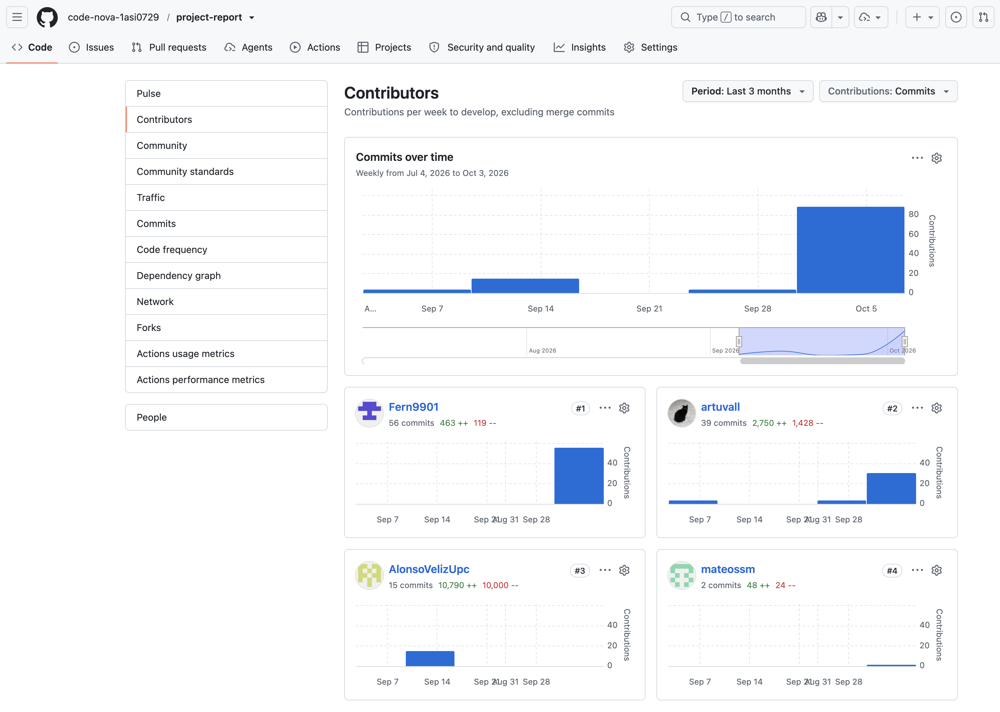
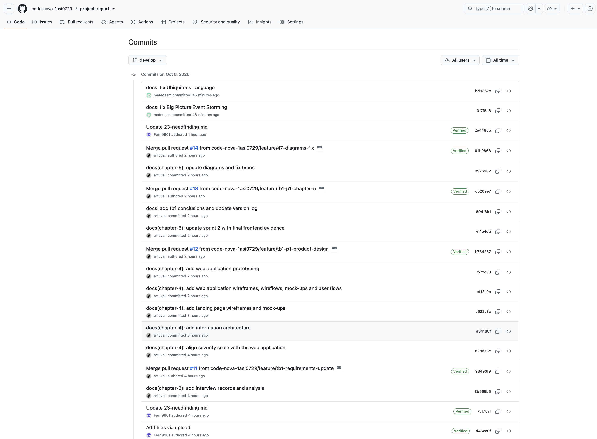
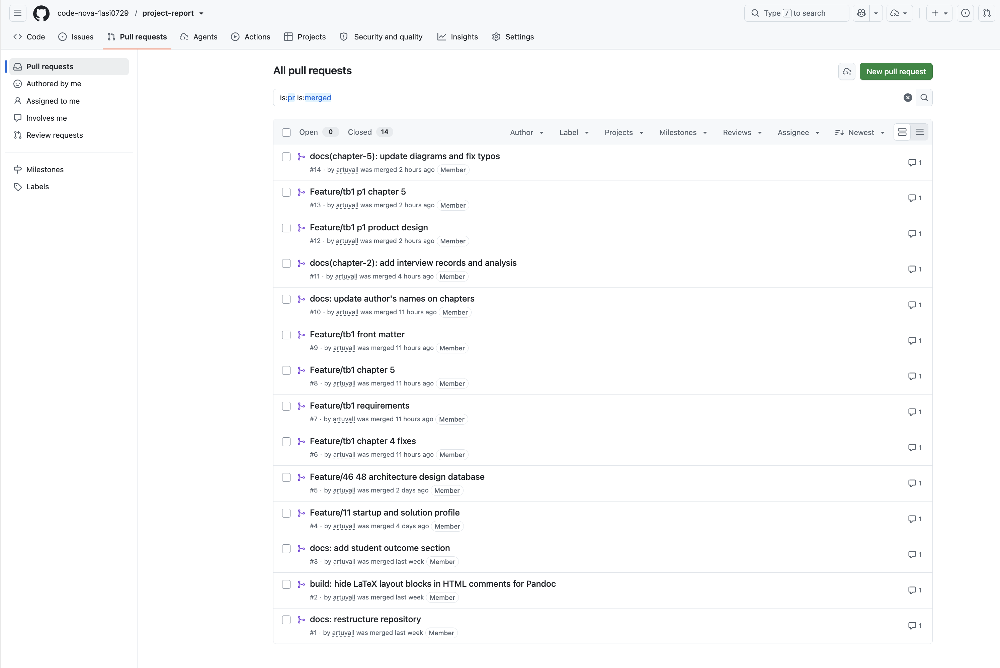
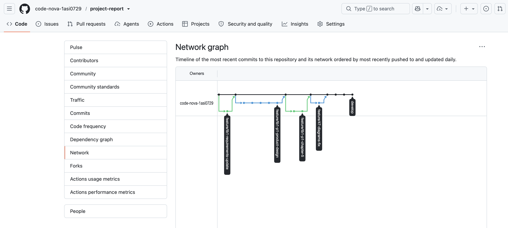

<!-- latex:
\newpage
-->

# Project Report Collaboration Insights

URL del repositorio del informe: <https://github.com/code-nova-1asi0729/project-report>

El informe se escribe de forma colaborativa durante todo el ciclo del proyecto. Esta sección explica cómo trabajamos en cada entrega y muestra las capturas de GitHub que lo respaldan. Lo descrito es coherente con el Registro de Versiones del Informe.

**AV1.** Para la primera entrega repartimos las secciones según el rol de cada integrante. Escribimos el informe en un documento compartido y subimos avances al repositorio sin una estructura definida. El líder del equipo consolidó el documento antes de la entrega.

| Integrante | Secciones a cargo |
|:---|:---|
| Valladolid Jiménez, Arturo Fernando | Carátula, registro de versiones, collaboration insights y Student Outcome. 1.1 Startup Profile y 1.2.1 Antecedentes y problemática. Capítulo IV completo: style guidelines, arquitectura de información, diseño del Landing Page y de la Web Application, prototipo, diagramas C4, class diagrams y database diagrams. 5.1 y la gestión del Sprint 1 (planning, aspectos, backlog y collaboration insights). |
| Diaz Vargas, Fernanda Ysabella | 1.2.2 Lean UX Process. Capítulo III: user stories, impact mapping y product backlog. |
| Romero Veliz, Matthias Alonso | 2.2 Entrevistas y 2.3 Needfinding: user personas, user task matrix, journey maps y empathy maps. |
| Salazar Miranda, Mateo Paolo | 1.3 Segmentos objetivo, 2.1 Competidores, 2.4 Big Picture Event Storming, 2.5 Ubiquitous Language y las evidencias del Landing Page en el Sprint 1. |

En el repositorio, los aportes de AV1 son los commits del 17 y 18 de septiembre. Se hicieron desde la web de GitHub (por ejemplo "Add files via upload"), porque todavía no usábamos ramas ni una convención de mensajes.

**TB1.** Para esta entrega pasamos el informe a Markdown, en un repositorio con un archivo por sección, y lo trabajamos con docs-as-code. El PDF se genera con Pandoc desde el repositorio. El flujo fue el siguiente:

1. El líder creó la estructura del repositorio y la plantilla de cada archivo.
2. Cada grupo de secciones se trabajó en una rama `feature` creada desde `develop`, por ejemplo `feature/tb1-chapter-5` o `feature/tb1-requirements`.
3. Cada rama entró a `develop` con un Pull Request. Hay 14 Pull Requests integrados a la fecha.
4. Los commits siguen Conventional Commits con el capítulo como scope, por ejemplo `docs(chapter-5): add sprint 2 backlog`.
5. Antes de cada entrega se actualiza el registro de versiones, la tabla de contenidos y se genera el PDF para revisarlo.

La tabla resume el aporte de cada integrante en el repositorio.

| Integrante | Usuario GitHub | Aporte al informe | Commits representativos |
|:---|:---|:---|:---|
| Valladolid Jiménez, Arturo Fernando | artuvall | Estructura del repositorio y flujo GitFlow. Student Outcome, front matter y anexos. Capítulos IV y V (incluye Sprint 2), conclusiones y revisión de los Pull Requests. | `72f2c53` docs(chapter-4): add web application prototyping `ef1b4d5` docs(chapter-5): update sprint 2 with final frontend evidence |
| Diaz Vargas, Fernanda Ysabella | Fern9901 | Migración y corrección de 1.1.2, 1.2.2, 2.1, 2.2.1, 2.3, 3.1 (epics y user stories), 3.3 y 4.1. | `573a8f2` Add new user stories for feature enhancements `2e4485b` Update 23-needfinding.md |
| Romero Veliz, Matthias Alonso | AlonsoVelizUpc | Commits de AV1 en el repositorio: Lean UX Canvas, README y reorganización de carpetas. | `fa4fcf7` Lean UX Canvas |
| Salazar Miranda, Mateo Paolo | mateossm | Corrección de 2.4 Big Picture Event Storming y 2.5 Ubiquitous Language. | `3f7f5e6` docs: fix Big Picture Event Storming `bd9367c` docs: fix Ubiquitous Language |

Las siguientes capturas muestran los analíticos de colaboración del repositorio.

