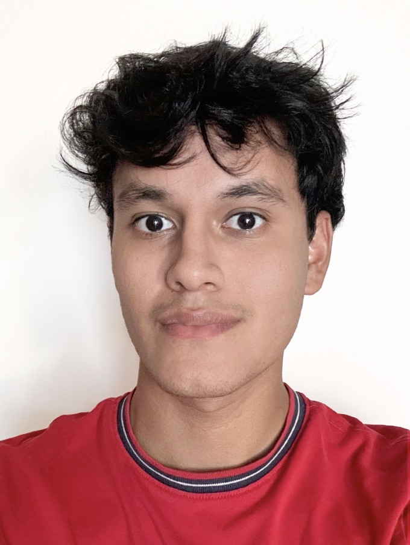
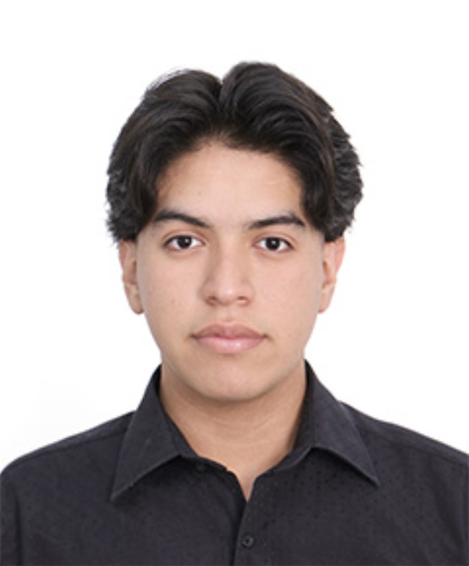
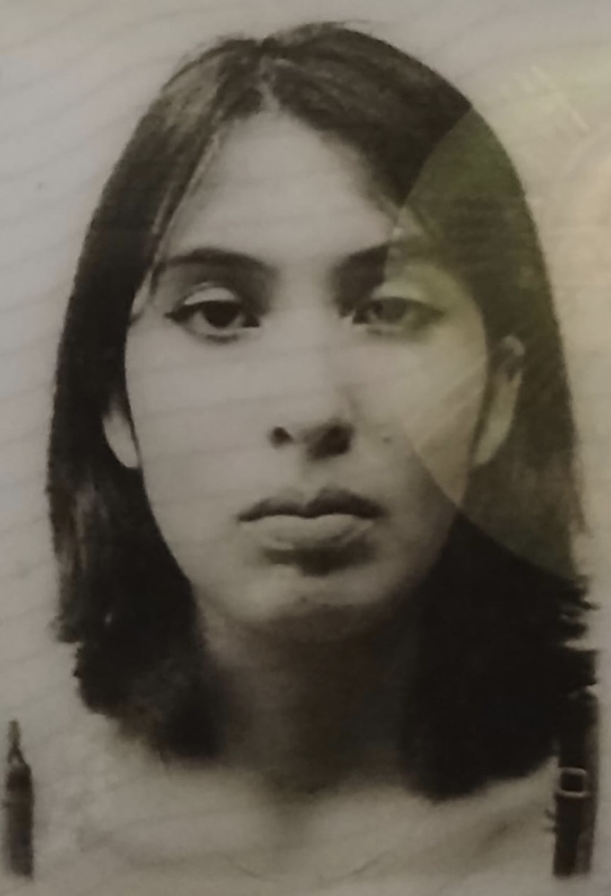
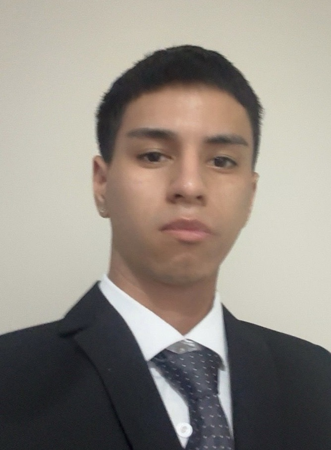

## 1.1. Startup Profile

### 1.1.1. Descripción de la Startup

CodeNova es una startup de tecnología dedicada al mantenimiento preventivo de edificios de departamentos y condominios mediante sensores IoT. El equipo crítico de un edificio, como los aires acondicionados, las bombas de agua o los tableros eléctricos, suele realizarse sólo cuando falla. Para entonces la reparación ya es una urgencia: cuesta más que una intervención planificada, interrumpe a los residentes y, en el peor de los casos, compromete la estructura. CodeNova nace para invertir ese orden y detectar el desgaste mientras todavía es corregible.

Nuestro producto, Vigilia,  es una plataforma web que concentra el monitoreo y la gestión del mantenimiento de un edificio. Sensores instalados en los equipos miden vibración, temperatura de componentes, humedad y consumo eléctrico; cuando una lectura se sale del rango esperado, la plataforma genera una alerta temprana con su severidad. Sobre esa base se organiza el trabajo del operador: recepción de solicitudes, planificación de visitas, agenda y control de materiales. Los administradores acceden a un dashboard con el estado del edificio y el ahorro acumulado frente al mantenimiento correctivo; los residentes reportan incidentes y siguen el avance de sus solicitudes; las empresas de mantenimiento reciben las alertas priorizadas y ordenan su semana de trabajo. El servicio se oferta bajo una cuota fija mensual por edificio, de modo que los costos de mantenimiento se mantienen en un rango predecible y se reduce el riesgo de fallas graves.

### 1.1.2. Perfiles de integrantes del equipo

| Foto | Integrante | Código | Perfil |
|:------------:|:----------------|:----------:|:----------------------------------------------|
|  | Valladolid Jiménez, Arturo Fernando | u202420147 | Soy estudiante de Ingeniería de Software en quinto ciclo. En CodeNova soy el Team Leader: coordino los sprints, organizo el repositorio y el flujo de trabajo en Git, y me encargo de consolidar los informes de cada entrega. Vengo de cursar Algoritmos y Estructura de Datos, Diseño y Patrones de Software, Especificación y Análisis de Requerimientos, Diseño de Base de Datos y Arquitectura de Computadoras, formación que me deja una base para leer y construir diseño de software, no solo código. Manejo HTML, CSS y C++. Cursos como Organización y Dirección de Empresas y Creatividad y Liderazgo me ayudaron con la parte de coordinación, que es la que más pesa en mi rol. En este proyecto quiero sostener el ritmo del equipo y, de paso, dominar Spring Boot y Angular para aportar también en la implementación. |
|  | Romero Veliz, Matthias Alonso | u20241b178 | Soy estudiante de Ingeniería de Software en quinto ciclo. En este proyecto planeo aportar de forma transversal a lo largo de todo el ciclo de vida del proyecto: desde el diseño y análisis de las entrevistas de Needfinding, la construcción de los User Personas, User Journey Maps y Empathy Maps, hasta la especificación de los User Stories, el Product Backlog y las decisiones de Product Design (Style Guidelines, arquitectura de información y UI del Landing Page y la Web Application). Cuento con conocimientos en diseño de software, algoritmos y estructuras de datos, y desarrollo web, lo que me permite moverme con soltura entre las etapas de investigación de usuarios, especificación de requisitos y diseño de producto. En este proyecto busco seguir fortaleciendo esa visión integral del ciclo de desarrollo, aportando tanto en la documentación como en la implementación técnica de CodeNova. |
|  | Diaz Vargas, Fernanda Ysabella | u202411843 | Soy estudiante de Ingeniería de Software en el sexto ciclo. En este trabajo CodeNova, me encargué del análisis y levantamiento de requisitos, liderando el Capítulo II. Desarrollé el análisis competitivo, la ejecución de entrevistas y la elaboración de los User Personas, User Journey Maps, Empathy Maps y el Event Storming. Mi experiencia en modelado de procesos y especificación de requisitos permitió traducir las necesidades de los usuarios en las bases del diseño de nuestro producto. |
|  | Salazar Miranda, Mateo Paolo | u202315171 | [COMPLETAR: carrera y ciclo.] Soy un estudiante responsable y comprometido, con interés en el desarrollo de soluciones tecnológicas innovadoras. Tengo habilidades de trabajo en equipo, pensamiento analítico y resolución de problemas. |
