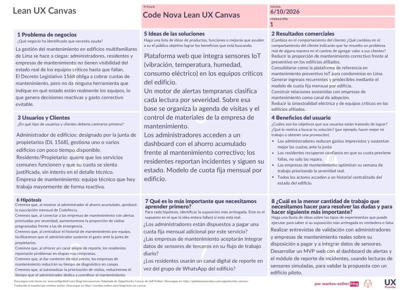

## 1.2. Solution Profile

### 1.2.1. Antecedentes y problemática

**Antecedentes**

El mercado de vivienda de Lima Metropolitana atraviesa su mejor momento en más de una década: las ventas crecieron 23.3% en 2024, el mejor resultado en once años y el cuarto mejor en los veintinueve años que CAPECO lleva realizando esa investigación [@capeco2025]. La oferta se concentra en viviendas multifamiliares, al punto de que el propio Estado justificó la actualización de su marco normativo en las "nuevas necesidades de las viviendas multifamiliares" [@dleg1568]. Cada uno de esos inmuebles funciona porque una serie de equipos críticos opera todos los días: bombas hidroneumáticas que suben el agua a los pisos altos, ascensores, aires acondicionados y tableros eléctricos.

Esa convivencia se rige por el Decreto Legislativo 1568, publicado en mayo de 2023, que entra en vigencia a los 180 días de publicado su reglamento: los propietarios están obligados a aportar las cuotas necesarias para el mantenimiento y conservación de los bienes comunes, incluidas las instalaciones sanitarias y eléctricas de uso común, y el administrador que designa la junta de propietarios se encarga de cobrar y recaudar esas cuotas de los gastos comunes [@dleg1568].

En la práctica, ese dinero se gasta casi siempre después del daño. Una administradora entrevistada por el equipo estima que cerca del 70% de su presupuesto de mantenimiento termina siendo gasto correctivo no planificado (Entrevista 2, sección 2.2.2), y una empresa de mantenimiento contrasta una visita programada de una a dos horas (hasta S/ 300) con una reparación de emergencia por cambio de motor que toma un día completo y cuesta entre S/ 2,500 y S/ 4,000, sin contar el sobrecosto del repuesto urgente (sección 2.2.2). Como referencia de planificación, el MEF asigna al mantenimiento preventivo del equipamiento un porcentaje anual de entre 1% y 3% de su valor, y al correctivo un 8% que se aplica de forma periódica según la vida útil del equipo [@mef2022]. Esa estimación fue diseñada para inversiones públicas de salud y educación y no compara costos reales en edificios residenciales, por lo que el equipo la complementa con la evidencia de sus entrevistas. En el sector privado limeño la secuencia es similar: las empresas de mantenimiento de bombas describen que, cuando no hay prevención, el tanque hidroneumático falla, la bomba entra en ciclo corto, el consumo eléctrico se dispara y el motor termina quemado. Antes de eso, la presión ya se había perdido en los pisos altos y las quejas de los residentes ya habían llegado a la administración [@samiria2025]. El chequeo mensual que evita esa cadena existe, y consiste justamente en medir vibraciones y amperaje.

El riesgo de incendio y el consumo eléctrico son la otra cara del problema. INDECI registró 11,854 incendios urbanos e industriales en el país entre 2015 y 2024 [@indeci2025], cifra que da la magnitud del riesgo de incendio en entornos urbanos y que ningún administrador puede anticipar sin información sobre el estado de los tableros y circuitos de su edificio. A eso se suma un consumo que nadie examina: la Guía de Orientación del Uso Eficiente de la Energía del MINEM estima que una vivienda en multifamiliar consume en promedio 7,859 kWh al año, que la refrigeración concentra alrededor del 41% del consumo final de electricidad del sector residencial y que la iluminación le sigue con 17% [@minem2022]. Para los multifamiliares, la propia guía indica que además del consumo de cada vivienda debe considerarse el consumo eléctrico de las áreas comunes. Hoy, la boleta mensual es la única señal que tiene un administrador sobre el comportamiento de los equipos del edificio.

**Problemática**

La gestión del mantenimiento en edificios de departamentos de Lima se hace a ciegas. El administrador no conoce el estado de los equipos, solo el monto facturado del último mes. El residente descubre los problemas cuando el agua no sube o el aire acondicionado deja de enfriar. La empresa de mantenimiento se entera por llamada de emergencia, cuando la reparación ya es la opción más cara. Las cuotas que la ley obliga a pagar terminan financiando emergencias en lugar de prevenirlas.

**Enunciado del problema**

El mantenimiento de los equipos críticos de un edificio multifamiliar (bombas hidroneumáticas, tableros eléctricos, ascensores y aires acondicionados) debería sostener el servicio diario de los residentes con un gasto previsible, financiado por las cuotas que los propietarios están obligados a aportar [@dleg1568]. En los edificios de Lima Metropolitana ese objetivo no se cumple: administradores, residentes y empresas de mantenimiento no disponen de información objetiva sobre el estado real de los equipos, las intervenciones suelen ocurrir después de la falla y las cuotas terminan destinándose a emergencias correctivas. Se requiere mejorar la oportunidad con la que las decisiones de mantenimiento se toman y se coordinan entre los tres actores. ¿Cómo lograr que administradores, residentes y empresas de mantenimiento actúen sobre el desgaste de los equipos antes de que se convierta en una emergencia?

**Puntos que debe resolver la solución propuesta**

- Dar visibilidad del estado de los equipos críticos mediante variables medibles: vibración, temperatura, humedad y consumo eléctrico.
- Detectar el desgaste a tiempo, con alertas tempranas clasificadas por severidad.
- Conectar en un mismo flujo de trabajo a los tres actores: el administrador decide y programa visitas, el residente reporta incidentes y sigue su avance, y la empresa de mantenimiento recibe alertas priorizadas y ordena su agenda.
- Conservar un historial centralizado por equipo que permita al administrador sustentar el gasto de las cuotas ante la junta de propietarios.
- Hacerlo bajo un modelo sostenible de cuota fija mensual por edificio.

  **Objetivos**

*Objetivo general.* 

Diseñar y construir un MVP web, compuesto por un Landing Page, una Web Application y un RESTful API de elaboración interna, que permita a administradores, residentes y empresas de mantenimiento conocer el estado de los equipos críticos de un edificio multifamiliar de Lima Metropolitana y actuar sobre alertas tempranas, con el fin de validar la propuesta de valor de CodeNova con un edificio piloto.

*Objetivos específicos.*

1. Ofrecer al administrador un dashboard de alertas por severidad construido sobre lecturas simuladas de vibración, temperatura, humedad y consumo eléctrico.
2. Permitir al residente reportar incidentes en áreas comunes con evidencia fotográfica y consultar el estado de su solicitud.
3. Permitir a la empresa de mantenimiento recibir alertas con contexto técnico previo, confirmar visitas y registrar los resultados de cada intervención.
4. Centralizar el historial de mantenimiento por equipo para el uso de los tres actores.
5. Desplegar el Landing Page, la Web Application y el RESTful API en plataformas cloud con despliegue automatizado.
6. Medir el éxito de la propuesta con los indicadores definidos en las Lean UX Hypothesis Statements.

   **Restricciones y alcance**

- **Productos incluidos:** un sitio web estático como Landing Page, una Web Application adaptable a las dimensiones del dispositivo e integrada con un RESTful API de elaboración interna. La experiencia debe ser consistente entre el Landing Page y la Web Application, y los call-to-action de cada segmento objetivo deben redirigir a la vista correspondiente.
- **Servicios externos:** la solución debe integrar al menos un servicio de terceros además del API propio. El diagrama de contexto identifica dos sistemas externos: la red de sensores IoT y un servicio de almacenamiento de medios en la nube.
- **Datos de sensores:** el MVP trabaja con lecturas simuladas. La instalación de sensores reales queda fuera del alcance académico y corresponde a un piloto posterior.
- **Tecnología:** servidor basado en Java y tecnologías open-source, con despliegue en plataformas server-side o cloud.
- **Ámbito:** edificios de departamentos y condominios de Lima Metropolitana, y los tres perfiles de usuario descritos en la sección 1.3.

**Técnica de las 5W y 2H**

Para conocer aún más la problemática usaremos la técnica de las 5W y 2H.

**What (¿Qué? / ¿Cuál?)**

*¿Cuál es el problema?* El problema es la gestión reactiva del mantenimiento en edificios multifamiliares de Lima: administradores, residentes y empresas de mantenimiento toman decisiones a ciegas, sin información objetiva sobre el estado real de los equipos críticos (bombas, tableros eléctricos, ascensores, aires acondicionados). Como consecuencia, las cuotas de mantenimiento que la ley obliga a pagar terminan financiando emergencias correctivas —más costosas y disruptivas— en lugar de prevenir fallas mientras aún son corregibles.

*¿Qué soluciones existen actualmente?* Existen soluciones CMMS/EAM con capacidades IoT como Fracttal One y DimoMaint, orientadas a operaciones industriales y portafolios corporativos, no a la gestión residencial de condominios; y plataformas locales de administración de edificios como OORB, que cubren facturación, cobranza y seguridad, pero sin ningún componente de monitoreo técnico de equipos (ver sección 2.1). Ninguna de ellas cubre el cruce específico que necesita un condominio residencial en Lima. Con nuestra propuesta de valor buscamos cerrar esa brecha mediante sensores IoT de bajo costo que generan alertas priorizadas por severidad, conectando en un mismo flujo de trabajo a los tres actores del ecosistema, bajo un modelo sostenible de cuota fija mensual por edificio.

*¿Cuál es la relación con el usuario?* El usuario es el eje central de la plataforma: el administrador la usa para decidir cuándo intervenir un equipo y sustentar el gasto ante la junta; el residente la usa para reportar incidentes y confiar en que su cuota previene fallas; y la empresa de mantenimiento la usa para priorizar su semana de trabajo con contexto técnico previo, lo que aporta mayor eficiencia y confianza a todo el ecosistema.

**Why (¿Por qué?)**

*¿Cuál es la causa principal del problema?* Consideramos que, si bien existen varios factores (falta de presupuesto, urgencia operativa, desconocimiento técnico), todos confluyen en una misma causa principal: no existe ningún canal que conecte el estado real de los equipos críticos con las decisiones de mantenimiento. Este supuesto lo contrastaremos en las Lean UX Assumptions (sección 1.2.2.2). El Decreto Legislativo 1568 obliga a los propietarios a aportar cuotas y encarga al administrador su cobro y ejecución [@dleg1568], pero esa obligación legal no viene acompañada de ninguna herramienta que indique en qué estado están realmente esos equipos, por lo que las decisiones terminan basándose en la última queja recibida y no en el desgaste real.

**Who (¿Quién?)**

*¿Quiénes están involucrados?* Está involucrada toda la cadena de gestión del edificio: administradores de propiedad horizontal, residentes y propietarios, empresas y técnicos de mantenimiento, las juntas de propietarios que aprueban los gastos, y de forma indirecta el Estado como regulador a través del Decreto Legislativo 1568.

*¿A quiénes les sucede el problema?* A administradores de edificios multifamiliares en Lima Metropolitana que gestionan uno o varios edificios con poco tiempo disponible; a residentes y propietarios que pagan una cuota sin visibilidad de en qué se usa; y a empresas de mantenimiento que hoy operan mayormente bajo demanda de emergencia.

**When (¿Cuándo?)**

*¿Cuándo sucede el problema?* Constantemente, y de forma creciente: el mercado de vivienda multifamiliar en Lima atraviesa su mejor momento en once años, con un crecimiento de ventas de 23.3% en 2024 [@capeco2025], lo que multiplica la cantidad de edificios operando bajo esta misma lógica reactiva. Además, el Decreto Legislativo 1568 exige formalmente el cobro de estas cuotas, sin ofrecer ninguna herramienta de gestión preventiva que las acompañe.

*¿Cuándo el cliente usa el producto?* El administrador revisa la plataforma como parte de su rutina semanal de gestión; el residente la usa puntualmente al detectar un problema o notar una falla en las áreas comunes; y la empresa de mantenimiento la consulta antes de salir a cada visita para priorizar su ruta de la semana.

**Where (¿Dónde?)**

*¿Dónde está el usuario cuando usa la plataforma?* El administrador la usa desde su oficina o celular mientras gestiona uno o varios edificios; el residente la usa desde su propio departamento al notar una falla; y el técnico de mantenimiento la consulta en campo, antes o durante la visita al edificio.

*¿Dónde surge el problema?* En los edificios multifamiliares de Lima Metropolitana, específicamente en las zonas donde operan los equipos críticos: cuartos de bombas hidroneumáticas, tableros eléctricos, cuartos de máquinas de ascensores y azoteas con unidades de aire acondicionado.

**How (¿Cómo?)**

*¿En qué condiciones los clientes usan nuestro producto?* Los administradores lo usan cuando reciben una alerta y deben decidir si programar una visita preventiva o cuando necesitan sustentar gastos ante la junta; los residentes cuando notan una falla en un área común; y las empresas de mantenimiento cuando organizan su agenda semanal o llegan a una visita y necesitan contexto técnico previo.

*¿Cómo se enteran de la aplicación?* A través de alianzas con empresas de mantenimiento locales (que recomiendan la plataforma a los administradores que atienden), un programa de edificios fundadores con beneficios de instalación, y contenido educativo dirigido a juntas de propietarios sobre sus obligaciones bajo el Decreto Legislativo 1568.

**How much (¿Cuánto?)**

*¿Cuánto le cuesta este problema a la economía, sociedad o institución del Perú actualmente?* El costo no está medido a nivel nacional para edificios residenciales; el equipo lo aproxima con tres evidencias. Primero, la experiencia directa de los actores: una emergencia con cambio de motor cuesta entre S/ 2,500 y S/ 4,000 frente a una visita programada de hasta S/ 300, y una administradora entrevistada estima que cerca del 70% de su presupuesto de mantenimiento es gasto correctivo no planificado (sección 2.2.2). Segundo, el riesgo de incendio, con 11,854 incendios urbanos e industriales registrados en el país entre 2015 y 2024 [@indeci2025]. Tercero, un consumo eléctrico residencial —concentrado en refrigeración (41%) e iluminación (17%)— que hoy nadie monitorea a nivel de edificio [@minem2022]. Como referencia de planificación, el MEF presupuesta el mantenimiento correctivo del equipamiento en 8% de su valor, aplicado periódicamente, frente a 1%–3% anual del preventivo [@mef2022].

*¿Cuánto costaría implementar la solución propuesta?* La estimación siguiente corresponde a llevar la solución a un piloto real en un edificio. En el marco del curso, el desarrollo lo aporta el propio equipo y el MVP usa lecturas simuladas, por lo que el desembolso efectivo se limita sobre todo al hosting. Los montos están en soles, no incluyen IGV y convierten los precios en dólares a S/ 3.4 por US$.

| Rubro | Estimación | Base del cálculo |
|:------------------------|:--------------|:-----------------------------------------------|
| Desarrollo del MVP (Landing Page, Web Application y RESTful API, incluida la integración con servicios externos) | S/ 18,000 – S/ 35,000 | Entre 5 y 10 meses-persona a unos S/ 3,560 mensuales por desarrollador: sueldo promedio de desarrollador de software en Perú (S/ 2,543) más cerca de 40% en beneficios laborales. |
| Sensores y gateway para un edificio piloto | S/ 2,300 – S/ 5,700 por edificio | 3 a 4 sensores de vibración y temperatura (USD 73–203 c/u), 2 sensores ambientales de temperatura y humedad (USD 39–52 c/u), 3 a 4 pinzas de corriente (US$ 84–105 c/u) y 1 gateway LoRaWAN (USD 130–350). Precios de lista de fabricantes, sin envío ni aranceles. |
| Diseño UI/UX | S/ 2,500 – S/ 6,000 | Estimación del equipo para el alcance del MVP. |
| Hosting e infraestructura cloud | S/ 1,400 – S/ 2,700 al año | API en Render (US$ 7 a 25 al mes), base de datos PostgreSQL gestionada (USD 7 a 20 al mes), frontend en Vercel Pro (USD 20 al mes) y Landing Page en GitHub Pages sin costo. No incluye el dominio. |
| Seguridad y soporte | S/ 2,000 – S/ 5,000 | Estimación del equipo: equivale a entre 0.6 y 1.4 meses-persona de refuerzo de seguridad y soporte inicial. |

Con estos rubros, el costo del primer año para un edificio piloto se ubica entre unos S/ 26,000 y S/ 54,000, sin contar la instalación.

### 1.2.2. Lean UX Process

#### 1.2.2.1. Lean UX Problem Statements

CodeNova busca construir una plataforma de mantenimiento preventivo basada en sensores IoT para edificios de departamentos y condominios en Lima Metropolitana, con el fin de que administradores, residentes y empresas de mantenimiento dejen de operar a ciegas frente al desgaste de los equipos críticos del edificio. La idea central es reemplazar la lógica "se revisa cuando falla" por una de detección temprana, en la que cada bomba hidroneumática, tablero eléctrico, ascensor o unidad de aire acondicionado transmita su propio estado de salud antes de que el problema se convierta en una emergencia costosa.

El problema que abordamos es que la gestión del mantenimiento en edificios multifamiliares de Lima carece de información objetiva sobre el estado real de sus equipos, una situación agravada por el auge inmobiliario que atraviesa la ciudad: las ventas de vivienda crecieron 23.3% en 2024, el mejor resultado en once años (CAPECO, 2025), concentradas principalmente en proyectos multifamiliares (Decreto Legislativo 1568, 2023). Desde enero de 2025, dicho decreto obliga a los propietarios a aportar cuotas para el mantenimiento de los bienes comunes, y encarga al administrador su cobro y ejecución (Decreto Legislativo 1568, 2023); sin embargo, esa obligación legal no viene acompañada de ninguna herramienta que le diga al administrador en qué estado están realmente esos equipos.

Hemos identificado que esta falta de visibilidad tiene un costo cuantificable: el propio Estado reconoce que el mantenimiento correctivo cuesta hasta 8% del valor del equipo por año, frente a un 1%-3% del preventivo (Ministerio de Economía y Finanzas, 2022), y las empresas de mantenimiento de bombas en Lima describen una secuencia recurrente —ciclo corto, sobreconsumo eléctrico, motor quemado— que un chequeo mensual básico podría evitar (Samiria Soluciones, 2025). A esto se suma un riesgo eléctrico invisibilizado: 11,854 incendios urbanos e industriales registrados en el país entre 2015 y 2024 (INDECI, 2025) y un consumo eléctrico residencial concentrado en refrigeración e iluminación que hoy nadie monitorea a nivel de edificio (MINEM, 2022).

Las alternativas actuales —hojas de cálculo, llamadas de emergencia, la boleta mensual como único indicador— resultan insuficientes porque no anticipan nada: informan del gasto después de ocurrido, no de la falla antes de que ocurra. Frente a este escenario, nuestra propuesta busca responder a la siguiente interrogante: ¿Cómo podríamos diseñar una plataforma que conecte el estado real de los equipos críticos de un edificio con las decisiones de mantenimiento de administradores, residentes y empresas de mantenimiento, para prevenir fallas antes de que se conviertan en emergencias?

#### 1.2.2.2. Lean UX Assumptions

Para afrontar el problema del mantenimiento reactivo en edificios multifamiliares, partimos de un conjunto de supuestos sobre nuestros tres tipos de usuario y su contexto, los cuales deben validarse antes de construir la solución completa. El éxito de CodeNova dependerá de qué tan acertadas sean estas hipótesis centradas en el administrador, el residente y la empresa de mantenimiento.

Nuestro análisis del contexto de administración de edificios en Lima muestra que los administradores cuentan con la obligación legal de gestionar el mantenimiento (Decreto Legislativo 1568, 2023), pero no con herramientas para hacerlo de forma anticipada. Suponemos que existe un vacío entre lo que la ley les exige y lo que hoy pueden realmente monitorear, y que valorarán información objetiva que les permita justificar gastos ante la junta de propietarios. Consideramos que los residentes, por su parte, no necesitan ni quieren visibilidad técnica detallada de los equipos, pero sí un canal simple para reportar incidentes y ver que su cuota se traduce en prevención real, no solo en reparaciones tras la queja.

Asimismo, identificamos que la desconfianza hacia el destino de las cuotas de mantenimiento es un factor clave: los residentes no siempre saben en qué se gasta su dinero, y los administradores enfrentan reclamos cuando una falla "se pudo haber evitado". En cuanto a las empresas de mantenimiento, creemos que no rechazan trabajar con datos de sensores de terceros si eso les permite priorizar su semana y llegar con contexto técnico a cada visita, reduciendo el tiempo de diagnóstico en campo.

Al evaluar las alternativas actuales, observamos que la mayoría de administradores usa hojas de cálculo, cuadernos de bitácora o el criterio de la empresa de mantenimiento de turno, sin ningún sistema que centralice lecturas de vibración, temperatura, humedad o consumo eléctrico. Suponemos que esta falta de datos genera decisiones basadas en la última queja recibida y no en el desgaste real del equipo.

Nuestra propuesta se diferenciará al ofrecer una plataforma que traduce lecturas de sensores IoT en alertas priorizadas por severidad, conectando a los tres actores (administrador, residente, empresa de mantenimiento) en un mismo flujo de trabajo. Creemos que, al mostrar el ahorro acumulado frente al mantenimiento correctivo, los administradores justificarán con más facilidad la cuota mensual ante la junta de propietarios, y que las empresas de mantenimiento reducirán su proporción de visitas de emergencia frente a las programadas.

##### 1.2.2.2.1. Assumptions Worksheet

**¿Quién es el usuario?**
Identificamos tres roles principales:
- **El Administrador:** Suponemos que es la persona responsable de coordinar el mantenimiento del edificio, con poco tiempo disponible y bajo presión constante de la junta de propietarios y de los residentes.
- **El Residente/Propietario:** Consideramos que es alguien que solo quiere que los servicios comunes funcionen y que su cuota se sienta justificada, sin interés en el detalle técnico.
- **La Empresa de Mantenimiento:** Suponemos que es un equipo técnico que hoy trabaja mayormente de forma reactiva y valoraría llegar a cada visita con información previa del equipo a revisar.

**¿Dónde encaja nuestro producto en su vida o actividades?**
 Creemos que el administrador revisará la plataforma como parte de su rutina semanal de gestión, el residente la usará puntualmente cuando detecte un problema, y la empresa de mantenimiento la consultará antes de salir a cada visita para priorizar su ruta.

**¿Qué problemas busca resolver nuestro producto?**
- **Problema de visibilidad:** Asumimos que la principal barrera del administrador es no saber en qué estado están los equipos hasta que fallan.
- **Problema de justificación:** Consideramos que los administradores se frustran al no poder sustentar ante la junta en qué se invierten las cuotas de mantenimiento.
- **Problema de priorización:** Creemos que las empresas de mantenimiento pierden eficiencia al no poder distinguir una emergencia real de una revisión rutinaria antes de llegar al edificio.

**¿Cuándo y cómo se utiliza el producto?**
Suponemos que su uso se itensifica cuando se acerca la fecha de revisión de cuotas o tras un incidente reciente. Además, creemos que los administradores prefieren un dashboard simple que muestre alertas por severidad, sin tener que interpretar datos técnicos crudos.

**¿Qué características son clave?** 
- **Confiabilidad de las alertas:** Consideramos esencial que los administradores confíen en que una alerta "crítica" realmente lo es, para no generar fatiga de notificaciones.
- **Trazabilidad:** Creemos que un historial de intervenciones y ahorro acumulado es fundamental para justificar decisiones ante la junta.
- **Simplicidad para el residente**Pensamos que el reporte de incidentes debe tomar segundos, sin fricciones ni formularios largos.

**¿Cómo debe ser el producto?**
Creemos que la experiencia debe transmitir control y prevención, no alarma constante. La plataforma debe sentirse como una herramienta de gestión seria y confiable, no como una app de quejas.

**Business outcomes**
- Reducir la proporción de mantenimiento correctivo frente al preventivo en los edificios afiliados.
- Consolidarse como la plataforma de referencia en mantenimiento preventivo IoT para condominios en Lima.
- Generar ingresos recurrentes y predecibles mediante el modelo de cuota fija mensual por edificio.
- Construir relaciones sostenidas con empresas de mantenimiento como canal de adopción.
- Reducir la siniestralidad eléctrica y de equipos críticos en los edificios afiliados.

**User outcomes**
- Los administradores reducen gastos imprevistos y sustentan mejor las cuotas ante la junta.
- Los residentes recuperan confianza en que su cuota previene fallas, no solo las repara.
- Las empresas de mantenimiento optimizan su semana de trabajo priorizando por severidad real.
- Todos los actores acceden a un historial centralizado del estado del edificio.

**Features**
-Sensores IoT de vibración, temperatura, humedad y consumo eléctrico instalados en equipos críticos.
- Motor de alertas tempranas con niveles de severidad.
- Dashboard administrativo con estado del edificio y ahorro acumulado.
- Módulo de reporte de incidentes para residentes con seguimiento de estado.
- Agenda y control de materiales para las visitas de mantenimiento.
- Historial de intervenciones y lecturas por equipo.

#### 1.2.2.3. Lean UX Hypothesis Statements

**Hipótesis de Negocio**

Creemos que, al mostrarle al administrador un dashboard con el ahorro acumulado frente al mantenimiento correctivo, lograremos que apruebe la suscripción mensual de CodeNova para su edificio. Validamos esta hipótesis si el 70% de los administradores que prueban una demo solicita continuar con la suscripción, y si el 50% de los edificios activos renueva su suscripción después de los primeros tres meses.
Consideramos que, al conectar a las empresas de mantenimiento con alertas priorizadas por severidad, aumentaremos la proporción de visitas programadas frente a las de emergencia. Confirmaremos esto si, tras seis meses de uso, los edificios afiliados registran una reducción de al menos 30% en las visitas de emergencia respecto a su historial previo.
Asimismo, creemos que al centralizar el historial de mantenimiento por equipo, facilitaremos que el administrador sustente el gasto de las cuotas ante la junta de propietarios, incrementando la retención del servicio. Esta hipótesis será válida si más del 60% de los administradores reporta, en encuestas trimestrales, que la plataforma les facilitó justificar los gastos de mantenimiento.

**Hipótesis de Usuario**

Creemos que, al ofrecer un canal simple de reporte de incidentes a los residentes, estos reportarán problemas más temprano en lugar de esperar a que el daño sea evidente. Sabremos que esto es cierto si el 60% de los incidentes reportados en la plataforma corresponde a etapas tempranas de falla (según clasificación de severidad) y no a fallas ya consumadas.
Consideramos que, al recibir alertas con severidad y contexto técnico previo, las empresas de mantenimiento reducirán su tiempo de diagnóstico en campo. Validaremos esta hipótesis si el 75% de los técnicos reporta, en encuestas posteriores a la visita, que la información previa aceleró su diagnóstico.
Creemos que, al mostrarle al residente el estado y las acciones tomadas frente a su reporte, aumentará su percepción de que la cuota de mantenimiento se usa de forma efectiva. Confirmaremos esto si el 65% de los residentes encuestados percibe una mejora en la transparencia del uso de sus cuotas tras tres meses de uso de la plataforma.
Finalmente, pensamos que al automatizar la priorización de visitas para el administrador, se reducirá el tiempo que dedica semanalmente a coordinar el mantenimiento. Esta hipótesis será válida si el tiempo reportado de gestión semanal disminuye en al menos 30% según encuestas comparativas antes/después de la adopción.

#### 1.2.2.4. Lean UX Canvas

 

