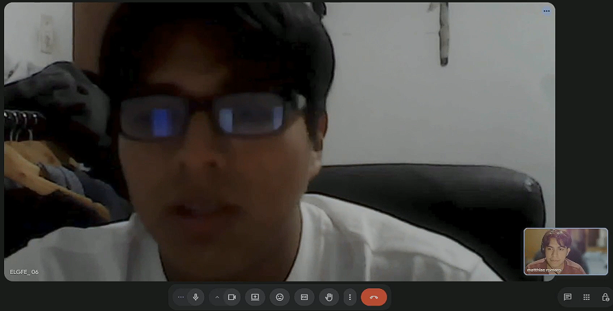
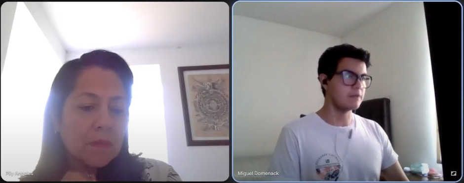
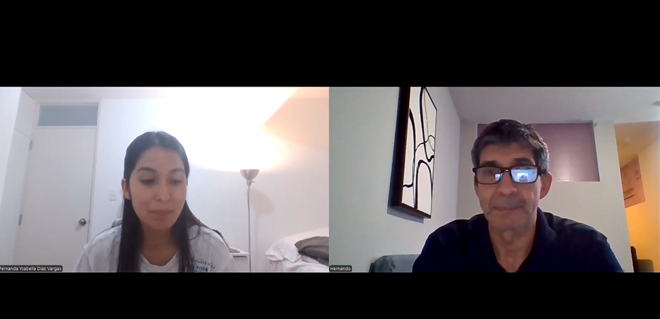

## 2.2. Entrevistas

### 2.2.1. Diseño de entrevistas
**Propietarios**
- 1. ¿Cómo describirías la última vez que tuviste un problema de mantenimiento en tu departamento o edificio (agua, ascensor, electricidad)? ¿Qué pasó desde que lo notaste hasta que se resolvió?
- 2. ¿Sabes en qué se usa exactamente la cuota de mantenimiento que pagas cada mes? ¿Alguna vez has cuestionado o pedido detalle de ese gasto?
- 3. ¿Alguna vez has sufrido un corte de agua, falla del ascensor o del aire acondicionado en áreas comunes? ¿Con qué frecuencia ocurre algo así?
- 4. ¿Confías en que la administración de tu edificio detecta los problemas a tiempo, o sientes que reaccionan solo cuando ya algo falló?
- 5. Si tu cuota subiera porque hubo una reparación de emergencia, ¿qué tanto te molestaría comparado con que subiera por mantenimiento preventivo programado?
- 6. ¿Te gustaría poder ver en algún momento el estado real de los equipos del edificio (bombas, tableros, ascensores) o prefieres no involucrarte en eso?
- 7. ¿Cómo reportas hoy un incidente (fuga, ruido, falla) al administrador? ¿Qué tan rápido sueles recibir respuesta o seguimiento?
- 8. ¿Qué tan importante es para ti que tu edificio tenga un sistema "inteligente" que prevenga fallas, versus otros beneficios (seguridad, áreas comunes, etc.)?
 
**Administradores**
- 1. ¿Cómo llevas actualmente el control del estado de los equipos del edificio (bombas, tableros eléctricos, ascensores, A/C)? ¿Usas alguna herramienta, hoja de cálculo o solo memoria/experiencia?
- 2. Cuéntame sobre la última falla grave que tuviste que gestionar: ¿cómo te enteraste, cuánto costó, y cuánto tiempo tomó resolverla?
- 3. ¿Con qué frecuencia programas mantenimiento preventivo versus cuánto terminas gastando en reparaciones de emergencia no planificadas?
- 4. ¿Cómo decides a qué empresa de mantenimiento llamar y cómo coordinas las visitas? ¿Qué parte de ese proceso te resulta más tediosa?
- 5. Cuando un residente reporta un incidente, ¿cómo registras y das seguimiento a esa solicitud hasta que se cierra?
- 6. ¿Qué información te gustaría tener a la mano para justificarle a la junta de propietarios en qué se gastan las cuotas de mantenimiento?
- 7. ¿Has tenido que enfrentar reclamos de residentes por fallas que "se pudieron haber evitado"? ¿Cómo manejas esas situaciones?
- 8. Si pudieras anticipar una falla antes de que ocurra (por ejemplo, una alerta de que una bomba está por fallar), ¿qué harías distinto en tu día a día?
 
**Empresa de mantenimiento**
- 1. ¿Cómo reciben hoy los pedidos de servicio de un edificio: llamada, WhatsApp, correo? ¿Qué información suelen tener antes de llegar al sitio?
- 2. Cuéntame de un caso reciente donde llegaron a una "emergencia" que, mirando atrás, se pudo haber prevenido si hubieran sabido antes que algo andaba mal.
- 3. ¿Cómo priorizan qué edificio o equipo atender primero cuando tienen varias solicitudes en la misma semana?
- 4. ¿Qué datos técnicos (vibración, temperatura, consumo eléctrico, horas de uso) sueles necesitar en campo y cuáles no tienes disponibles al momento de la visita?
- 5. ¿Qué diferencia, en tiempo y costo, hay entre una visita de mantenimiento programado y una reparación de emergencia para el mismo tipo de equipo?
- 6. ¿Cómo llevan el historial de mantenimiento de cada edificio o equipo? ¿Se pierde información cuando cambia el técnico o el administrador?
- 7. ¿Qué tan seguido un cliente (administrador) les pide evidencia o reportes del trabajo realizado? ¿Cómo se los entregan hoy?
- 8. Si pudieran recibir alertas priorizadas por severidad antes de que el equipo falle completamente, ¿cambiaría su forma de programar la semana de trabajo? ¿Cómo?

### 2.2.2. Registro de entrevistas

Hicimos entrevistas semiestructuradas a los tres segmentos: dos administradoras, dos residentes y tres personas de empresas de mantenimiento. Todas se grabaron y están juntas en un solo video. Para cada entrevista anotamos los datos de la persona, el minuto en que empieza en el video y un resumen de lo que contó.

- **Nombre del archivo:** upc-pre-202620-1asi0729-16692-CodeNova-needfinding-sprint-1.mov
- **URL del video:** https://acortar.link/rZDIrw

#### Segmento #1: Administradores de edificios y condominios

**Entrevista 1**

| Dato | Detalle |
|:---|:---|
| Nombre y apellidos | Nella Vargas |
| Edad | 64 años |
| Distrito | San Miguel |
| Ocupación | Administradora de edificio |
| Inicio en el video | 00:00 |
| Duración | 07:24 |

**Resumen.** La entrevistada administra un edificio y lleva el control del estado de los equipos (bombas, tableros eléctricos, ascensores, A/C) de forma completamente manual: anota en un cuaderno físico las fechas de próximo mantenimiento y hace seguimiento presencial de que los equipos "trabajen bien", sin usar ninguna herramienta digital ni hoja de cálculo. Aplica mantenimiento preventivo cada 6 meses a los equipos, y es consciente de que descuidar esa frecuencia le sale más caro: cuando un equipo como el ascensor falla sin haber tenido mantenimiento, debe llamar a una empresa de emergencia a un costo mayor. Como evidencia de una falla grave reciente, relató un corte eléctrico que afectó solo a su edificio (mientras el resto de la cuadra recuperó luz), lo que derivó en un diagnóstico de la compañía eléctrica y de un electricista, encontrándose que el tablero eléctrico fallaba y requería un componente de mayor potencia; el cambio del equipo tomó aproximadamente 3 a 4 días adicionales una vez identificado el problema. Sobre la coordinación con proveedores, identifica como el punto más tedioso del proceso conseguir que la empresa de mantenimiento le dé tiempo de atención, ya que estas empresas manejan agendas fijas salvo que se trate de una emergencia, caso en el que sí responden de inmediato. Para el registro y priorización de incidentes reportados por residentes, aplica un criterio de urgencia claro: emergencias como fugas de agua, fallas del ascensor o de la luz se atienden de inmediato, mientras que incidentes menores (como una cerradura dañada dentro de un departamento) quedan como segunda prioridad, sin mencionar el uso de un sistema formal de registro más allá de la gestión manual/verbal. En cuanto a la rendición de cuentas ante la junta de propietarios, conserva todos los recibos y boletas de gastos (productos de limpieza, materiales, pagos a proveedores) como evidencia física de en qué se invierte la cuota de mantenimiento, mostrándolos directamente a la junta para demostrar transparencia. Reconoce enfrentar reclamos de residentes que esperan soluciones inmediatas a fallas que "se pudieron evitar"; su manera de manejarlo es priorizar dar una pronta solución, lo cual —según indica— es aprobado por la mayoría de residentes aunque siempre exista algún reclamo persistente. Frente a la posibilidad de anticipar fallas, expresó explícitamente el deseo de contar con una herramienta que le avise cuándo un equipo está por fallar (por ejemplo, una alerta sobre un tablero o fusible próximo a quemarse), de manera que pueda coordinar el mantenimiento antes de que el equipo se malogre, en lugar de reaccionar después del hecho.

**Entrevista 2**

| Dato | Detalle |
|:---|:---|
| Nombre y apellidos | Mireya Perales |
| Edad | 35 años |
| Distrito | San Borja |
| Ocupación | Administradora de edificio |
| Inicio en el video | 07:24 |
| Duración | 03:49 |

**Resumen.** La entrevistada lleva el control del estado de los equipos en un Excel que actualiza tarde —a veces una semana después de cada visita técnica—, por lo que en el día a día confía más en la memoria y en lo que le indica el técnico de turno que en el archivo. Hace dos meses enfrentó una falla grave: se quemó el motor de la bomba de agua de su edificio, de la que se enteró por la llamada furiosa de un residente del piso 8 al no subir el agua. La reparación de emergencia costó S/ 3,900 y tomó 4 días resolverse, porque el técnico habitual no tenía el repuesto en stock. Programa mantenimiento preventivo dos veces al año, pero reconoce que cerca del 70% de su presupuesto de mantenimiento termina siendo gasto correctivo no planificado. Coordina con 2 o 3 empresas de confianza, llamando a la que responda más rápido, y señala que lo más tedioso es coordinar el acceso con el conserje y hacer seguimiento manual de si la visita realmente se realizó. Los residentes le escriben directamente por WhatsApp a su número personal, y ella anota los reportes en una libreta física de la oficina, tachándolos cuando se resuelven —reconoce que si pierde la libreta, pierde el historial completo—. Le gustaría poder mostrarle a la junta de propietarios un número concreto de ahorro (por ejemplo, "este año evitamos 2 emergencias que hubieran costado S/ 8,000"), ya que hoy solo puede mostrar facturas de lo ya gastado, nunca lo que se ahorró por prevenir. Ha enfrentado reclamos de residentes por fallas que "se pudieron evitar", sin tener forma de demostrar que no hubo negligencia de su parte, lo que describe como una situación injusta. Si pudiera anticipar una falla antes de que ocurra, llamaría al técnico esa misma semana en vez de esperar una emergencia de fin de semana (más cara y difícil de atender), y avisaría a los residentes con anticipación en vez de que se enteren cuando ya no hay agua.

#### Segmento #2: Propietarios y residentes

**Entrevista 3**

| Dato | Detalle |
|:---|:---|
| Nombre y apellidos | Luis Becerra |
| Edad | 24 años |
| Distrito | San Miguel |
| Ocupación | Propietario |
| Inicio en el video | 38:11 |
| Duración | 04:11 |

**Resumen.** El entrevistado relata que hace un mes se malogró la bomba de agua de su edificio un sábado por la noche; se dio cuenta porque no subía presión al tercer piso, donde vive. Reportó por el grupo de WhatsApp del edificio (unas 40 personas, usado para todo tipo de temas) a las 9pm, pero el administrador recién respondió el lunes, dejando al edificio casi 36 horas sin presión adecuada de agua. Al llegar el técnico, se supo que el motor llevaba tiempo haciendo un ruido raro que nadie había reportado. Paga S/ 180 mensuales de cuota, de los cuales conoce que cubren personal de limpieza y seguridad, pero desconoce el detalle del gasto en mantenimiento de equipos —una vez pidió esa información y le remitieron un balance anual en PDF que nunca llegó a revisar por no ser comprensible. El ascensor se ha detenido unas 3 veces este año, y reconoce que las bajadas menores de presión ya ni se reportan porque se asume que se normalizarán solas. No confía en que la administración detecte los problemas a tiempo; considera que no es un problema de mala gestión, sino de falta de herramientas para saber que algo anda mal antes de que falle. Le molestaría mucho más un alza de cuota por una emergencia (ej. S/50 de golpe) que por mantenimiento preventivo explicado con anticipación (ej. S/10 programado). No necesita ver datos técnicos, pero sí le gustaría un indicador simple tipo semáforo (verde/amarillo/rojo) del estado de los equipos. Hoy la respuesta a un reporte demora entre unas horas y 2 días. Aunque un sistema "inteligente" de mantenimiento no es su primer criterio al elegir dónde vivir —pesa más la seguridad—, después de vivir la falla de la bomba sí pagaría más para que no se repita.

**Entrevista 4**

| Dato | Detalle |
|:---|:---|
| Nombre y apellidos | Pilar Angeles |
| Edad | 54 años |
| Distrito | Magdalena |
| Ocupación | Residente |
| Inicio en el video | 30:11 |
| Duración | 08:00 |

**Resumen.** La entrevistada es residente de un edificio donde el reporte de incidentes y las coordinaciones con la administración se realizan a través de un chat de propietarios e inquilinos, logrando una comunicación y respuesta rápidas. Hace dos meses, mientras se encontraba fuera del país, ocurrió la ruptura de una tubería en el departamento frente al suyo con filtraciones hacia el pasillo; la emergencia se resolvió en pocas horas gracias a la alerta inmediata por el chat y a que un familiar acudió a abrir el departamento, lo que evitó que el agua ingresara a los ascensores. En el ámbito económico, recibe mensualmente el desglose de los gastos de mantenimiento por correo electrónico y en impresos publicados en el edificio, sobre los cuales nunca ha tenido inconvenientes ni reclamos. Las reparaciones urgentes se financian mediante un fondo de contingencia constituido por el redondeo de la cuota mensual. A pesar de que la administración programa mantenimiento preventivo para bombas y ascensores, los ascensores sufren fallas aproximadamente una vez cada dos meses, las cuales son atendidas por técnicos especializados. Actualmente, la información sobre el estado de los equipos es reactiva y se limita a fotos o videos enviados por el personal de vigilancia una vez ocurrido el problema; por ello, la entrevistada valora positivamente la implementación de sistemas inteligentes y tecnología de monitoreo en tiempo real que permitan conocer el estado real de los equipos y prevenir fallas.

#### Segmento #3: Empresas de mantenimiento

**Entrevista 5**

| Dato | Detalle |
|:---|:---|
| Nombre y apellidos | Hernando Diaz |
| Edad | 61 años |
| Distrito | <!-- TODO: distrito --> |
| Ocupación | Trabajador de Empresa de Mantenimiento |
| Inicio en el video | 11:12 |
| Duración | 07:58 |

**Resumen.** El entrevistado trabaja como técnico en una empresa de mantenimiento y recibe hoy los pedidos de servicio principalmente por correo electrónico, donde el cliente indica el tipo de emergencia o pedido junto con algunas pautas iniciales para el trabajo. Como ejemplo de una falla que se pudo haber prevenido, relató una visita de emergencia por un aire acondicionado que dejó de funcionar: al llegar identificó que el drenaje estaba tapado, un problema que se habría evitado con un mantenimiento programado y un seguimiento regular por apartamento. La priorización de solicitudes cuando hay varias en la misma semana no responde a un criterio de severidad, sino de orden de llegada: se atiende primero a quien llamó más temprano, sin distinguir qué tan crítico es el problema frente a otros. En campo, suele contar con herramientas básicas (termómetro, herramientas de electricidad), pero no dispone de medidores eléctricos ni de instrumentos para medir la presión de gas, por lo que en esos casos debe solicitarlos aparte. Sobre costos, señaló que no existe diferencia entre una visita programada y una reparación de emergencia por el mismo tipo de equipo: el costo es el mismo salvo que se necesite reemplazar una pieza. El historial de mantenimiento se lleva de forma manual: cada técnico reporta a diario sus órdenes de trabajo a su jefe directo, quien las almacena en su computadora; para evitar pérdida de información al cambiar de técnico, todos dejan notas del trabajo realizado en cada orden. Indicó que los residentes rara vez piden reportes o evidencia del trabajo: su única exigencia es que la emergencia quede resuelta. Finalmente, frente a la posibilidad de recibir alertas priorizadas por severidad antes de que un equipo falle por completo, se mostró favorable: considera que le permitiría prepararse mejor, ofrecer un mejor servicio y mantenimiento preventivo en lugar de trabajar solo bajo presión de emergencia.

**Entrevista 6**

| Dato | Detalle |
|:---|:---|
| Nombre y apellidos | Valeria Rojas |
| Edad | 30 años |
| Distrito | <!-- TODO: distrito --> |
| Ocupación | Coordinadora de Operaciones y Servicio Técnico |
| Inicio en el video | 19:10 |
| Duración | 06:52 |

**Resumen.** La entrevistada, Valeria, trabaja como Coordinadora de Operaciones y Servicio Técnico en una empresa de mantenimiento de bombas de presión para edificios. Actualmente, los pedidos de servicio llegan principalmente por whatsapp, con información básica como dirección, nombre del condominio y fotos del tablero y la bomba; los detalles técnicos (amperaje, presión, vibración, temperatura) solo se obtienen cuando el técnico está en sitio, lo que afecta el diagnóstico y los materiales llevados. Como caso prevenible, relató una emergencia en Chorrillos donde la bomba dejó de dar agua en pisos altos: al llegar encontraron amperaje elevado y motor sobrecalentado, requiriendo reemplazo completo; lecturas periódicas habrían permitido detectar la falla a tiempo. La priorización se basa en gravedad percibida (sin agua, tableros quemados, bombas contra incendios), pero a veces cede ante clientes insistentes, generando semanas con múltiples urgencias. Alertas clasificadas por severidad aportarían un criterio más objetivo para organizar la agenda. En campo, necesitan datos como presión de entrada/salida, amperaje, temperatura del motor, condición del tanque y ruidos/vibraciones, pero carecen de historial evolutivo de estos parámetros. Una visita programada permite coordinar acceso, revisar varios puntos y llevar materiales; una emergencia implica mover técnicos de otras zonas, cortes sin aviso y gastos adicionales por repuestos y mano de obra. El historial se gestiona con informes PDF, fotos por WhatsApp y Excel; la información se fragmenta cuando intervienen varias personas o cambian administradores, obligando a reexplicar procesos. El historial mínimo debería incluir fecha, técnico, equipo, motivo, diagnóstico, acciones, materiales y evidencias fotográficas. Los clientes solicitan reportes con frecuencia para justificar gastos en juntas de propietarios, entregándose por whatsapp y correo. Alertas priorizadas por severidad permitirían separar casos críticos, preparar técnicos con anticipación, conocer síntomas y evolución de fallas, y organizar la agenda por severidad, tipo de equipo y ubicación, mejorando la eficiencia del servicio.

**Entrevista 7**

| Dato | Detalle |
|:---|:---|
| Nombre y apellidos | Diego Rances |
| Edad | 30 años |
| Distrito | <!-- TODO: distrito --> |
| Ocupación | Técnico / responsable de campo, empresa de mantenimiento de bombas y sistemas eléctricos |
| Inicio en el video | 26:02 |
| Duración | 04:09 |

**Resumen.** El entrevistado indica que cerca del 80% de los pedidos que reciben por WhatsApp o llamada son emergencias, sin ningún dato previo sobre el estado del equipo. Describe un caso reciente en el que un motor se quemó en un edificio de Chorrillos: al llegar, el amperaje estaba disparado y ya no tenía arreglo, algo que se hubiera notado con anticipación si hubiesen medido vibración y amperaje semanas antes. Hoy priorizan sus visitas según quién llama primero o insiste más, no según la gravedad real del problema; un cliente pequeño con una emergencia real puede esperar porque un cliente grande llamó antes por algo menor. Las variables técnicas que más le ayudarían en campo son vibración, amperaje del motor y horas de uso acumuladas, ninguna de las cuales tiene disponible hoy, por lo que hace el diagnóstico completo desde cero en cada visita, incluso en equipos que ya conoce. Señala una diferencia marcada entre una visita programada (1 a 2 horas, hasta S/ 300) y una reparación de emergencia con cambio de motor (todo un día, entre S/ 2,500 y S/ 4,000, más el sobrecosto de conseguir el repuesto con urgencia). El historial de mantenimiento depende de las notas personales de cada técnico; si ese técnico deja la empresa o cambia de zona, la información se pierde casi por completo, quedando solo lo que el cliente recuerda. La evidencia del trabajo se limita a 2 o 3 fotos por WhatsApp; solo elaboran un reporte formal en PDF cuando el cliente es una empresa grande que lo exige por contrato, nunca para condominios normales. Frente a la posibilidad de recibir alertas priorizadas por severidad, afirma que cambiaría totalmente su forma de trabajar: podría agrupar visitas por zona en una misma ruta en vez de salir de emergencia cada vez que suena el teléfono, ahorrando tiempo de traslado y atendiendo primero lo realmente grave.

### 2.2.3. Análisis de entrevistas

Para cada segmento separamos las características objetivas (datos de la persona) de las subjetivas (lo que piensa y siente). Entre paréntesis va cuántas personas del segmento coinciden con cada punto.

#### Segmento #1: Administradores de edificios y condominios

**Características objetivas**

*Edad*

- Administradoras entre 35 y 64 años (2 de 2).

*Distrito*

- San Borja y San Miguel (2 de 2).

*Edificios a cargo*

- Administran 1 edificio cada una (2 de 2).

*Herramientas de control*

- Ninguna utiliza un sistema o software especializado de gestión de mantenimiento; el registro es manual (cuaderno físico) o semi-digital (Excel actualizado tarde) (2 de 2).

**Características subjetivas**

*Gestión del mantenimiento*

- Aplican mantenimiento preventivo de forma periódica (cada 6 meses o dos veces al año) (2 de 2).
- Reconocen que, pese a la prevención, una parte importante de su gasto y tiempo termina en reparaciones correctivas de emergencia (2 de 2).
- Dependen más de la memoria propia o del criterio del técnico de turno que de un registro sistemático confiable (2 de 2).

*Relación con proveedores de mantenimiento*

- Identifican como el punto más tedioso conseguir disponibilidad de la empresa de mantenimiento, ya que trabajan con agendas fijas salvo que se trate de una emergencia (2 de 2).
- Ante una emergencia, la respuesta de las empresas sí es inmediata, a diferencia del mantenimiento regular (2 de 2).

*Gestión de incidentes de residentes*

- Priorizan los reportes por criterio de urgencia manual (emergencias primero), sin un sistema formal de registro (2 de 2).
- El canal de comunicación con los residentes es informal: verbal/presencial en un caso, WhatsApp personal en el otro (2 de 2).

*Transparencia y rendición de cuentas ante la junta*

- Sustentan el gasto de mantenimiento mostrando evidencia física de lo ya gastado (boletas, facturas, recibos), sin ningún indicador de ahorro por prevención (2 de 2).
- Enfrentan reclamos de residentes por fallas que "se pudieron evitar", sin tener cómo demostrar que no hubo negligencia de su parte (2 de 2).

*Interés en la solución*

- Ambas expresan explícitamente, sin que se les sugiera, el deseo de contar con una alerta que avise cuándo un equipo está por fallar, para actuar antes de que se malogre (2 de 2).

#### Segmento #2: Propietarios y residentes

**Características objetivas**

*Edad*

- Residentes entre 24 y 54 años (2 de 2).

*Distrito*

- San Miguel y Magdalena (2 de 2).

*Condición*

- Ambos son propietarios de su unidad (2 de 2).

**Características subjetivas**

*Percepción de la gestión de incidentes*

- Se observa un contraste marcado según el canal de reporte: quien reporta por un chat genérico del edificio (mezclado con otros temas) tuvo una respuesta demorada (36 horas); quien cuenta con un chat dedicado de propietarios tuvo una respuesta y resolución en pocas horas (1 de 2 cada caso) esto sugiere que un canal claro y dedicado mejora directamente el tiempo de respuesta.
- Uno de los dos desconfía de que la administración detecte fallas a tiempo (1 de 2), mientras el otro percibe una gestión más eficiente ante emergencias puntuales (1 de 2); sin embargo, ambos coinciden en que la información sobre el estado de los equipos es hoy reactiva (2 de 2).

*Transparencia y uso de la cuota*

- También hay contraste en transparencia: uno desconoce el detalle del gasto en mantenimiento y recibió un balance en PDF que no pudo interpretar (1 de 2); el otro recibe un desglose mensual claro por correo e impresos y no ha tenido reclamos al respecto (1 de 2) lo que evidencia que la transparencia sí es alcanzable cuando se comunica de forma simple y constante.

*Frecuencia de fallas en equipos comunes*

- Ambos reportan fallas recurrentes del ascensor: 3 veces al año en un caso, aproximadamente cada 2 meses en el otro (2 de 2).
- En ambos casos, la evidencia del estado de los equipos llega después de ocurrida la falla (fotos/videos del personal de vigilancia, o simplemente ausencia de reporte hasta que el equipo falla) (2 de 2).

*Interés en la solución*

- Ambos valoran positivamente contar con visibilidad del estado real de los equipos, aunque con distinto nivel de detalle esperado: uno pide un indicador simple tipo semáforo, el otro pide monitoreo en tiempo real (2 de 2).
- Uno de los dos manifiesta explícitamente disposición a pagar más por mantenimiento preventivo si está bien explicado, especialmente después de haber sufrido una falla (1 de 2).

#### Segmento #3: Empresas de mantenimiento

**Características objetivas**

*Edad*

- Entre 30 y 61 años (3 de 3).

*Ocupación*

- Técnicos/responsables de campo y una coordinadora de operaciones, en empresas de mantenimiento de bombas, sistemas eléctricos y aire acondicionado (3 de 3).

*Canal de recepción de pedidos*

- WhatsApp o llamada (2 de 3); correo electrónico (1 de 3).

**Características subjetivas**

*Forma de trabajo actual*

- La mayoría de pedidos son de emergencia, con información previa nula o muy limitada sobre el estado del equipo (3 de 3).
- Priorizan por orden de llegada o insistencia del cliente, no por severidad real del problema (2 de 3); uno parte de un criterio de gravedad percibida, aunque reconoce que a veces cede ante clientes insistentes (1 de 3).

*Datos técnicos disponibles en campo*

- Carecen de datos técnicos previos (vibración, amperaje, presión, temperatura); solo los obtienen una vez en sitio (3 de 3).
- Coinciden en que contar con esas lecturas de forma anticipada habría permitido prevenir la falla que relataron como caso reciente (3 de 3).

*Costo y eficiencia*

- Diferencia significativa de costo y tiempo entre visita programada y reparación de emergencia (2 de 3); uno reporta que el costo es el mismo salvo que se necesite reemplazar una pieza (1 de 3).
- Pérdida o fragmentación del historial cuando cambia el técnico o interviene más de una persona (2 de 3); uno mitiga esto parcialmente con un reporte diario a su jefe directo (1 de 3).

*Evidencia y reportes*

- La entrega de evidencia es mayormente informal, por fotos de WhatsApp (2 de 3); los reportes formales en PDF solo se elaboran cuando el cliente lo exige por contrato o para justificar gastos ante la junta (2 de 3).
- El interés del cliente final por la evidencia varía: uno indica que rara vez se la piden, priorizando solo que la emergencia quede resuelta (1 de 3); otro indica que sí se la solicitan con frecuencia para justificar gastos ante la junta (1 de 3).

*Interés en la solución*

- Alta disposición a recibir alertas priorizadas por severidad para organizar mejor la semana y pasar de un esquema reactivo a uno preventivo (3 de 3).
- Coinciden en que esto permitiría preparar a los técnicos con anticipación y mejorar la eficiencia general del servicio (3 de 3).

#### Conclusiones del análisis

- Ninguno de los tres segmentos tiene hoy datos del estado de los equipos antes de que fallen. La información llega cuando la falla ya ocurrió.
- Los administradores necesitan mostrar a la junta algo más que facturas. Les sirve un número de ahorro y un historial por equipo.
- Los residentes no quieren datos técnicos. Les basta un canal claro para reportar y ver en qué estado está su reporte.
- Las empresas de mantenimiento priorizan por orden de llegada. Con alertas por severidad podrían ordenar su semana y llegar con contexto a cada visita.

