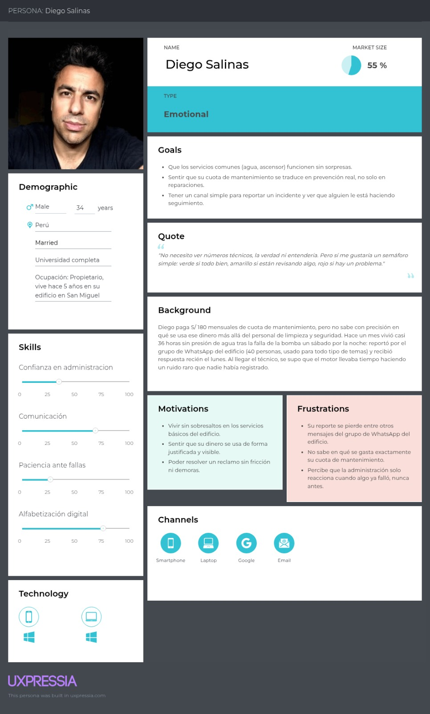
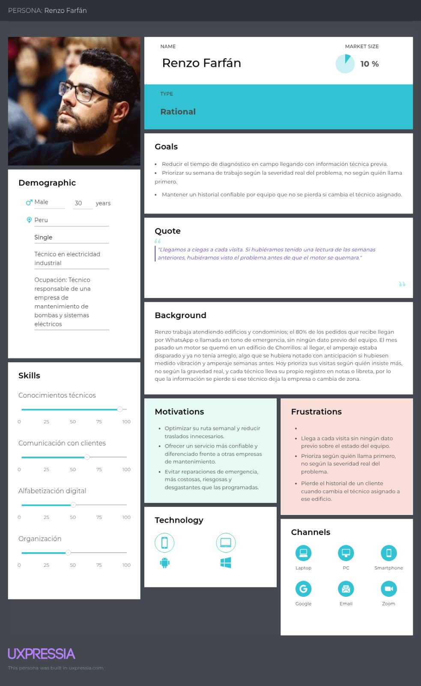
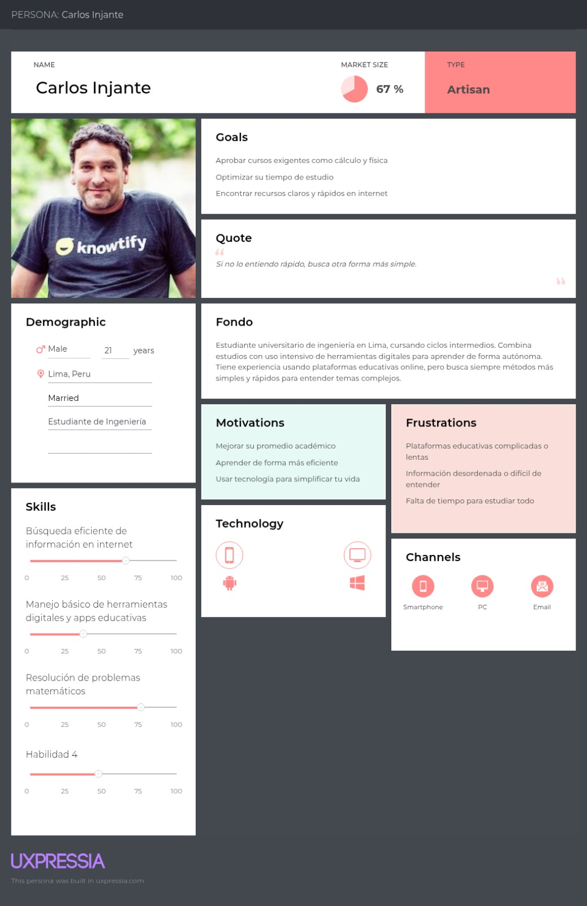
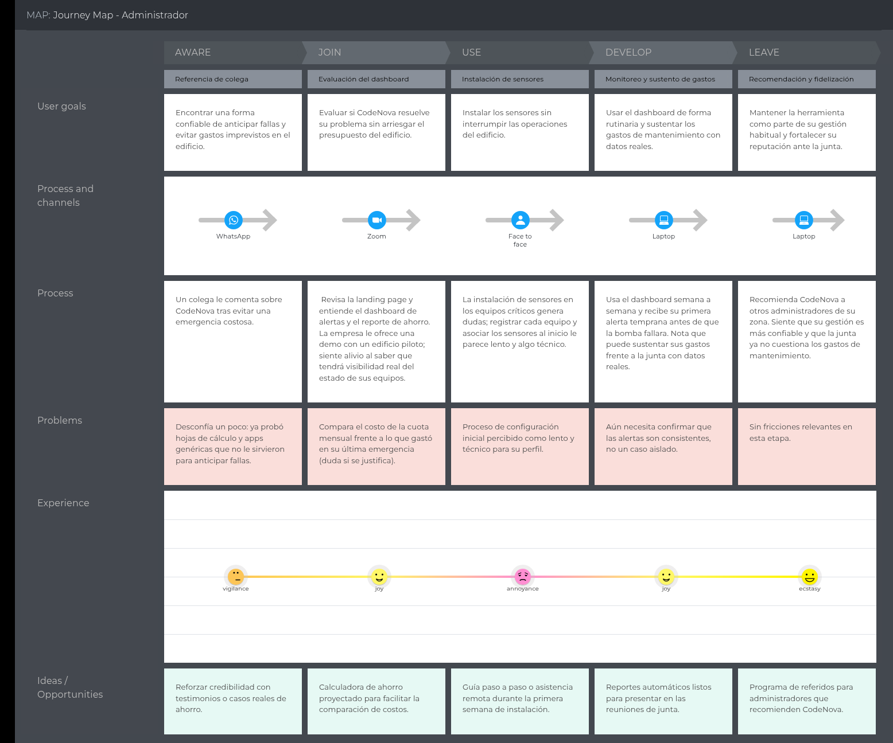
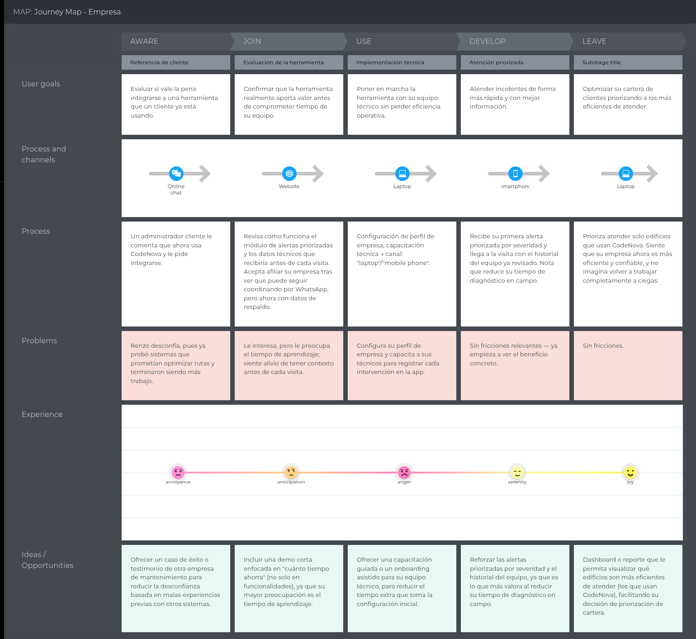
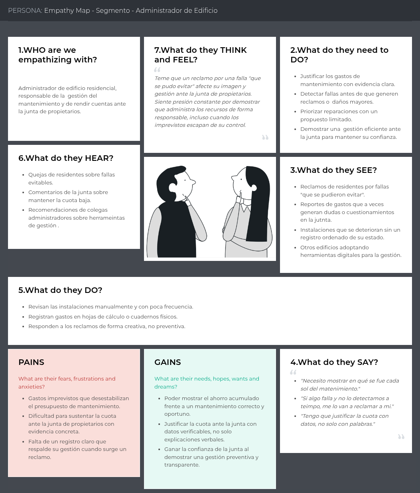
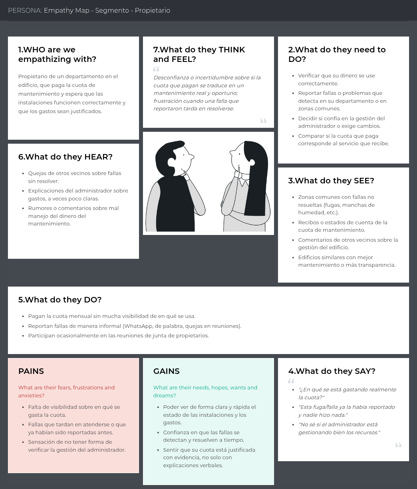
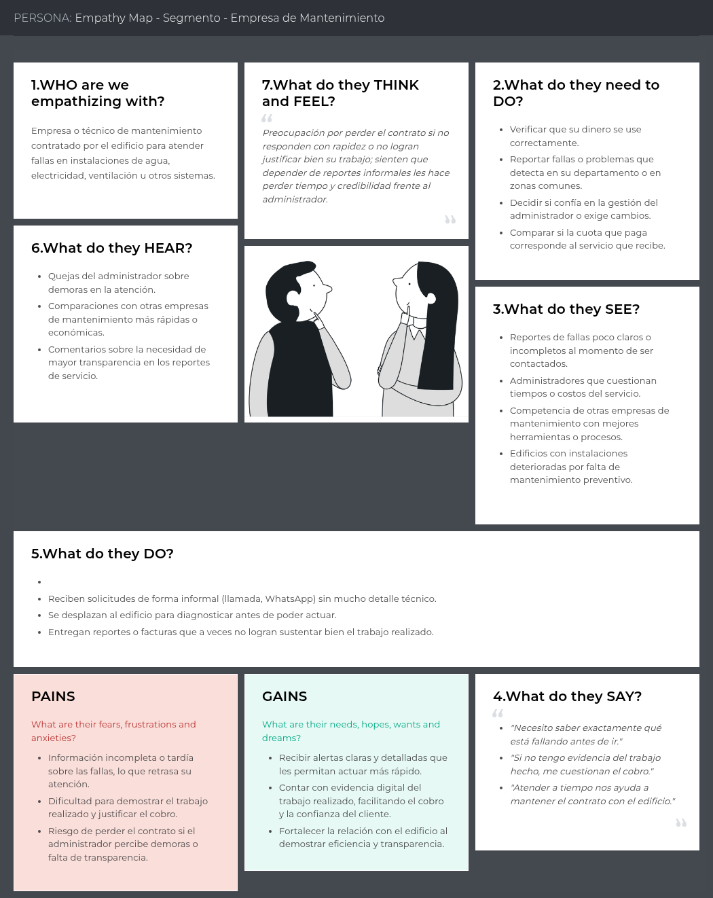

## 2.3. Needfinding

Para el proceso de Needfinding se consideró realizar entrevistas a los tres tipos de usuario previamente definidos: administradores de edificios y condominios, propietarios y residentes, y empresas de mantenimiento. El propósito de esta investigación es comprender las motivaciones, dificultades y necesidades reales de cada actor frente a la gestión del mantenimiento de los equipos críticos de un edificio multifamiliar en Lima Metropolitana.

Mediante este análisis se busca validar los supuestos iniciales planteados en el Lean UX Canvas (sección 1.2.2.2), como la existencia de una brecha entre la obligación legal de recaudar cuotas de mantenimiento y las herramientas disponibles para gestionarlo de forma anticipada, así como la relevancia de la confianza y la transparencia en el uso de esas cuotas. Los resultados permitirán identificar con mayor precisión los problemas que CodeNova debe resolver para cada segmento, y sentarán la base para la construcción de los User Personas, el User Journey Mapping y el Empathy Mapping.

### 2.3.1. User Personas

{width=100%}

{width=100%}

{width=100%}

### 2.3.2. User Task Matrix

**Segmento Objetivo #1**

| Actividades | Frecuencia | Importancia |
|:---|:---|:---|
| Revisar el estado de los equipos críticos del edificio (bombas, tableros, ascensor) | Con frecuencia | Alta |
| Coordinar y confirmar visitas con la empresa de mantenimiento | Con frecuencia | Alta |
| Registrar y dar seguimiento a solicitudes de residentes | Con frecuencia | Alta |
| Autorizar el pago de una reparación o intervención | A veces | Alta |
| Programar mantenimiento preventivo periódico | Con frecuencia | Alta |
| Sustentar los gastos de mantenimiento ante la junta de propietarios | A veces | Alta |
| Comunicar a los residentes el estado de una falla o visita | Con frecuencia | Media |
| Revisar boletas y consumo eléctrico del edificio | Con frecuencia | Media |
| Evaluar o buscar nuevas empresas de mantenimiento | A veces | Media |
| Cerrar y documentar una intervención realizada | Con frecuencia | Alta |

**Segmento Objetivo #2**

| Actividades | Frecuencia | Importancia |
|:---|:---|:---|
| Reportar un incidente o falla en áreas comunes | A veces | Alta |
| Hacer seguimiento al estado de un reporte enviado | A veces | Alta |
| Pagar la cuota de mantenimiento mensual | Con frecuencia | Alta |
| Consultar en qué se usa la cuota de mantenimiento | Rara vez | Media |
| Comunicarse con vecinos sobre problemas recurrentes (WhatsApp del edificio) | Con frecuencia | Media |
| Evaluar si un problema amerita reportarse o esperar a que se resuelva solo | Con frecuencia | Media |
| Participar en reuniones de junta de propietarios | A veces | Media |
| Recibir y leer comunicados de la administración | Con frecuencia | Baja |

**Segmento Objetivo #3**

| Actividades | Frecuencia | Importancia |
|:---|:---|:---|
| Recibir y atender pedidos de servicio de administradores | Con frecuencia | Alta |
| Priorizar qué edificio o equipo atender primero en la semana | Con frecuencia | Alta |
| Diagnosticar el estado de un equipo en campo | Con frecuencia | Alta |
| Registrar el historial de la intervención realizada | A veces | Alta |
| Coordinar horarios de acceso con el administrador o conserje | Con frecuencia | Media |
| Cotizar y gestionar la compra de repuestos | A veces | Alta |
| Entregar evidencia o reporte del trabajo realizado | A veces | Media |
| Comunicarse con otros técnicos sobre casos similares | A veces | Baja |
| Evaluar la adopción de nuevas herramientas o tecnología de monitoreo | A veces | Media |

### 2.3.3. User Journey Mapping

{width=80%}

{width=80%}

{width=80%}

### 2.3.4. Empathy Mapping

{width=80%}

{width=80%}

{width=80%}