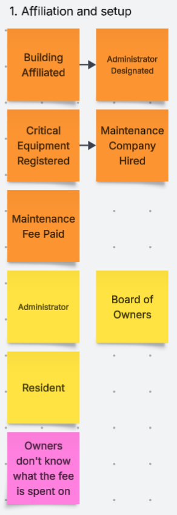
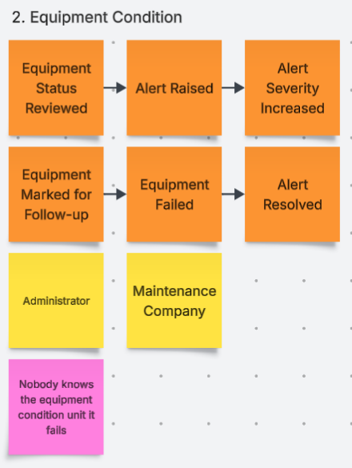
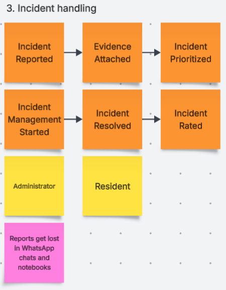
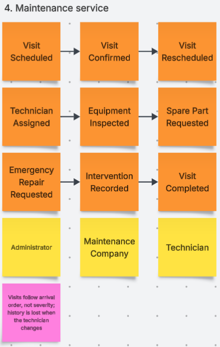
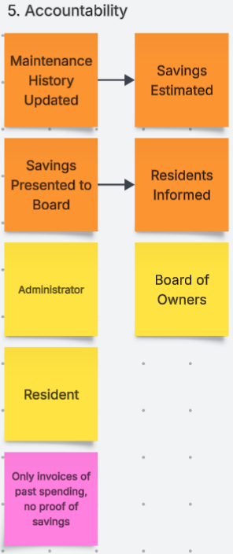

## 2.4. Big Picture Event Storming

 

<em>Figura 2.4-1 – Big Picture Event Storming (parte 1)</em>

 

<em>Figura 2.4-2 – Big Picture Event Storming (parte 2)</em>

 

<em>Figura 2.4-3 – Big Picture Event Storming (parte 3)</em>

 

<em>Figura 2.4-4 – Big Picture Event Storming (parte 4)</em>

 

<em>Figura 2.4-5 – Big Picture Event Storming (parte 5)</em>

