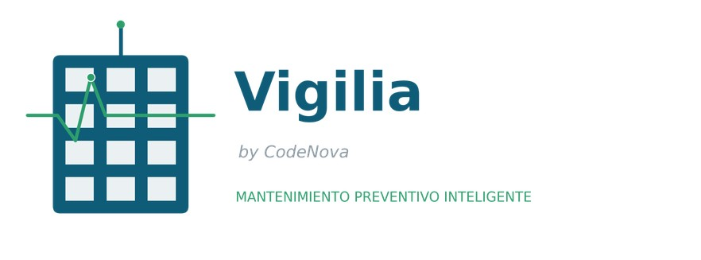

<!-- Fuente en el AV1: pp. 77-80. Migrar el contenido debajo de cada título. -->

## 4.1. Style Guidelines

El diseño gráfico de la plataforma CodeNova fue definido por el equipo mediante la aplicación de distintas estrategias orientadas a garantizar una estética coherente, una interfaz clara y una experiencia visual que transmita control y prevención, sin caer en la alarma constante. El diseño de nuestro logotipo busca encapsular los conceptos de monitoreo, prevención y confianza, que son los pilares de la plataforma.

Para la paleta de colores, se ha elegido un azul principal que transmite confianza, estabilidad y tecnología, elementos cruciales para una herramienta que administradores y empresas de mantenimiento usarán para tomar decisiones sobre equipos críticos. Este se complementa con un verde de acento que evoca prevención y control ('todo en orden'), y con una escala semántica de severidad (verde, amarillo, naranja y rojo) que es central en la propuesta de valor de CodeNova, ya que las alertas priorizadas por severidad son el corazón funcional del producto. El blanco y el gris claro aportan limpieza visual y mejoran la legibilidad de paneles con datos técnicos. La combinación busca proyectar una imagen seria y confiable, pero accesible incluso para administradores y residentes sin formación técnica.

### 4.1.1. General Style Guidelines

Aquí se sientan las bases de la identidad visual y verbal de la plataforma, asegurando consistencia en todas las pantallas. Nos hemos basado en principios de diseño inclusivo, considerando que CodeNova será usado tanto por perfiles técnicos (empresas de mantenimiento) como por usuarios sin formación técnica (residentes).

**Branding**
El logo debe representar el monitoreo preventivo y la conexión entre los actores del edificio. Se propone un diseño que combine dos elementos: un contorno simplificado de edificio (representando el condominio monitoreado) atravesado por una línea de pulso o señal (representando la lectura constante de los sensores IoT). Este concepto visual refuerza la propuesta de valor central: anticipar el desgaste antes de que se convierta en una falla.

  

 *Figura 28a. Logo Vigilia — versión horizontal (isotipo + wordmark)*
 

**Typography**

Se propone utilizar la familia tipográfica IBM Plex Sans, una fuente sans-serif de carácter técnico e industrial, pero con buena legibilidad en pantallas. Su estilo sobrio se alinea con el contexto de infraestructura y mantenimiento de equipos, sin perder calidez ni cercanía para los residentes.

- Escala base: 16px
- Interlineado: 1.5
- Weights (pesos): Regular, Medium, SemiBold, Bold
Nomenclatura tipográfica (NOMBRE / TAMAÑO / PESO):
- Heading 1: 32px / Bold (títulos de página principal, ej. nombre del edificio en el dashboard)
- Heading 2: 24px / SemiBold (títulos de sección, ej. 'Alertas activas')
- Heading 3: 20px / SemiBold (subtítulos o títulos de tarjetas de equipo)
- Base: 16px / Regular (párrafos y texto principal)
- Label: 14px / Medium (etiquetas de botones, campos de formulario y chips de severidad)
  
**Colors**

La paleta de colores está pensada para transmitir confianza y control, y para que la severidad de una alerta se reconozca de un vistazo.
- Azul Primario (#0F5C78): refuerza la sensación de estabilidad y tecnología (botones principales, navegación).
- Verde Prevención (#2E9E6D): indica que un equipo está en estado normal o que una acción preventiva fue exitosa.
- Gris Claro (#F4F6F8): proporciona limpieza visual (fondos).
- Gris Oscuro (#22303C): asegura legibilidad óptima (textos).
Semántica de severidad (elemento diferenciador de CodeNova, usado en alertas y en el estado tipo semáforo del residente):
- Verde (#2E9E6D): Normal / sin alerta.
- Amarillo (#F4B400): Severidad Baja.
- Naranja (#F2994A): Severidad Media/Alta.
- Rojo (#E53935): Severidad Crítica.
  
**Spacing**

La unidad base de 8px establece un ritmo visual que facilita la comprensión.
-8px: entre íconos y texto.
- 16px: entre párrafos y elementos de lista.
- 24px: relleno interno en tarjetas de equipo y alertas.
- 32px: separación entre secciones principales del dashboard.
- 48px: márgenes superiores e inferiores de la página.
- 
**Tono de Comunicación y Lenguaje Aplicado**
  
El tono debe ser Claro, Tranquilizador y Profesional. Buscamos un equilibrio que transmita control ante una alerta, sin sonar alarmista, y que sea comprensible tanto para un técnico como para un residente sin conocimientos técnicos.
- Tono: Sereno y confiable, incluso al comunicar una alerta crítica. Se evita el lenguaje alarmista tipo '¡Peligro!' y se prioriza un lenguaje orientado a la acción ('Requiere atención', 'Programar visita').
- Lenguaje: Claro y sencillo, evitando tecnicismos innecesarios para el residente (ej. 'Hay una alerta en la bomba de agua' en vez de 'Lectura de vibración fuera de rango en equipo HB-04').

### 4.1.2. Web Style Guidelines

[COMPLETAR]
