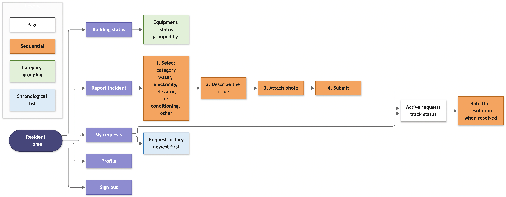
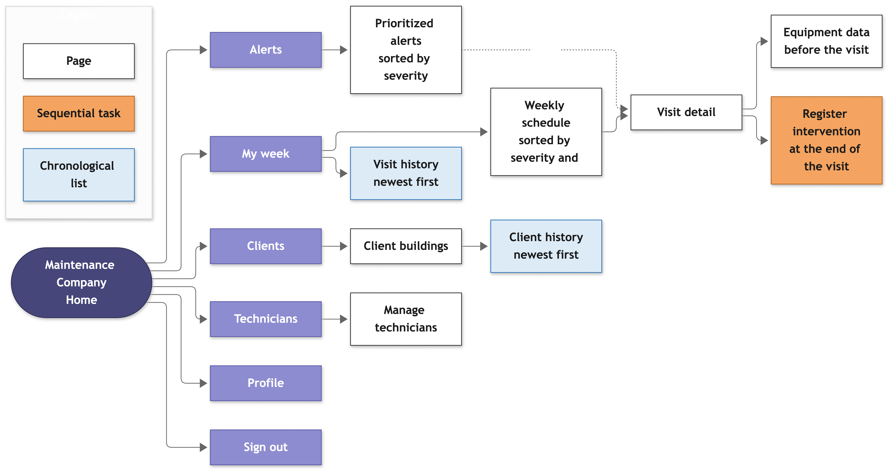

## 4.2. Information Architecture

En esta sección explicamos cómo organizamos el contenido del Landing Page y de la Web Application para que cada usuario encuentre rápido lo que necesita. Esto importa porque muchas veces el usuario entra en un momento de estrés: una alerta, una falla o un reclamo.

Diferenciamos dos cosas. El **diseño objetivo** es la aplicación completa, con las vistas de los tres roles. Lo **implementado en el Sprint 2** es la parte del administrador para Asset Monitoring y la parte del residente para Incidents. Cuando algo todavía no está construido, lo indicamos.

### 4.2.1. Organization Systems

Combinamos cuatro formas de organizar la información:

- **Jerárquica.** Es la principal: edificio → equipo → sensores, lecturas y alertas. En la aplicación se ve en el filtro de equipos por edificio y en el historial de lecturas por equipo.
- **Secuencial.** Para las tareas con pasos: reportar un incidente, asignar un sensor o, más adelante, programar una visita.
- **Por categoría.** Los equipos se agrupan por tipo (bomba de agua, tablero eléctrico, ascensor y HVAC) y los incidentes por categoría (agua, electricidad, ascensor, aire acondicionado y otro).
- **Cronológica.** Para el historial de lecturas y de incidentes, del más reciente al más antiguo.

Además, el diseño objetivo se organiza **por audiencia**:

- **Administrador.** Entra al panel de alertas, ordenado por severidad. Revisa el equipo afectado y, desde ahí, más adelante podrá programar una visita y ver el ahorro acumulado para la junta.
- **Residente.** Entra cuando nota una falla. Reporta el incidente, sigue su estado y lo califica cuando está resuelto.
- **Empresa de mantenimiento.** Entra por una alerta priorizada. Revisa su semana ordenada por severidad y zona, consulta los datos del equipo antes de la visita y registra la intervención al terminar.






Los tres diagramas siguen la misma lógica: una pantalla de inicio de la que salen las secciones principales del rol. El del administrador es el más grande, porque concentra edificios, alertas, incidentes, visitas y reportes. El del residente es el más simple.

### 4.2.2. Labeling Systems

Usamos etiquetas cortas y del lenguaje del usuario, no técnicas. La aplicación está en inglés por defecto y en español con el selector de idioma. Las etiquetas salen de los archivos `public/i18n/en.json` y `es.json`, así que en el informe y en la aplicación son las mismas.

**Menú principal (Sprint 2):**

| Opción | Inglés | Español | Ruta |
|:---|:---|:---|:---|
| Inicio | Home | Inicio | `/home` |
| Edificios | Buildings | Edificios | `/asset-monitoring/buildings` |
| Equipos | Equipment | Equipos | `/asset-monitoring/equipment` |
| Alertas | Alerts | Alertas | `/asset-monitoring/alerts` |
| Sensores | Sensors | Sensores | `/asset-monitoring/sensors` |
| Lecturas | Readings | Lecturas | `/asset-monitoring/readings` |
| Incidentes | Incidents | Incidentes | `/incidents` |

**Estados y niveles que ve el usuario:**

| Concepto | Valores en inglés | Valores en español |
|:---|:---|:---|
| Severidad de alerta | Low, Medium, High, Critical | Baja, Media, Alta, Crítica |
| Estado de alerta | Active, In progress, Resolved | Activa, En gestión, Resuelta |
| Estado de equipo | Operational, Requires follow-up, Out of service, Decommissioned | Operativo, Requiere seguimiento, Fuera de servicio, Dado de baja |
| Estado de sensor | Unassigned, Assigned, Monitoring, Disconnected, Inactive | Sin asignar, Asignado, Monitoreando, Desconectado, Inactivo |
| Estado de incidente | Received, In progress, Resolved | Recibido, En gestión, Resuelto |

Los botones dicen la acción de negocio, no la acción técnica: "New equipment" lleva al formulario, "Register" crea el equipo y "Save changes" guarda una edición. Para los cambios de estado usamos verbos claros: "In progress", "Resolve", "Decommission", "Assign", "Start management" y "Rate".

En el diseño objetivo el menú cambia según el rol. El residente tendrá "Home", "My requests" y "Profile", y la empresa de mantenimiento "My week", "Alerts" y "Clients".

### 4.2.3. SEO Tags and Meta Tags

El Landing Page es la página que tiene que aparecer en los buscadores. Sus etiquetas están en inglés, igual que el contenido del sitio:

```html
<title>Vigilia — Smart Preventive Maintenance</title>
<meta name="description" content="Vigilia: an IoT preventive maintenance platform for buildings and condominiums. Catch failures in pumps, panels and elevators before they become emergencies.">
<meta name="keywords" content="preventive maintenance, building maintenance, condominium, IoT sensors, water pump, elevator, electrical panel, Lima, Vigilia">
<meta name="author" content="CodeNova">
```

La Web Application no necesita posicionarse en buscadores, porque se entra desde el Landing Page. Solo lleva el título "Vigilia" y un título por vista, por ejemplo "Vigilia - Home".

### 4.2.4. Searching Systems

La aplicación tiene filtros que ayudan a encontrar rápido lo importante.

| Sistema | Descripción | Beneficio para el usuario | Estado |
|:---|:---|:---|:---|
| Alertas ordenadas por severidad | La tabla de alertas va de Critical a Low y arriba muestra cuántas hay de cada nivel. Un interruptor muestra u oculta las resueltas. | El administrador ve primero lo más grave sin leer cada alerta. | Sprint 2 |
| Filtro de equipos por edificio | Un selector muestra solo los equipos de un edificio. | Quien administra varios edificios no se confunde de edificio. | Sprint 2 |
| Historial de lecturas por equipo y fechas | Se elige un equipo y un rango de fechas. | El administrador revisa el comportamiento de un equipo en un periodo concreto. | Sprint 2 |
| Orden y paginación en tablas | Las tablas se ordenan por columna y se paginan. | Las listas largas siguen siendo manejables. | Sprint 2 |
| Búsqueda de empresas de mantenimiento | El administrador busca una empresa por RUC o nombre para vincularla a su edificio. | Vincula a su proveedor sin coordinar por fuera de la plataforma. | Sprint 3 |

### 4.2.5. Navigation Systems

**Implementado en el Sprint 2.** La navegación es una barra superior con las siete opciones del menú y el selector de idioma. La opción activa queda subrayada. Home lleva directo al panel de alertas, que es la vista principal del administrador. Desde las listas se pasa a los formularios ("New", "Edit", "Assign", "Rate") y cada formulario tiene "Cancel" para volver sin guardar. Las rutas son semánticas: `/asset-monitoring/equipment/3/edit` dice qué recurso se edita. Si el usuario escribe una ruta que no existe, ve una página 404 con un enlace a Home.

**Diseño objetivo.** El panel del administrador sumará el estado general del edificio, el ahorro acumulado y las últimas intervenciones. El residente navegará entre "Home" (semáforo de los equipos comunes), "My requests" y "Profile". La empresa de mantenimiento navegará entre "My week" (agenda priorizada), "Alerts" y "Clients". Cuando exista IAM, después de iniciar sesión cada usuario llegará a la pantalla de su rol.
