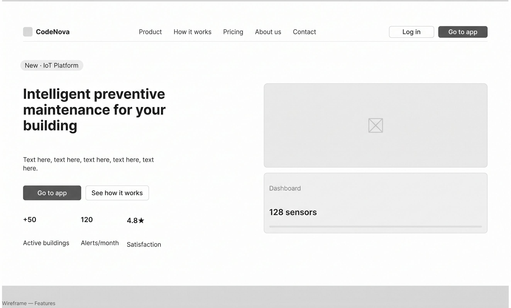
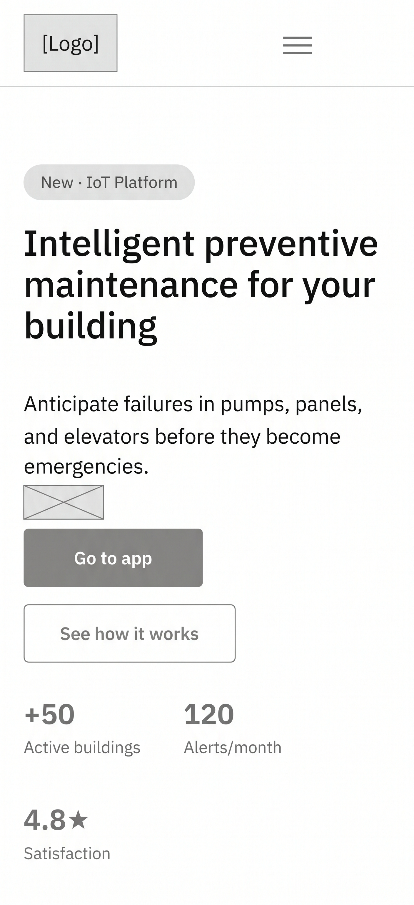
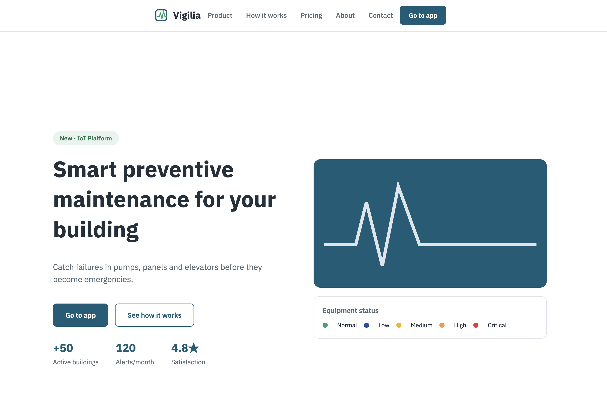
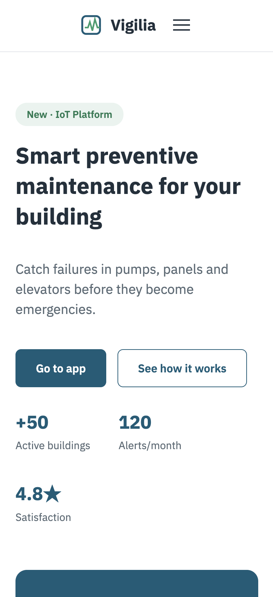

## 4.3. Landing Page UI Design

El Landing Page tiene que explicar en pocos segundos qué hace Vigilia: anticipar fallas antes de que se conviertan en emergencias. Está pensado para administradores y empresas de mantenimiento que todavía no conocen la plataforma. El diseño aplica las Style Guidelines de la sección 4.1 y la arquitectura de la sección 4.2.

La página sigue un orden de lectura: propuesta de valor, funciones, cómo funciona, planes, el equipo y contacto. En TB1 cambiamos el llamado a la acción principal. En el AV1 era "Solicitar demo"; ahora es "Go to app" y lleva a la Web Application, como pide el statement. El sitio está en inglés por defecto.

<!-- TODO (P2): reemplazar los wireframes y mock-ups por la versión en inglés con el botón "Go to app" -->

### 4.3.1. Landing Page Wireframe

**Desktop Web Browser.** El primer bloque tiene el titular, una frase corta, los dos botones de acción y tres datos rápidos (edificios activos, alertas por mes y satisfacción). A la derecha va una vista previa del estado de los equipos. Debajo vienen los tres pasos del servicio: instalar sensores, recibir alertas priorizadas y ahorrar en mantenimiento.

Decisiones de diseño:

- **Contraste.** Fondo blanco para que resalten los botones y los textos.
- **Repetición.** Botones con forma de píldora y tarjetas que se repiten en todas las secciones.
- **Proximidad y alineación.** Dos columnas: texto a la izquierda e imagen a la derecha. Lo relacionado va junto.
- **Minimalismo.** Mucho espacio en blanco. Parte del público no tiene formación técnica y una página cargada lo aleja.

**Mobile Web Browser.** Las secciones se apilan en una sola columna y se recorren con scroll. Los enlaces del menú pasan a un menú desplegable en la esquina superior derecha. Los botones principales van centrados y con un tamaño cómodo para el pulgar.

### 4.3.2. Landing Page Mock-up

**Desktop Web Browser.** El mock-up aplica la identidad de la sección 4.1. El Azul Primario (#0F5C78) va en la navegación y en los botones principales, y el Verde Prevención (#2E9E6D) en los detalles que transmiten control. La tipografía es IBM Plex Sans, con distintos pesos para separar titular, subtítulos y texto. Los colores de severidad solo aparecen en la vista previa del estado de los equipos, para no gastar su significado en adornos.

**Mobile Web Browser.** Mantiene los colores y la tipografía, en una sola columna. El menú desplegable libera espacio y el botón principal queda visible apenas carga la página.

En las dos versiones aplicamos varias heurísticas de Nielsen. El menú fijo arriba ayuda a ubicarse (visibilidad del estado). Las etiquetas usan palabras del usuario (relación con el mundo real). Los botones y tarjetas se ven igual en toda la página (consistencia). Solo se muestra lo esencial (diseño minimalista).
