## 4.4. Web Applications UX/UI Design

En esta sección están los wireframes, wireflows, mock-ups y user flows de la Web Application. Los diseños muestran el **diseño objetivo**, con las vistas de los tres roles. En el Sprint 2 implementamos una parte: Asset Monitoring para el administrador e Incidents para el residente (sección 5.2.2). En la implementación usamos una barra de navegación superior en lugar del menú lateral de los diseños, siguiendo el layout del proyecto de referencia del curso.

### 4.4.1. Web Applications Wireframes

Los wireframes definen la estructura de cada vista sin colores ni imágenes finales. Todas comparten el mismo esqueleto: menú a la izquierda, título de la vista arriba y el contenido en tarjetas o tablas. Los diseños completos están en Figma: <https://www.figma.com/design/jNGWsrdmqjlwTasD1MXpMV/CodeNova?node-id=2022-6613>

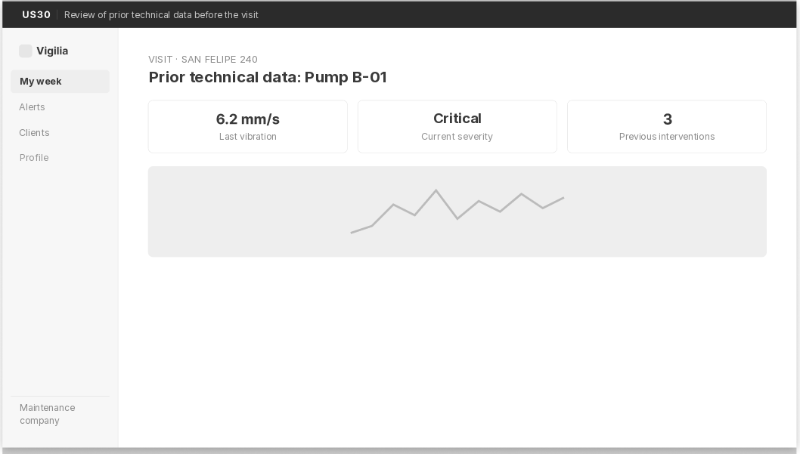

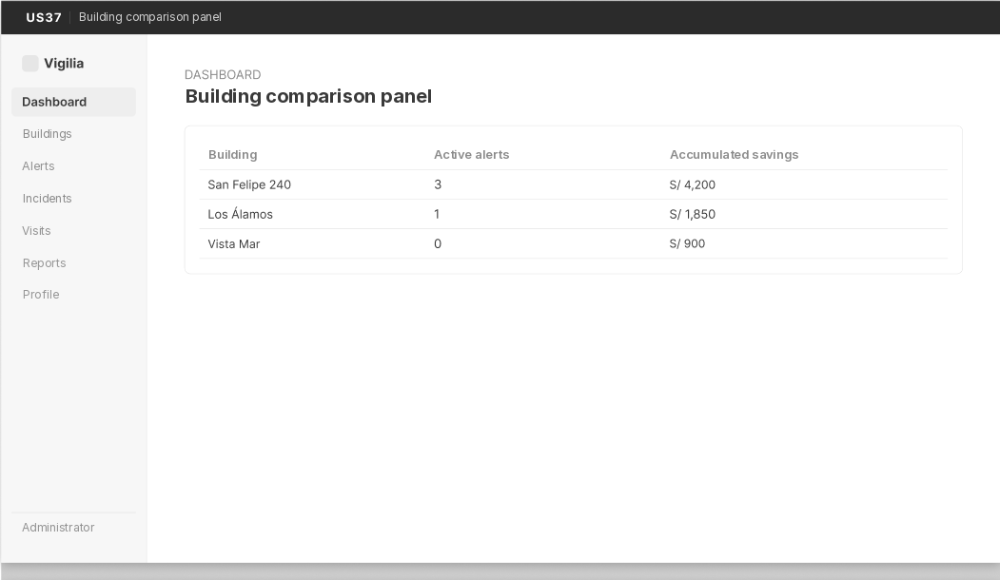

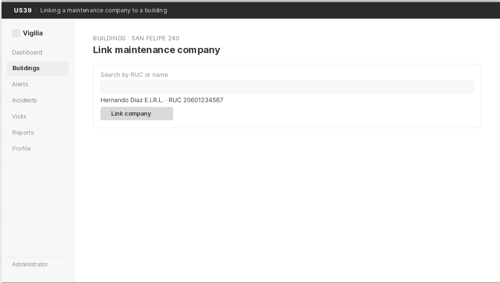

**Principios de diseño:**

- **Contraste.** Los botones principales usan el Azul Primario y los chips de severidad sus colores semánticos, sobre fondo blanco o gris claro.
- **Alineación.** Textos y títulos alineados a la izquierda, como en "Active alerts" o en el detalle de un equipo.
- **Repetición.** Las tarjetas se repiten para alertas, incidentes y visitas, y la navegación es la misma en todas las vistas.
- **Proximidad.** En el detalle de un equipo, los datos del equipo van juntos arriba y el historial de lecturas va en su propio bloque.

**Heurísticas de Nielsen aplicadas:**

- **Visibilidad del estado del sistema.** Cada alerta muestra su severidad y cada incidente su estado (Received, In progress, Resolved).
- **Relación con el mundo real.** El residente ve palabras simples como "Report incident", no términos como "lectura fuera de rango".
- **Control y libertad.** Cada formulario tiene "Cancel" para volver sin guardar.
- **Consistencia.** Los botones principales tienen el mismo color y forma en todas las vistas.
- **Prevención de errores.** Dar de baja un equipo pide confirmación. Un sensor que ya tiene equipo no se puede asignar a otro.
- **Reconocer antes que recordar.** El menú siempre está visible, con etiquetas cortas.
- **Diseño minimalista.** Cada vista muestra solo lo necesario para su tarea.
- **Ayudar a recuperarse de errores.** Si no hay lecturas en un rango de fechas, la vista lo dice con un mensaje claro en lugar de quedar vacía.

### 4.4.2. Web Applications Wireflow Diagrams

Los wireflows combinan los wireframes con la secuencia de pasos que sigue el usuario para cumplir un objetivo.

**Wireflow 1: Reporte de incidente y seguimiento**

- **User goal:** Como residente, después de notar una falla en un área común, quiero reportarla en segundos y ver que alguien la está atendiendo, sin depender del grupo de WhatsApp del edificio.
- **User persona:** Diego Salinas (residente).
- **User stories:** US23, US24 y US25.

1. El residente entra a "Incidents" y presiona "Report incident".
2. Elige el edificio, la categoría (agua, electricidad, ascensor, aire acondicionado u otro) y escribe una descripción corta. Si sabe qué equipo falló, lo elige.
3. En el diseño objetivo puede adjuntar una foto (US24, Sprint 3).
4. Al enviar, el incidente aparece en la lista con estado "Received".
5. El residente vuelve a la lista cuando quiere y ve el estado actualizado: Received → In progress → Resolved.

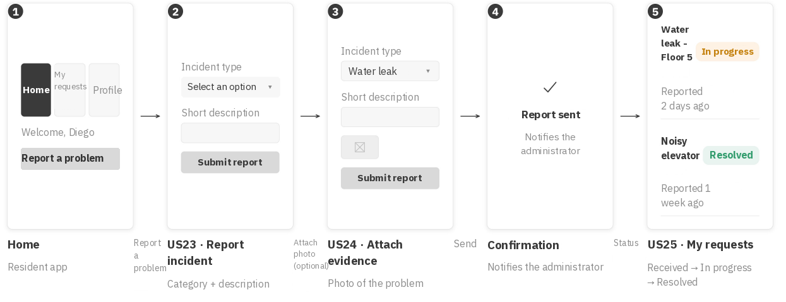

**Wireflow 2: Registro de equipo y asignación de sensor**

- **User goal:** Como administrador, quiero registrar un equipo crítico de mi edificio y asignarle un sensor, para que la plataforma empiece a monitorearlo.
- **User persona:** Carlos Injante (administrador).
- **User stories:** US08 y US10.

1. El administrador entra a "Equipment" y presiona "New equipment".
2. Elige el edificio y completa código, nombre, tipo, ubicación, fecha de instalación y estado.
3. Al registrarlo, el equipo aparece en la lista de su edificio.
4. En "Sensors" elige un sensor sin asignar y presiona "Assign".
5. Elige el equipo y confirma. Desde ese momento las lecturas de ese sensor aparecen en el historial del equipo.

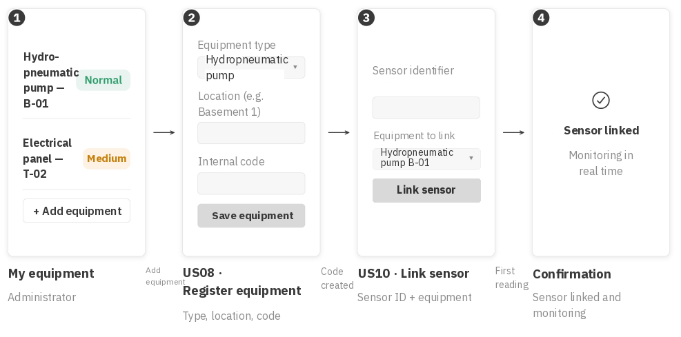

<!-- TODO (P2): actualizar el wireflow 2 en Figma; la imagen todavía muestra la asociación del sensor desde la ficha del equipo -->

**Wireflow 3: Programación y confirmación de una visita preventiva**

- **User goal:** Como administrador, al recibir una alerta, quiero programar una visita con la empresa de mantenimiento y que esta la confirme, para intervenir antes de que la falla se agrave.
- **User personas:** Carlos Injante (administrador) y Renzo Farfán (empresa de mantenimiento).
- **User stories:** US28 y US29.

1. El administrador abre una alerta activa y presiona "Schedule visit".
2. Elige la empresa de mantenimiento del edificio y una fecha.
3. La visita se crea con estado "Proposed" y la empresa recibe un aviso.
4. La empresa revisa la propuesta y la confirma o propone otra fecha.
5. Cuando se confirma, la visita pasa a "Confirmed" y ambos ven la fecha final.

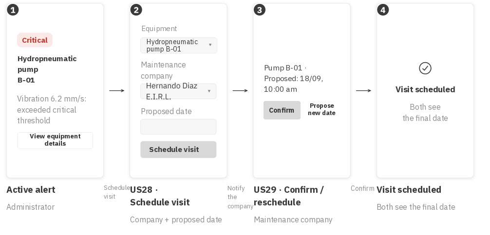

**Wireflow 4: Priorización semanal y registro de intervención**

- **User goal:** Como técnico de mantenimiento, quiero ver mi semana priorizada por severidad y, al terminar cada visita, registrar lo que hice.
- **User persona:** Renzo Farfán (empresa de mantenimiento).
- **User stories:** US32, US30 y US31.

1. El técnico entra a "My week" y ve sus visitas ordenadas por severidad y zona.
2. Antes de salir, abre el detalle del equipo y revisa las últimas lecturas y las intervenciones anteriores.
3. Hace la visita con ese contexto.
4. Al terminar, registra la intervención: trabajo realizado, materiales, costo preventivo y estado final del equipo.
5. La visita pasa a "Completed" y el equipo queda con el estado que registró el técnico. Si quedó operativo, la plataforma calcula el ahorro estimado.

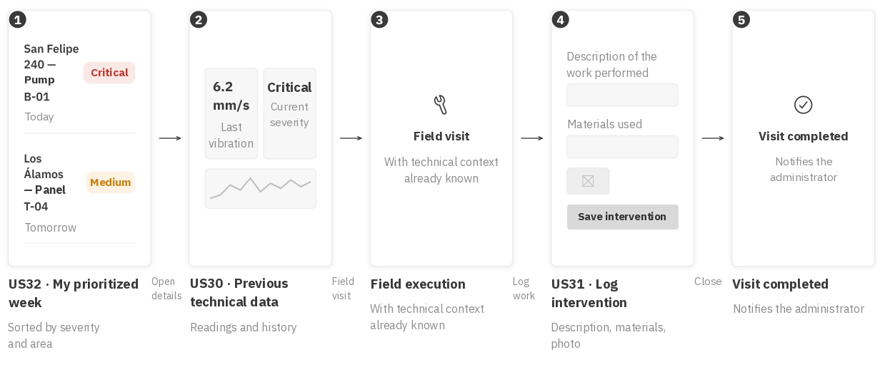

**Wireflow 5: Registro e inicio de sesión por rol**

Este flujo es de IAM y se implementa en el último sprint (sección 3.3). Lo dejamos diseñado para que el resto de vistas sepa a dónde llega cada rol.

- **User goal:** Como usuario nuevo, quiero registrarme según mi rol y luego iniciar sesión para usar las herramientas que me corresponden.
- **User personas:** los tres.
- **User stories:** US01, US02, US04 y US05.

1. El usuario elige su rol y completa el formulario de registro.
2. La plataforma valida los datos propios del rol, como el código del edificio o el RUC.
3. Al terminar el registro, la plataforma lo lleva a la pantalla de inicio de sesión. Registrarse no inicia sesión.
4. El usuario ingresa su correo y contraseña.
5. La plataforma lo lleva a la vista de su rol: panel de alertas, inicio del residente o "My week".

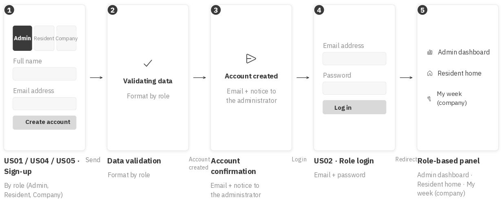

### 4.4.3. Web Applications Mock-ups

Los mock-ups son la versión de alta fidelidad de los wireframes. Aplican la paleta de la sección 4.1: Azul Primario para navegación y acciones principales, Verde Prevención para estados positivos y la escala de severidad solo en alertas. Los componentes se repiten en todas las vistas: tarjetas, chips de severidad y botones redondeados.

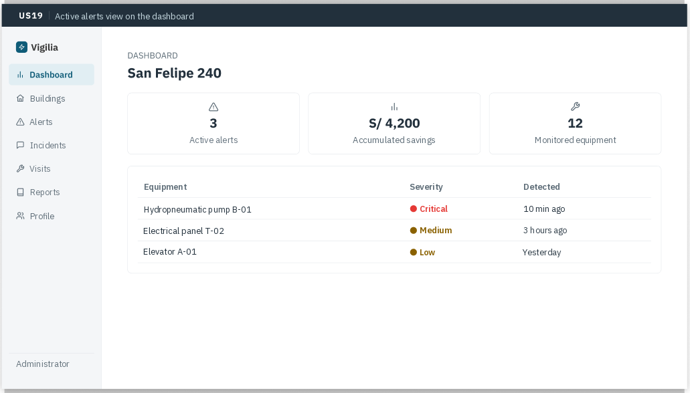

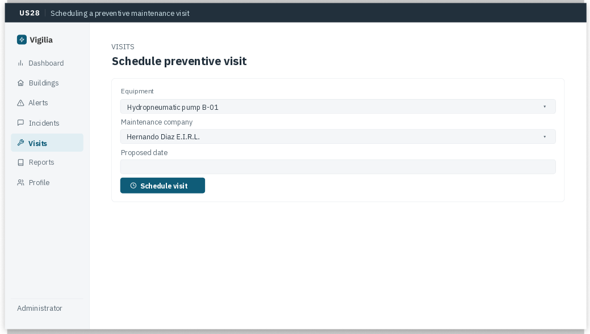

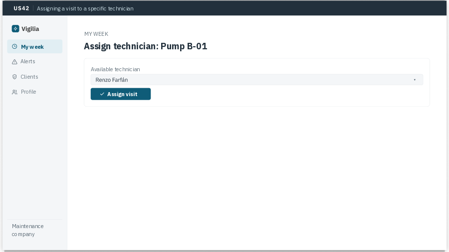

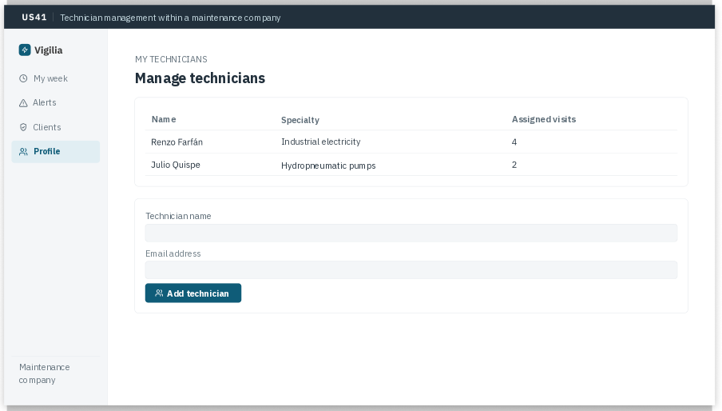

Los mock-ups cubren las vistas que necesitan los flujos de la sección 4.4.2:

- **Residente:** lista de incidentes → reporte → seguimiento.
- **Administrador:** panel de alertas → detalle de la alerta → programar visita → ahorro acumulado.
- **Empresa de mantenimiento:** "My week" → datos técnicos del equipo → registro de intervención.

### 4.4.4. Web Applications User Flow Diagrams

Hicimos un user flow por cada user goal. Cada uno tiene su camino feliz (happy path) y un camino alternativo (unhappy path), dibujados sobre los mock-ups.

**User Flow 1: Reportar un incidente**

- **User goal:** Como residente, quiero reportar una falla que noté en un área común y saber que quedó registrada, sin llamar ni escribir al grupo del edificio.
- **User persona:** Diego Salinas (residente).
- **User stories:** US23, US24 y US25.

*Happy path:*

1. El residente presiona "Report incident".
2. Elige la categoría y describe lo que pasó.
3. Si quiere, adjunta una foto.
4. Envía el reporte. La plataforma lo registra al momento.
5. Vuelve a la lista y ve su incidente con estado "Received".

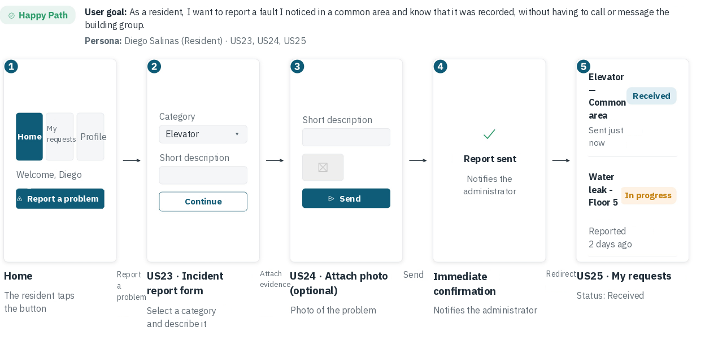

*Unhappy path: la foto pesa más de 5 MB.*

1. El residente elige una foto de su galería.
2. La plataforma detecta que pasa el límite.
3. Muestra "The file exceeds the maximum size (5 MB)" sin borrar el resto del formulario.
4. El residente elige otra foto o sigue sin foto.
5. El reporte se envía igual, con o sin foto.

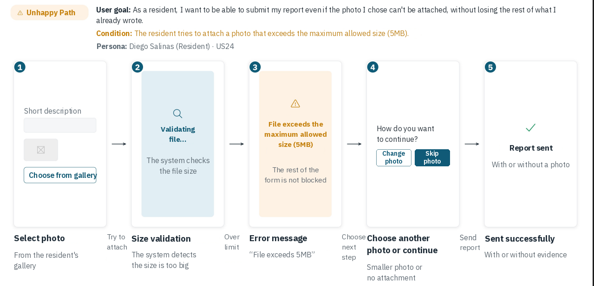

**User Flow 2: Recibir y atender una alerta priorizada**

- **User goal:** Como empresa de mantenimiento, quiero recibir una alerta priorizada, revisar el contexto técnico y confirmar la visita, sin llamar al administrador para pedir más datos.
- **User persona:** Renzo Farfán (empresa de mantenimiento).
- **User stories:** US21, US30 y US29.

*Happy path:*

1. Recibe un aviso dentro de la aplicación por una alerta crítica en un edificio que atiende.
2. Abre el detalle de la alerta: severidad, equipo y últimas lecturas.
3. Revisa el historial del equipo para tener contexto.
4. Confirma la visita en la fecha que propuso el administrador.
5. La visita queda "Confirmed" y aparece en "My week".

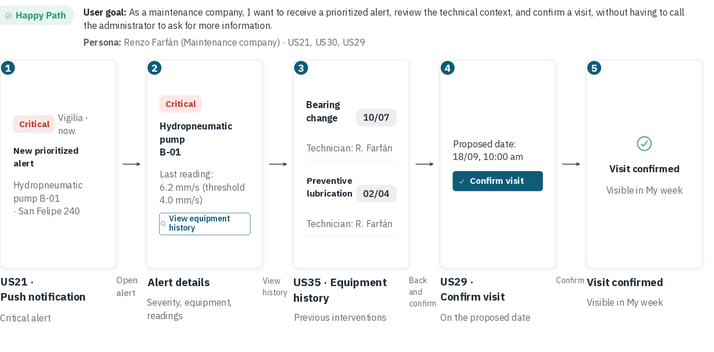

*Unhappy path: la empresa no puede ir en la fecha propuesta.*

1. En el detalle de la alerta revisa la fecha propuesta.
2. Como no tiene disponibilidad, presiona "Propose another date".
3. Elige una fecha nueva y la envía.
4. El administrador recibe el aviso y aprueba la nueva fecha.
5. La visita queda "Confirmed" con la fecha nueva.

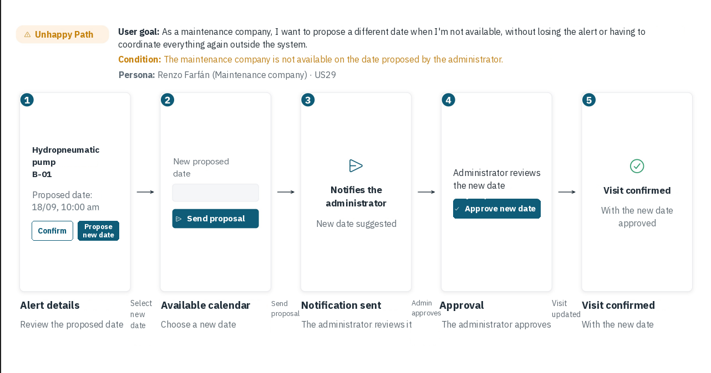

**User Flow 3: Programar una visita preventiva desde una alerta**

- **User goal:** Como administrador, al ver una alerta de severidad alta, quiero programar una visita preventiva en pocos pasos, para intervenir antes de que la falla se agrave.
- **User persona:** Carlos Injante (administrador).
- **User stories:** US19 y US28.

*Happy path:*

1. En el panel de alertas ve las alertas activas ordenadas por severidad.
2. Abre la alerta más grave.
3. Presiona "Schedule visit".
4. Elige la empresa de mantenimiento y una fecha.
5. Confirma. La visita queda "Proposed" y la empresa recibe un aviso.

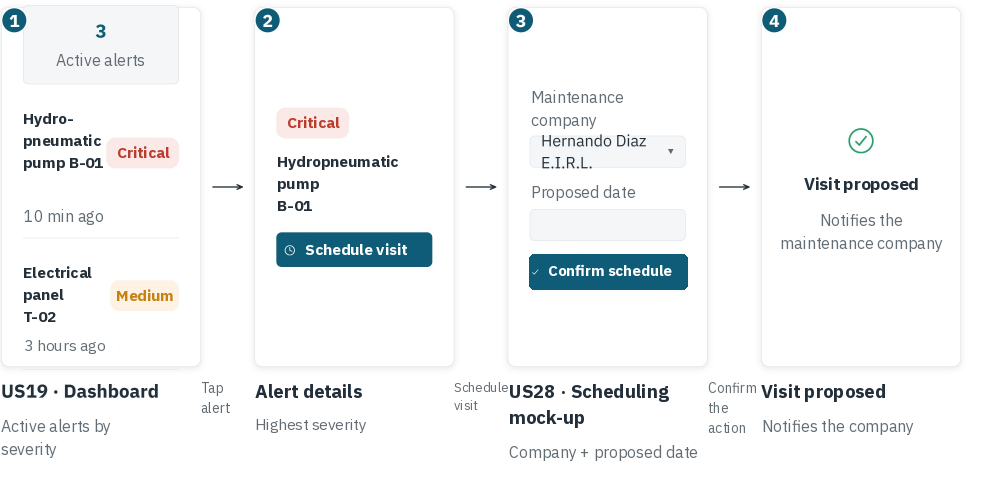

*Unhappy path: el equipo ya tiene una visita programada.*

1. Desde el detalle de la alerta presiona "Schedule visit".
2. La plataforma detecta que el equipo ya tiene una visita activa.
3. Muestra "This equipment already has a visit scheduled for [date]" y ofrece ver esa visita.
4. El administrador revisa la visita existente.
5. No se crea una visita duplicada.

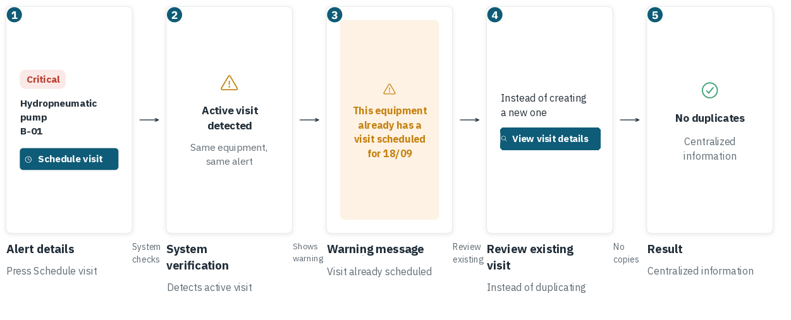
