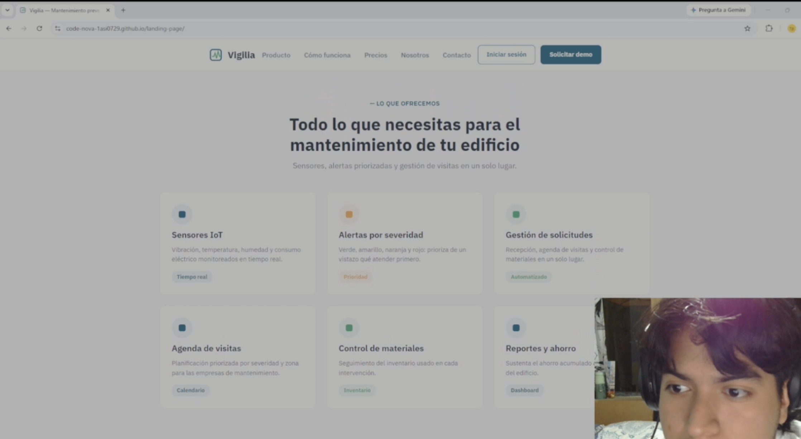

## 4.5. Web Applications Prototyping

Armamos un prototipo navegable en Figma a partir de los mock-ups de la sección 4.4.3. Sirve para recorrer los flujos principales antes de programarlos y para mostrarlos en la exposición.

- **Prototipo en Figma:** <https://www.figma.com/design/jNGWsrdmqjlwTasD1MXpMV/CodeNova?node-id=2022-6613>
- **Video del prototipo:** https://acortar.link/koLkSz
- **Duración:** 02:45

