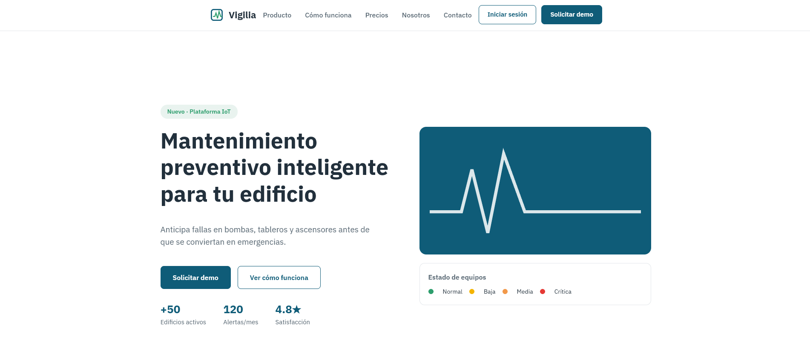
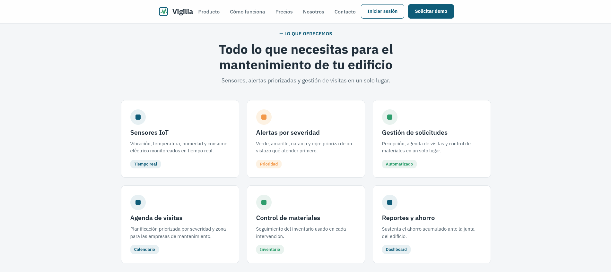
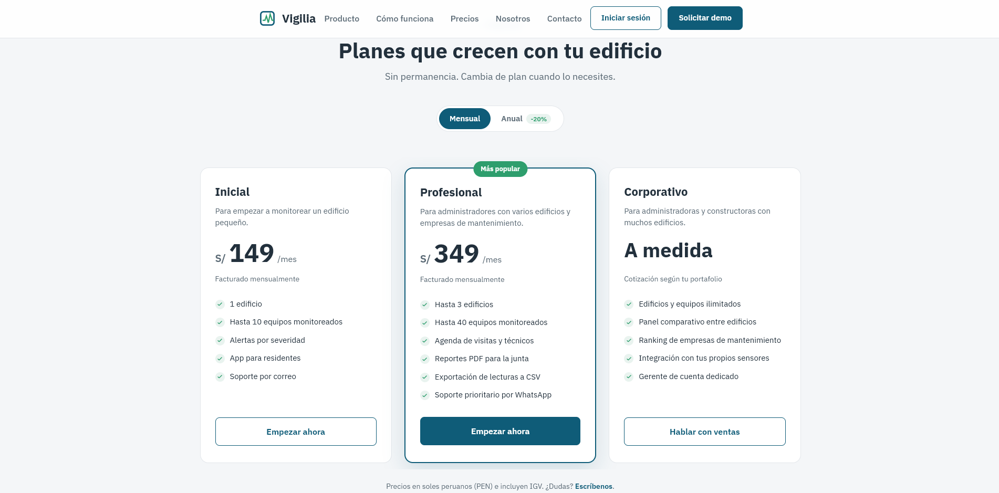
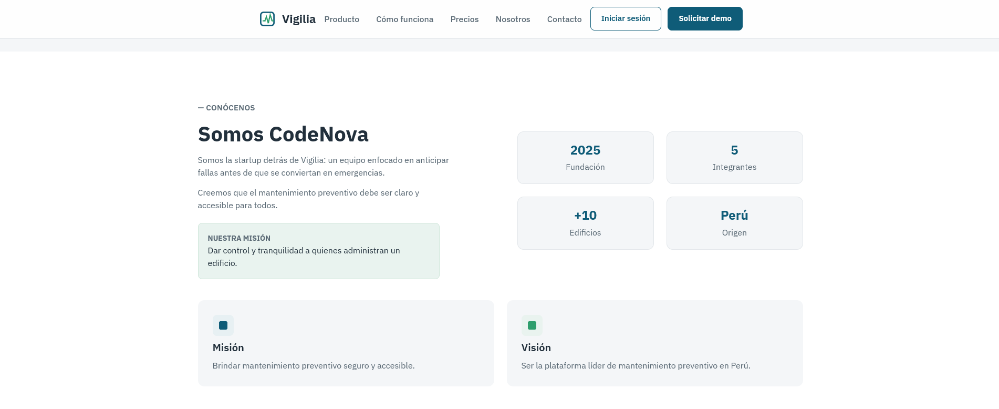
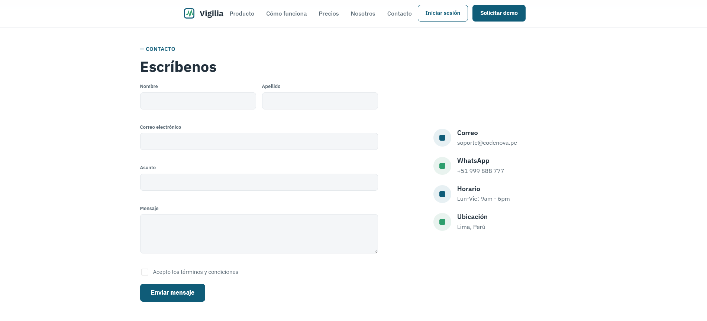
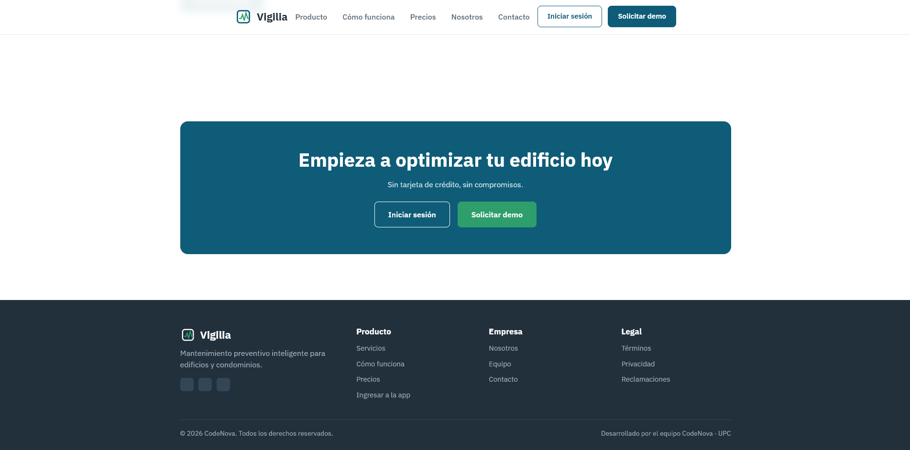
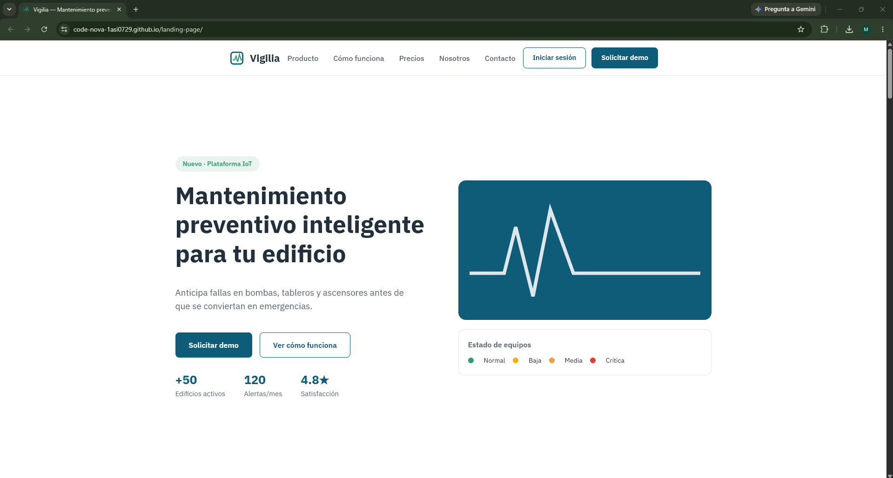

### 5.2.1. Sprint 1

El Sprint 1 tuvo un objetivo concreto: publicar la primera versión del Landing Page para la entrega AV1. En el planning también incluimos el registro y el inicio de sesión, pero esa parte no se llegó a implementar. En el Sprint 2 explicamos por qué la movimos al final del backlog (sección 5.2.2.1).

#### 5.2.1.1. Sprint Planning 1

La reunión de planning se hizo de forma virtual. En ella definimos el goal, revisamos las historias del landing page y repartimos las tareas.

| Sprint # | Sprint 1 |
|:---|:---|
| **Sprint Planning Background** | |
| Date | 2026-09-02 |
| Time | 12:00 PM |
| Location | Reunión virtual en Google Meet |
| Prepared By | Valladolid Jiménez, Arturo Fernando / Romero Veliz, Matthias Alonso |
| Attendees (to planning meeting) | Valladolid Jiménez, Arturo Fernando / Diaz Vargas, Fernanda Ysabella / Romero Veliz, Matthias Alonso / Salazar Miranda, Mateo Paolo |
| Sprint 0 Review Summary | No aplica. Es el primer sprint del proyecto. |
| Sprint 0 Retrospective Summary | No aplica. Es el primer sprint del proyecto. |
| **Sprint Goal & User Stories** | |
| Sprint 1 Goal | Nuestro foco es dar a los visitantes y futuros administradores una primera impresión confiable de Vigilia y un punto de entrada a la plataforma. Creemos que esto genera confianza en los administradores que buscan una forma de prevenir fallas en su edificio. Lo confirmaremos cuando un visitante pueda ver el Landing Page desde cualquier dispositivo y solicitar una demo sin ayuda del equipo. |
| Sprint 1 Velocity | 18 story points |
| Sum of Story Points | 18 (US48: 2, US49: 2, US50: 3, US01: 3, US02: 3, US07: 2, US08: 3) |

#### 5.2.1.2. Aspect Leaders and Collaborators

En el Sprint 1 el trabajo de implementación fue el Landing Page. Lo dividimos en cuatro aspectos, uno por grupo de secciones del sitio. Cada aspecto tuvo un líder y los demás colaboraron revisando y ajustando.

| Team Member (Last Name, First Name) | GitHub Username | Hero y Navbar | Nosotros y Equipo | Soluciones y Footer | Idioma y Animaciones |
|:---|:---|:---:|:---:|:---:|:---:|
| Valladolid Jiménez, Arturo Fernando | artuvall | C | C | C | L |
| Diaz Vargas, Fernanda Ysabella | Fern9901 | C | C | L | C |
| Romero Veliz, Matthias Alonso | AlonsoVelizUpc | L | C | C | C |
| Salazar Miranda, Mateo Paolo | mateossm | C | L | C | C |

#### 5.2.1.3. Sprint Backlog 1

El Sprint 1 incluyó las historias del Landing Page y las primeras historias de registro y de edificios. La tabla muestra el estado de cada tarea al cierre del sprint. Las tareas del RESTful API y del login quedaron en To-do y pasaron al backlog, porque en el Sprint 2 cambiamos la prioridad hacia los bounded contexts core.

<!-- TODO: captura del tablero del Sprint 1 en Trello y su URL pública -->

| Sprint # | Sprint 1 | | | | | | |
|:---|:---|:---|:---|:---|:---|:---|:---|
| **User Story** | | **Work-Item / Task** | | | | | |
| Story Id | Story Title | Task Id | Task Title | Task Description | Estimation (Hours) | Assigned To | Status |
| US48 | Visualización de la landing page informativa | T01 | Maquetar la sección hero y la propuesta de valor (HTML y CSS) | Maquetar el hero, la barra de navegación y la propuesta de valor según el mock-up. | 6 | Romero Veliz, Matthias Alonso | Done |
| US48 | Visualización de la landing page informativa | T02 | Implementar las secciones "Cómo funciona" y "Nosotros" | Agregar las secciones de pasos y del equipo. | 5 | Salazar Miranda, Mateo Paolo | Done |
| US49 | Solicitud de demo desde la landing page | T03 | Formulario de contacto con validación de correo | Crear el formulario de solicitud de demo y validar que el correo tenga un formato válido. | 4 | Romero Veliz, Matthias Alonso | Done |
| US50 | Onboarding guiado para nuevo administrador | T04 | Diseñar los pasos del tutorial guiado (wireframe) | Definir en Figma los pasos del recorrido guiado para un administrador nuevo. | 3 | Salazar Miranda, Mateo Paolo | Done |
| US01 | Registro de administrador con validación de edificio | T05 | Endpoint POST de registro de administrador (Spring Boot) | Crear el endpoint que registra al administrador y su edificio. | 6 | Romero Veliz, Matthias Alonso | To-do |
| US01 | Registro de administrador con validación de edificio | T06 | Formulario de registro en Angular con validaciones | Crear el formulario de registro con sus validaciones. | 5 | Diaz Vargas, Fernanda Ysabella | To-do |
| US02 | Inicio de sesión por rol | T07 | Endpoint POST de inicio de sesión con JWT | Crear el endpoint que valida credenciales y devuelve un token JWT. | 6 | Romero Veliz, Matthias Alonso | To-do |
| US02 | Inicio de sesión por rol | T08 | Pantalla de inicio de sesión y guard de rutas | Crear la vista de inicio de sesión y proteger las rutas con un guard. | 5 | Diaz Vargas, Fernanda Ysabella | To-do |
| US07 | Registro de un edificio y sus datos generales | T09 | Endpoint POST `/buildings` | Crear el endpoint que registra un edificio. | 4 | Romero Veliz, Matthias Alonso | To-do |
| US08 | Registro de equipos críticos del edificio | T10 | Endpoint POST `/equipment` | Crear el endpoint que registra un equipo crítico. | 5 | Romero Veliz, Matthias Alonso | To-do |
| — | Configuración transversal | T11 | Agregar el selector de idioma y las animaciones del sitio | Agregar el cambio de idioma y las animaciones de entrada de las secciones. | 3 | Valladolid Jiménez, Arturo Fernando | Done |
| — | Configuración transversal | T12 | Configurar y publicar el Landing Page en GitHub Pages | Activar GitHub Pages sobre la rama `main` y revisar el sitio publicado. | 3 | Valladolid Jiménez, Arturo Fernando | Done |

#### 5.2.1.4. Development Evidence for Sprint Review

En el Sprint 1 implementamos el Landing Page en el repositorio `landing-page`. Trabajamos directo sobre `main` y varias subidas se hicieron desde la web de GitHub. Eso dejó mensajes de commit poco claros. Lo corregimos desde el Sprint 2 con GitFlow y Conventional Commits (sección 5.1.2).

| Repository | Branch | Commit Id | Commit Message | Commit Message Body | Committed on (Date) |
|:---|:---|:---|:---|:---|:---|
| code-nova-1asi0729/landing-page | main | 519b96d | feat: initial release of landing page website | Primera versión del sitio: estructura HTML, estilos y script de navegación. | 17/09/2026 |
| code-nova-1asi0729/landing-page | main | 69bcdeb | Add files via upload | Agrega los extras del landing (`landing-extras.js`) y un primer prototipo de vistas de la aplicación. | 18/09/2026 |
| code-nova-1asi0729/landing-page | main | 54dc142 | Add files via upload | Vuelve a subir el sitio completo (HTML, CSS y JS) alineado al mock-up. | 18/09/2026 |
| code-nova-1asi0729/landing-page | main | 2daa7ce | Add files via upload | Reorganiza el contenido de `index.html`. | 18/09/2026 |
| code-nova-1asi0729/landing-page | main | 46d3c61 | feat: add new team member to landing page | Tarjetas del equipo en la sección "Nosotros". | 18/09/2026 |
| code-nova-1asi0729/landing-page | main | 4532dcc | Add files via upload | Agrega imágenes y favicon, y ajusta el script de navegación. | 18/09/2026 |
| code-nova-1asi0729/landing-page | main | 1f21b16 | Add files via upload | Ajustes finales de estilos y contenido. Es la versión publicada al cierre del sprint. | 18/09/2026 |

#### 5.2.1.5. Execution Evidence for Sprint Review

Al cierre del sprint el Landing Page muestra la propuesta de valor, las funciones principales, los planes, el equipo y un formulario de contacto. Las capturas son del sitio publicado.

#### 5.2.1.6. Services Documentation Evidence for Sprint Review

En el Sprint 1 no implementamos Web Services, así que no hay endpoints que documentar. El Landing Page es un sitio estático y no consume ningún API. La documentación de endpoints empieza en el Sprint 2 con el fake API (sección 5.2.2.6).

#### 5.2.1.7. Software Deployment Evidence for Sprint Review

Publicamos el Landing Page en GitHub Pages. Los pasos fueron:

1. En el repositorio `landing-page`, entrar a *Settings > Pages*.
2. En *Build and deployment*, elegir *Deploy from a branch*, la rama `main` y la carpeta raíz.
3. Guardar y esperar a que GitHub termine el despliegue.
4. Abrir la URL publicada y revisar cada sección.

URL del sitio: <https://code-nova-1asi0729.github.io/landing-page/>

#### 5.2.1.8. Team Collaboration Insights during Sprint

Cada integrante lideró un aspecto del Landing Page y revisó el trabajo de los demás. Diseñamos primero en Figma y luego pasamos a HTML y CSS. Al inicio costó que lo implementado se viera igual que el mock-up. Lo resolvimos revisando juntos cada sección antes de subirla.

Lo que no salió bien fue el manejo del repositorio. Trabajamos sobre `main`, sin ramas `feature`, y varias subidas se hicieron arrastrando archivos en la web de GitHub. Por eso hay commits como "Add files via upload" o "Delete app directory". En el Sprint 2 cambiamos a GitFlow, con Pull Requests y Conventional Commits.

<!-- TODO: captura de Insights > Contributors del repositorio landing-page -->
