### 5.2.2. Sprint 2

En el Sprint 2 construimos la primera versión de la Frontend Web Application y una nueva versión del Landing Page. La aplicación cubre los dos bounded contexts core que el administrador y el residente usan todos los días: Asset Monitoring (edificios, equipos, sensores, lecturas y alertas) e Incidents. Como el RESTful API se construye en el Sprint 3, la aplicación consume un fake API con los mismos endpoints.

#### 5.2.2.1. Sprint Planning 2

Antes de planificar revisamos qué salió del Sprint 1 y la retroalimentación del AV1. La decisión más importante fue cambiar el orden del backlog. En el Sprint 1 habíamos planificado el registro y el inicio de sesión, pero IAM es un bounded context genérico: no es lo que hace valiosa a Vigilia. Por eso lo movimos al final del Product Backlog (sección 3.3) y en este sprint empezamos por lo que el administrador necesita ver cada día: sus edificios, sus equipos y las alertas.

| Sprint # | Sprint 2 |
|:---|:---|
| **Sprint Planning Background** | |
| Date | 2026-10-02 |
| Time | 07:30 PM |
| Location | Reunión virtual en Google Meet |
| Prepared By | Valladolid Jiménez, Arturo Fernando |
| Attendees (to planning meeting) | Valladolid Jiménez, Arturo Fernando / Diaz Vargas, Fernanda Ysabella / Romero Veliz, Matthias Alonso / Salazar Miranda, Mateo Paolo |
| Sprint 1 Review Summary | Publicamos la primera versión del Landing Page en GitHub Pages, con la propuesta de valor, las funciones, los planes, el equipo y el formulario de demo. Las historias del Landing Page (US48 y US49) quedaron terminadas. Las tareas del RESTful API y del login no se empezaron. En la revisión del AV1 recibimos tres observaciones: priorizar los bounded contexts core antes que IAM, corregir el Container Diagram para separar el contenido estático de la aplicación que corre en el navegador, y llevar el informe a un repositorio con GitFlow. |
| Sprint 1 Retrospective Summary | Lo que salió bien: cada integrante lideró una parte del Landing Page y lo entregamos a tiempo. Lo que debemos mejorar: trabajamos el Landing Page directo en `main` y con subidas desde la web de GitHub, el informe estaba en un documento compartido sin historial claro y planificamos más historias de las que podíamos terminar. Acordamos usar GitFlow con Pull Requests y Conventional Commits en todos los repositorios, pasar el informe a Markdown y tomar menos historias, pero terminarlas. |
| **Sprint Goal & User Stories** | |
| Sprint 2 Goal | Nuestro foco es que el administrador vea el estado de sus equipos y las alertas activas de su edificio, revise el historial de lecturas de un equipo y atienda los incidentes que reportan los residentes. Creemos que esto le permite decidir qué equipo atender primero y responder a los residentes sin depender de llamadas o de grupos de WhatsApp. Lo confirmaremos cuando el administrador identifique la alerta más severa en menos de 30 segundos desde que abre la aplicación, y cuando un residente reporte un incidente y lo vea en estado "Reportado" en menos de 2 minutos. |
| Sprint 2 Velocity | 30 story points |
| Sum of Story Points | 29 (US07: 2, US08: 3, US09: 3, US10: 3, US11: 2, US14: 3, US19: 3, US20: 2, US23: 3, US25: 3, US27: 2) |

No incluimos la recepción de lecturas (US12), la generación automática de alertas (US17 y US18) ni la detección de sensores desconectados (US13). Son reglas que corren en el RESTful API. En este sprint las lecturas las envía el simulador de sensores al fake API, y las alertas de prueba ya vienen en los datos iniciales.

#### 5.2.2.2. Aspect Leaders and Collaborators

Dividimos el sprint en siete aspectos. Cinco son partes de la Web Application y siguen los bounded contexts. Los otros dos son la nueva versión del Landing Page y el despliegue. Cada líder implementó su aspecto en su propia rama `feature` y los colaboradores revisaron el Pull Request antes del merge.

| Team Member (Last Name, First Name) | GitHub Username | Base y Edificios | Equipos Críticos | Alertas | Sensores y Lecturas | Incidentes | Landing Page v2 | Despliegue |
|:---|:---|:---:|:---:|:---:|:---:|:---:|:---:|:---:|
| Valladolid Jiménez, Arturo Fernando | artuvall | L | C | L | C | C | C | L |
| Diaz Vargas, Fernanda Ysabella | Fern9901 | C | C | C | L | C | C | C |
| Romero Veliz, Matthias Alonso | AlonsoVelizUpc | C | L | C | C | C | C | C |
| Salazar Miranda, Mateo Paolo | mateossm | C | C | C | C | L | L | C |

#### 5.2.2.3. Sprint Backlog 2

El objetivo del sprint es que el administrador vea el estado de sus equipos y alertas, y que el residente reporte incidentes. Partimos cada historia en tareas pequeñas, siguiendo las capas de cada bounded context: domain, infrastructure, application y presentation. Las tareas sin historia son de configuración del proyecto, del Landing Page o del despliegue.

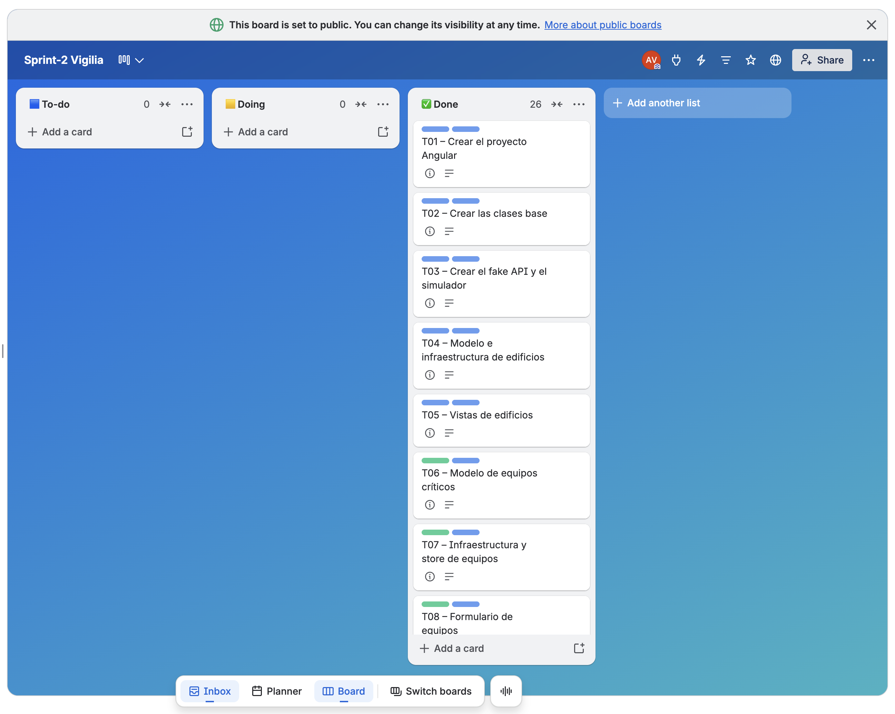

URL del tablero: https://trello.com/invite/b/6ac7f0abcc1877f39fe043f8/ATTIe3299734d72fea4237c83c32e6afbfc704FF511C/sprint-2-vigilia

| Sprint # | Sprint 2 | | | | | | |
|:---|:---|:---|:---|:---|:---|:---|:---|
| **User Story** | | **Work-Item / Task** | | | | | |
| Story Id | Story Title | Task Id | Task Title | Task Description | Estimation (Hours) | Assigned To | Status |
| — | Configuración transversal | T01 | Crear el proyecto Angular | Crear el proyecto con Angular 22, Angular Material y ngx-translate (en y es). Agregar el layout, el selector de idioma, Home y la vista 404. | 4 | Valladolid Jiménez, Arturo Fernando | Done |
| — | Configuración transversal | T02 | Crear las clases base | Implementar `BaseEntity`, `BaseAssembler`, `BaseApiEndpoint`, `BaseApi` y `BaseForm` en `shared`. | 3 | Valladolid Jiménez, Arturo Fernando | Done |
| — | Configuración transversal | T03 | Crear el fake API y el simulador | Crear `db.json` y `routes.json` para json-server con la base `/api/v1`, y el simulador que envía lecturas cada 10 segundos. | 3 | Valladolid Jiménez, Arturo Fernando | Done |
| US07 | Registro de un edificio y sus datos generales | T04 | Modelo e infraestructura de edificios | Crear la entidad `Building`, su assembler, su endpoint y `AssetMonitoringStore`. | 3 | Valladolid Jiménez, Arturo Fernando | Done |
| US07 | Registro de un edificio y sus datos generales | T05 | Vistas de edificios | Crear la lista con tabla, orden y paginación, y el formulario para registrar y editar edificios. | 4 | Valladolid Jiménez, Arturo Fernando | Done |
| US08 | Registro de equipos críticos del edificio | T06 | Modelo de equipos críticos | Crear `CriticalEquipment` y los enums `EquipmentType` y `EquipmentStatus`. | 2 | Romero Veliz, Matthias Alonso | Done |
| US08 | Registro de equipos críticos del edificio | T07 | Infraestructura y store de equipos | Crear el assembler y el endpoint de equipos, y agregar sus métodos a `AssetMonitoringApi` y `AssetMonitoringStore`. | 4 | Romero Veliz, Matthias Alonso | Done |
| US08 | Registro de equipos críticos del edificio | T08 | Formulario de equipos | Crear el formulario con edificio, tipo, ubicación, fecha de instalación (datepicker) y estado. | 4 | Romero Veliz, Matthias Alonso | Done |
| US11 | Consulta del listado de equipos por edificio | T09 | Lista de equipos | Crear la tabla de equipos con filtro por edificio. | 3 | Romero Veliz, Matthias Alonso | Done |
| US09 | Edición o baja de un equipo registrado | T10 | Editar y dar de baja | Reusar el formulario para editar y agregar `decommission()`, que cambia el estado a DECOMMISSIONED sin borrar el equipo. | 2 | Romero Veliz, Matthias Alonso | Done |
| US19 | Visualización de alertas activas en el dashboard | T11 | Modelo e infraestructura de alertas | Crear `Alert`, `AlertSeverity`, `AlertStatus`, su assembler y su endpoint. | 3 | Valladolid Jiménez, Arturo Fernando | Done |
| US19 | Visualización de alertas activas en el dashboard | T12 | Alertas activas ordenadas | Agregar al store el computed `activeAlerts`, ordenado de mayor a menor severidad. | 2 | Valladolid Jiménez, Arturo Fernando | Done |
| US19 | Visualización de alertas activas en el dashboard | T13 | Vista de alertas | Crear tarjetas con el conteo por severidad y una tabla con un color por nivel. Enlazar Home con esta vista. | 4 | Valladolid Jiménez, Arturo Fernando | Done |
| US20 | Cambio de estado de una alerta | T14 | Cambiar estado de alertas | Agregar los botones "En gestión" y "Resolver", y el método `changeAlertStatus` del store. | 2 | Valladolid Jiménez, Arturo Fernando | Done |
| US10 | Asociación de sensores a un equipo específico | T15 | Modelo e infraestructura de sensores | Crear `Sensor` con `assignTo()` y `unassign()`, su assembler y su endpoint. Un sensor solo puede tener un equipo activo. | 3 | Diaz Vargas, Fernanda Ysabella | Done |
| US10 | Asociación de sensores a un equipo específico | T16 | Vistas de sensores | Crear la lista de sensores y el formulario para asignar un sensor a un equipo. | 4 | Diaz Vargas, Fernanda Ysabella | Done |
| US14 | Consulta del historial de lecturas de un equipo | T17 | Infraestructura de lecturas | Crear `SensorReading`, su assembler y su endpoint. | 2 | Diaz Vargas, Fernanda Ysabella | Done |
| US14 | Consulta del historial de lecturas de un equipo | T18 | Vista de historial de lecturas | Crear la vista con selector de equipo y rango de fechas. Mostrar "No hay lecturas registradas en este periodo" si no hay datos. | 4 | Diaz Vargas, Fernanda Ysabella | Done |
| US23 | Reporte de incidente por parte del residente | T19 | Modelo de incidentes | Crear el bounded context Incidents con `Incident`, `IncidentStatus` e `IncidentCategory`. | 2 | Salazar Miranda, Mateo Paolo | Done |
| US23 | Reporte de incidente por parte del residente | T20 | Infraestructura y store de incidentes | Crear `IncidentsApi`, su endpoint, su assembler e `IncidentsStore`. | 3 | Salazar Miranda, Mateo Paolo | Done |
| US23 | Reporte de incidente por parte del residente | T21 | Formulario de reporte | Crear el formulario con edificio, equipo opcional, categoría y descripción. | 3 | Salazar Miranda, Mateo Paolo | Done |
| US25 | Seguimiento del estado de un incidente reportado | T22 | Lista de incidentes | Crear la tabla de incidentes con los botones "Iniciar gestión" y "Resolver" según el estado. | 3 | Salazar Miranda, Mateo Paolo | Done |
| US27 | Calificación del incidente resuelto | T23 | Calificación del incidente | Crear el formulario de calificación de 1 a 5. Solo se califica una vez y solo si el incidente está resuelto. | 3 | Salazar Miranda, Mateo Paolo | Done |
| — | Landing Page | T24 | Nueva versión del Landing Page | Actualizar el contenido y hacer que los botones de llamado a la acción lleven a la Web Application. | 4 | Salazar Miranda, Mateo Paolo | Done |
| — | Despliegue | T25 | Desplegar el fake API | Crear el Web Service en Render con la carpeta `server`. | 2 | Valladolid Jiménez, Arturo Fernando | Done |
| — | Despliegue | T26 | Desplegar la Web Application | Conectar el repositorio a Vercel y configurar `environment.ts` con la URL del fake API. | 2 | Valladolid Jiménez, Arturo Fernando | Done |

#### 5.2.2.4. Development Evidence for Sprint Review

En este sprint creamos el repositorio `Frontend` y trabajamos con GitFlow. La base del proyecto se hizo en `develop` y salió a `main` como versión 0.1.0. Desde ahí, cada aspecto tuvo su rama `feature` y entró a `develop` con un Pull Request. La tabla muestra los commits de implementación de cada repositorio.

| Repository | Branch | Commit Id | Commit Message | Commit Message Body | Committed on (Date) |
|:---|:---|:---|:---|:---|:---|
| code-nova-1asi0729/Frontend | develop | ecef535 | chore: initialize Angular 22 project | — | 07/10/2026 |
| code-nova-1asi0729/Frontend | develop | 79cab77 | build(deps): add Angular Material | — | 07/10/2026 |
| code-nova-1asi0729/Frontend | develop | 2149a70 | build(deps): add ngx-translate and json-server | — | 07/10/2026 |
| code-nova-1asi0729/Frontend | develop | 794ff3e | feat(shared): add base entity, assembler and api endpoint classes | — | 07/10/2026 |
| code-nova-1asi0729/Frontend | develop | 70c9d07 | feat(shared): add layout, language switcher, home and page not found views | — | 07/10/2026 |
| code-nova-1asi0729/Frontend | develop | 268cf6c | feat(server): add fake API seed data and sensor simulator | — | 07/10/2026 |
| code-nova-1asi0729/Frontend | develop | 6380b49 | feat(asset-monitoring): add buildings list and form | — | 07/10/2026 |
| code-nova-1asi0729/Frontend | develop | 0870228 | build: add Vercel configuration | — | 07/10/2026 |
| code-nova-1asi0729/Frontend | develop | bfa9982 | docs: add README, frontend class diagrams and sprint 2 tasks | — | 07/10/2026 |
| code-nova-1asi0729/Frontend | main | 3359c43 | Merge pull request #1 from code-nova-1asi0729/develop | Release 0.1.0: project base and buildings | 07/10/2026 |
| code-nova-1asi0729/Frontend | feature/asset-monitoring-equipment | d801f2f | add critical equipment domain, infrastructure and store | — | 08/10/2026 |
| code-nova-1asi0729/Frontend | feature/asset-monitoring-equipment | 64f5787 | feat(asset-monitoring): add equipment list and form views | — | 08/10/2026 |
| code-nova-1asi0729/Frontend | develop | e300cee | Merge pull request #3 from code-nova-1asi0729/feature/asset-monitoring-equipment | feat(asset-monitoring): add equipment list and form views | 08/10/2026 |
| code-nova-1asi0729/Frontend | feature/asset-monitoring-alerts | 19b0fef | feat(asset-monitoring): add alert domain, infrastructure and store | — | 08/10/2026 |
| code-nova-1asi0729/Frontend | feature/asset-monitoring-alerts | 6bddb8c | feat(asset-monitoring): add active alerts dashboard view | — | 08/10/2026 |
| code-nova-1asi0729/Frontend | feature/asset-monitoring-alerts | 124ce46 | feat(shared): link home button to the alerts dashboard | — | 08/10/2026 |
| code-nova-1asi0729/Frontend | feature/asset-monitoring-alerts | c60a37f | style(asset-monitoring): let the alerts table scroll on small screens | — | 08/10/2026 |
| code-nova-1asi0729/Frontend | develop | cf8356d | Merge pull request #4 from code-nova-1asi0729/feature/asset-monitoring-alerts | — | 08/10/2026 |
| code-nova-1asi0729/Frontend | feature/asset-monitoring-sensors | ff2b051 | feat(asset-monitoring): add sensor and reading domain, infrastructure and store | — | 08/10/2026 |
| code-nova-1asi0729/Frontend | feature/asset-monitoring-sensors | ddd413e | feat(asset-monitoring): add sensor list and assign form views | — | 08/10/2026 |
| code-nova-1asi0729/Frontend | feature/asset-monitoring-sensors | 652179a | feat(asset-monitoring): add reading history view | — | 08/10/2026 |
| code-nova-1asi0729/Frontend | feature/asset-monitoring-sensors | d76ede2 | fix(server): keep the sensor simulator running while json-server reloads | — | 08/10/2026 |
| code-nova-1asi0729/Frontend | feature/asset-monitoring-sensors | cbf6f19 | style(asset-monitoring): keep sensor serial numbers on one line | — | 08/10/2026 |
| code-nova-1asi0729/Frontend | develop | e949b10 | Merge pull request #5 from code-nova-1asi0729/feature/asset-monitoring-sensors | — | 08/10/2026 |
| code-nova-1asi0729/Frontend | feature/incidents | 4d96e2f | feat(incidents): add incident domain and infrastructure | — | 08/10/2026 |
| code-nova-1asi0729/Frontend | feature/incidents | 4d927ec | feat(incidents): add incidents store | — | 08/10/2026 |
| code-nova-1asi0729/Frontend | feature/incidents | d9a4cb5 | feat(incidents): add incident list, report and rating views | — | 08/10/2026 |
| code-nova-1asi0729/Frontend | develop | c0a76cc | Merge pull request #6 from code-nova-1asi0729/feature/incidents | — | 08/10/2026 |
| code-nova-1asi0729/Frontend | main | e675ddb | Merge pull request #7 from code-nova-1asi0729/develop | release: sprint 2 frontend | 08/10/2026 |
| code-nova-1asi0729/landing-page | main | c05402a | Add files via upload | Actualiza el contenido del Landing Page. | 01/10/2026 |
| code-nova-1asi0729/landing-page | develop | 12efd2f | feat(landing): link the landing page to the web app and remove request a demo | — | 08/10/2026 |
| code-nova-1asi0729/landing-page | main | 73ca6fe | Merge pull request #1 from code-nova-1asi0729/develop | — | 08/10/2026 |

#### 5.2.2.5. Execution Evidence for Sprint Review

Al cierre del sprint la Web Application tiene siete opciones en el menú: Home, Buildings, Equipment, Alerts, Sensors, Readings e Incidents. Todas las vistas están en inglés por defecto y en español con el selector de idioma. Las capturas usan los datos de prueba del fake API.

En Home el administrador entra directo a sus alertas.

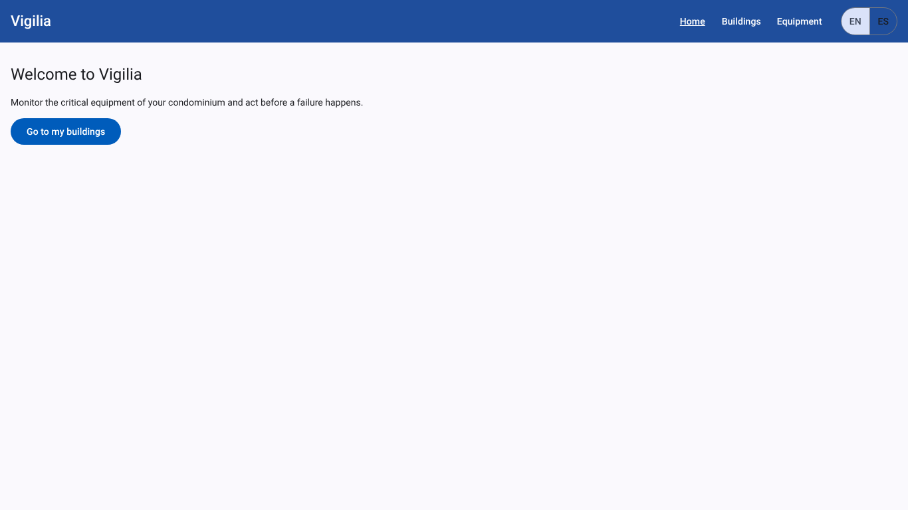

En Buildings el administrador lista, registra y edita sus edificios (US07).

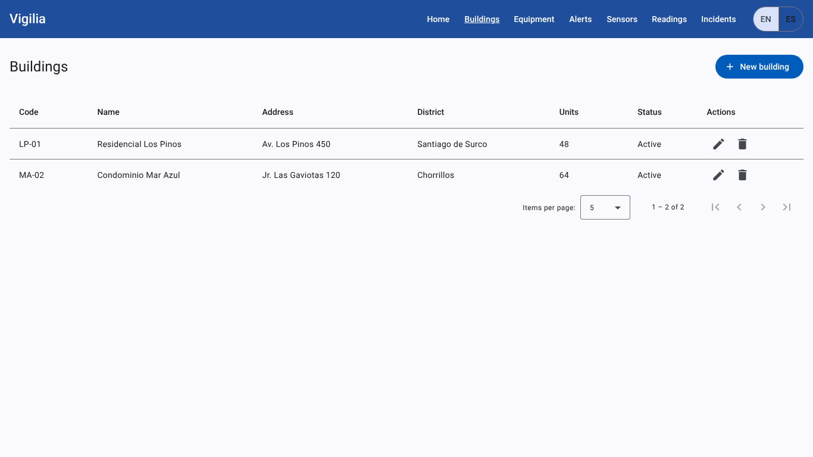

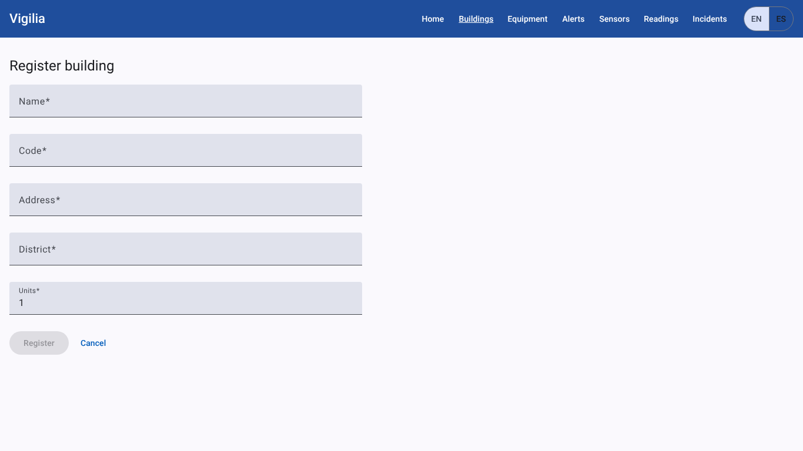

En Equipment ve los equipos críticos y los filtra por edificio (US11). Desde la misma tabla edita un equipo o lo da de baja (US08 y US09). El estado se muestra con un color: verde si está operativo y ámbar si requiere seguimiento.

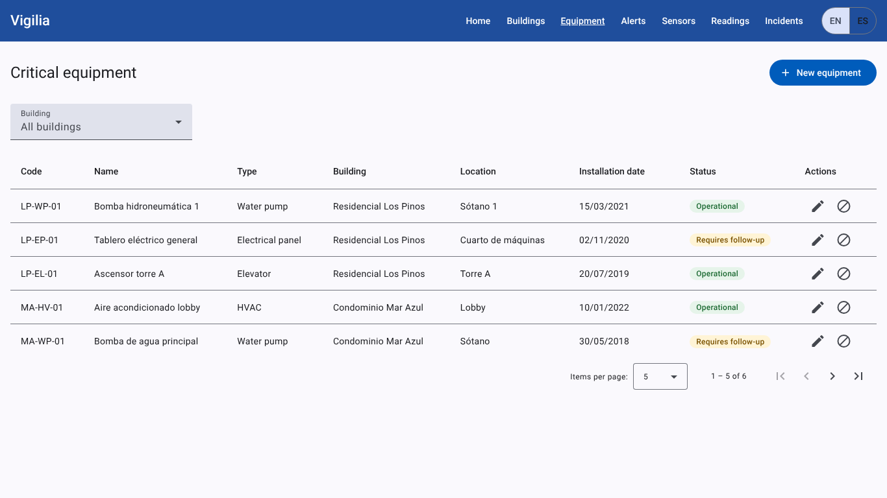

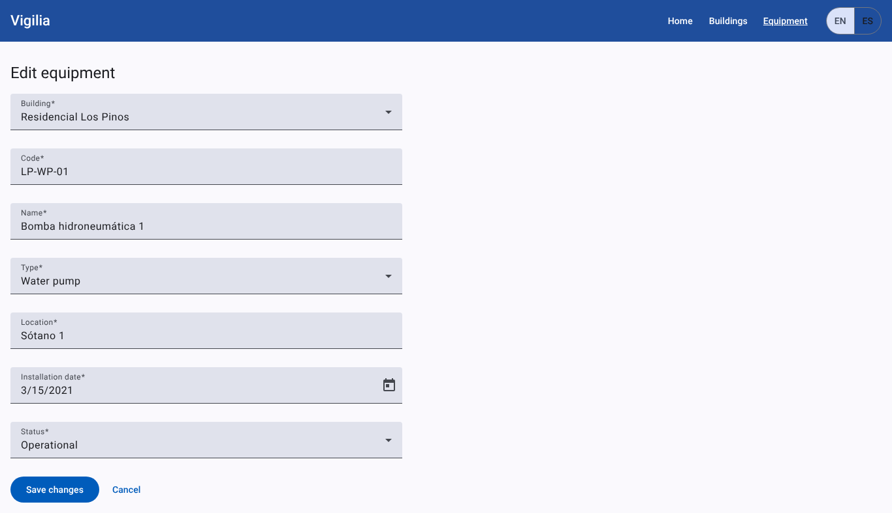

La misma vista con el idioma en español:

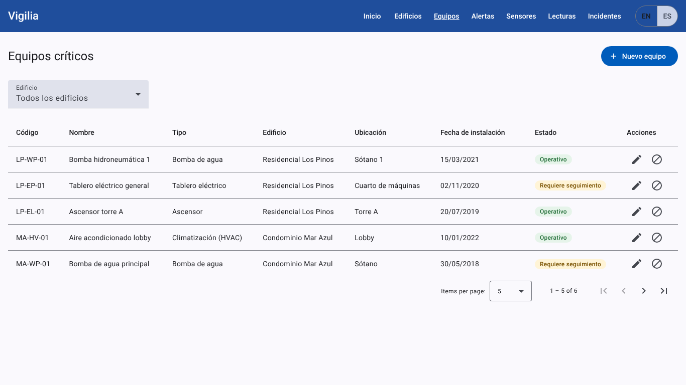

En Alerts el administrador ve cuántas alertas activas hay por severidad y una tabla ordenada de la más grave a la menos grave (US19). Desde la tabla marca una alerta como "In progress" (en gestión) o la resuelve (US20). Un interruptor muestra también las alertas resueltas.

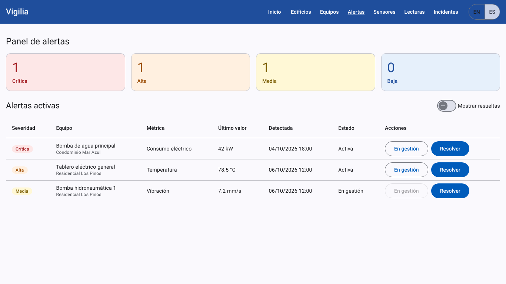

En Sensors el administrador asigna un sensor libre a un equipo (US10). Un sensor que ya tiene equipo no se puede asignar a otro.

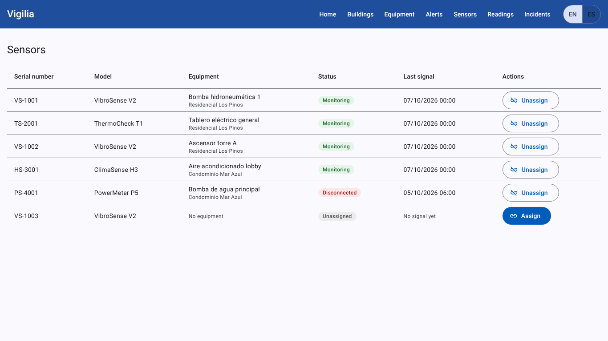

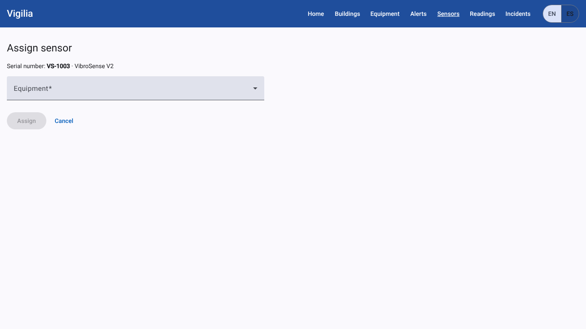

En Readings elige un equipo y un rango de fechas, y ve sus lecturas de la más reciente a la más antigua (US14). Con el simulador encendido, el botón "Actualizar" trae las lecturas nuevas.

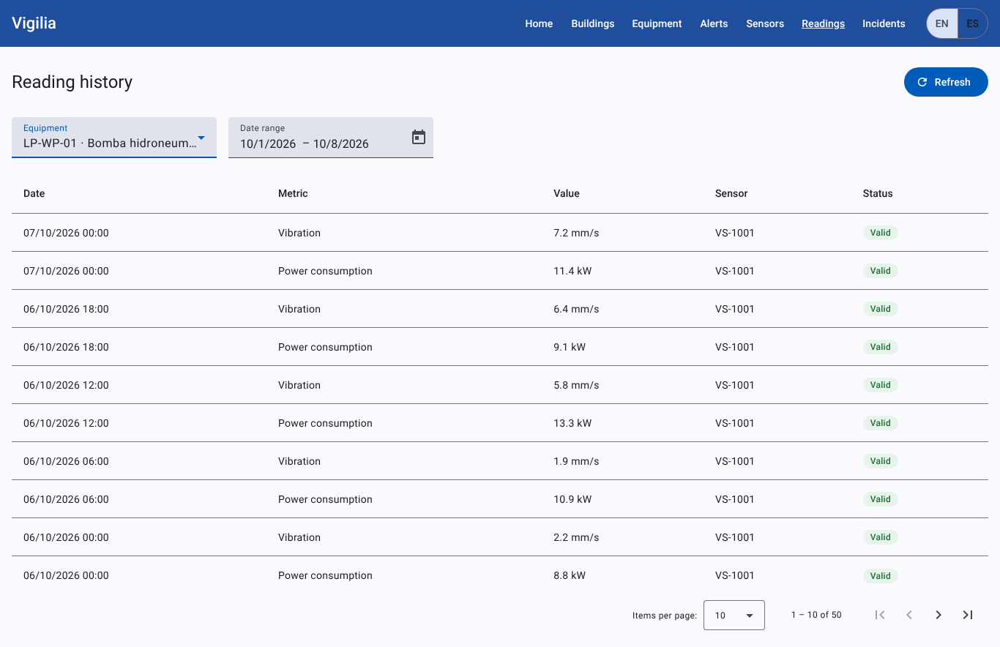

En Incidents el residente reporta un incidente (US23). La administración cambia su estado de "Received" a "In progress" y luego a "Resolved" (US25). Mientras no hay IAM, el formulario usa un residente de prueba fijo. Cuando está resuelto, el residente lo califica de 1 a 5 (US27).

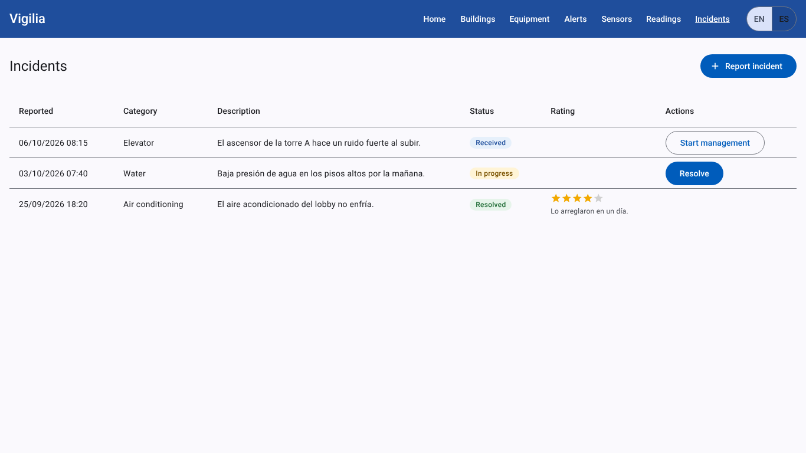

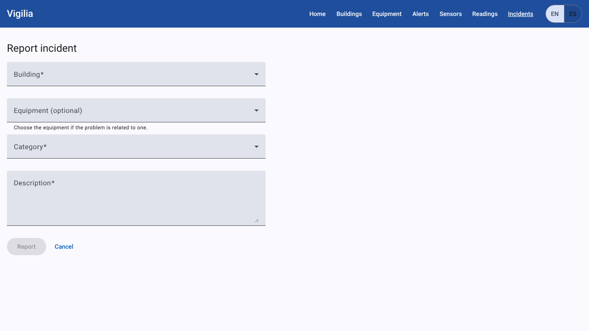

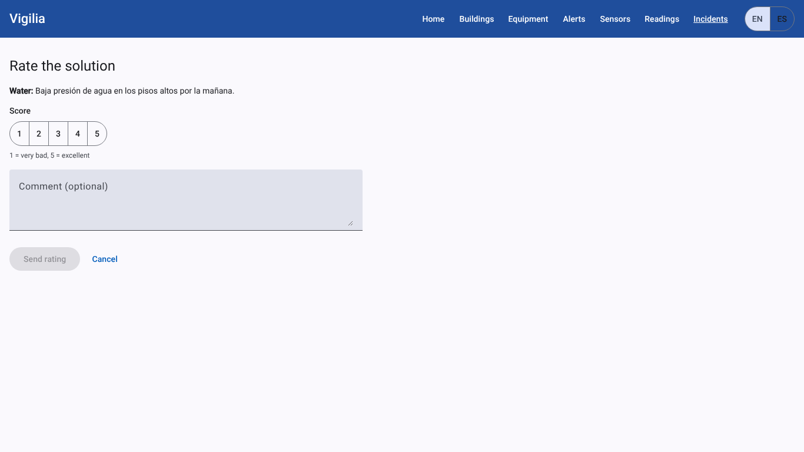

Si el usuario escribe una ruta que no existe, la aplicación muestra la vista 404 con un enlace a Home.

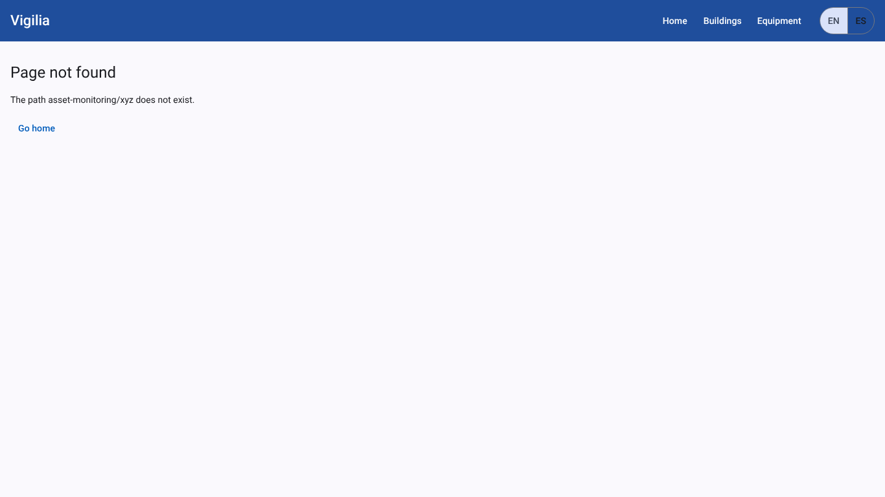

#### 5.2.2.6. Services Documentation Evidence for Sprint Review

En este sprint todavía no hay RESTful API, así que no hay documentación OpenAPI. Lo que sí documentamos son los endpoints del fake API que consume la Web Application. Son los mismos recursos, verbos y nombres de campos que tendrá el RESTful API en el Sprint 3 (sección 4.6.4). Así el cambio al API real solo afecta la URL base.

El fake API usa json-server 0.17.4. La regla de `routes.json` (`"/api/v1/*": "/$1"`) expone todos los recursos bajo `/api/v1`. Está desplegado en <https://vigilia-fake-api.onrender.com/api/v1> y en local corre en <http://localhost:3000/api/v1>. El código está en la carpeta `server` del repositorio [Frontend](https://github.com/code-nova-1asi0729/Frontend) (commit `268cf6c`).

| Endpoint | Acción | Verbo HTTP | Sintaxis de llamada | Parámetros | Ejemplo de response |
|:---|:---|:---:|:---|:---|:---|
| Buildings | Listar edificios | GET | `/api/v1/buildings` | — | `[{"id":1,"name":"Residencial Los Pinos","code":"LP-01","district":"Santiago de Surco","totalUnits":48,"status":"ACTIVE"}]` |
| Buildings | Registrar un edificio | POST | `/api/v1/buildings` | Body: `name`, `code`, `address`, `district`, `totalUnits`, `status` | El edificio creado con su `id`. Código 201. |
| Buildings | Editar un edificio | PUT | `/api/v1/buildings/{id}` | `id` en la ruta. Body: el edificio completo | El edificio actualizado. Código 200. |
| Buildings | Eliminar un edificio | DELETE | `/api/v1/buildings/{id}` | `id` en la ruta | `{}`. Código 200. |
| Equipment | Listar equipos | GET | `/api/v1/equipment` | Opcional: `buildingId` | `[{"id":1,"buildingId":1,"code":"LP-WP-01","type":"WATER_PUMP","installationDate":"2021-03-15","status":"OPERATIONAL"}]` |
| Equipment | Registrar un equipo | POST | `/api/v1/equipment` | Body: `buildingId`, `code`, `name`, `type`, `location`, `installationDate` (`yyyy-MM-dd`), `status` | El equipo creado con su `id`. Código 201. |
| Equipment | Editar o dar de baja un equipo | PUT | `/api/v1/equipment/{id}` | `id` en la ruta. Para dar de baja se envía `status: DECOMMISSIONED` | El equipo actualizado. Código 200. |
| Sensors | Listar sensores | GET | `/api/v1/sensors` | Opcional: `status`, `equipmentId` | `[{"id":1,"equipmentId":1,"serialNumber":"VS-1001","status":"MONITORING_ACTIVE","lastSeenAt":"2026-10-07T00:00:00Z"}]` |
| Sensors | Asignar o desasignar un sensor | PUT | `/api/v1/sensors/{id}` | `id` en la ruta. Body con `equipmentId` (o `null`) y `status` | El sensor actualizado. Código 200. |
| Sensor Readings | Listar lecturas | GET | `/api/v1/sensor-readings` | Opcional: `equipmentId`, `_sort`, `_order`, `_limit` | `[{"id":1,"sensorId":1,"equipmentId":1,"metric":"VIBRATION","value":2.3,"unit":"mm/s","recordedAt":"2026-09-30T06:00:00Z"}]` |
| Sensor Readings | Registrar una lectura (simulador) | POST | `/api/v1/sensor-readings` | Body: `sensorId`, `equipmentId`, `metric`, `value`, `unit`, `status`, `recordedAt` | La lectura creada con su `id`. Código 201. |
| Alerts | Listar alertas | GET | `/api/v1/alerts` | Opcional: `status`, `equipmentId` | `[{"id":1,"equipmentId":2,"metric":"TEMPERATURE","severity":"HIGH","status":"ACTIVE","lastValue":78.5}]` |
| Alerts | Cambiar el estado de una alerta | PUT | `/api/v1/alerts/{id}` | `id` en la ruta. Body con `status`: ACKNOWLEDGED o RESOLVED | La alerta actualizada. Código 200. |
| Incidents | Listar incidentes | GET | `/api/v1/incidents` | Opcional: `buildingId`, `residentId`, `status` | `[{"id":1,"buildingId":1,"residentId":3,"category":"ELEVATOR","status":"REPORTED","ratingScore":null}]` |
| Incidents | Reportar un incidente | POST | `/api/v1/incidents` | Body: `buildingId`, `residentId`, `equipmentId` (opcional), `category`, `description` | El incidente creado con estado REPORTED. Código 201. |
| Incidents | Cambiar estado o calificar | PUT | `/api/v1/incidents/{id}` | `id` en la ruta. Body con `status`, fechas del cambio y, al calificar, `ratingScore` y `ratingComment` | El incidente actualizado. Código 200. |

Estas capturas muestran respuestas del fake API con los datos de prueba.

`GET /api/v1/buildings` devuelve los dos edificios de prueba:

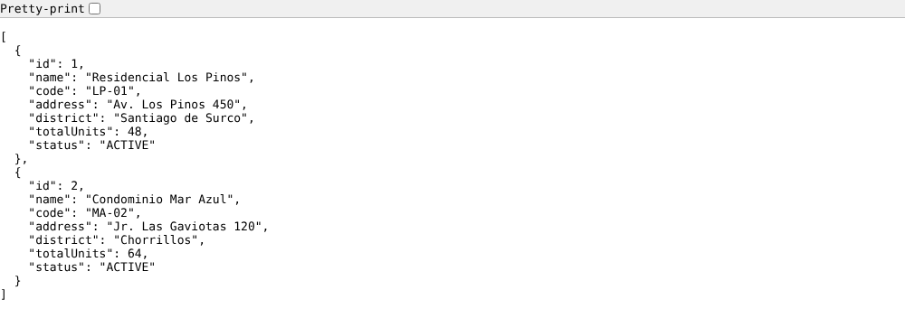

`GET /api/v1/equipment?buildingId=1` devuelve solo los equipos del edificio 1. Es el filtro que usa la lista de equipos:

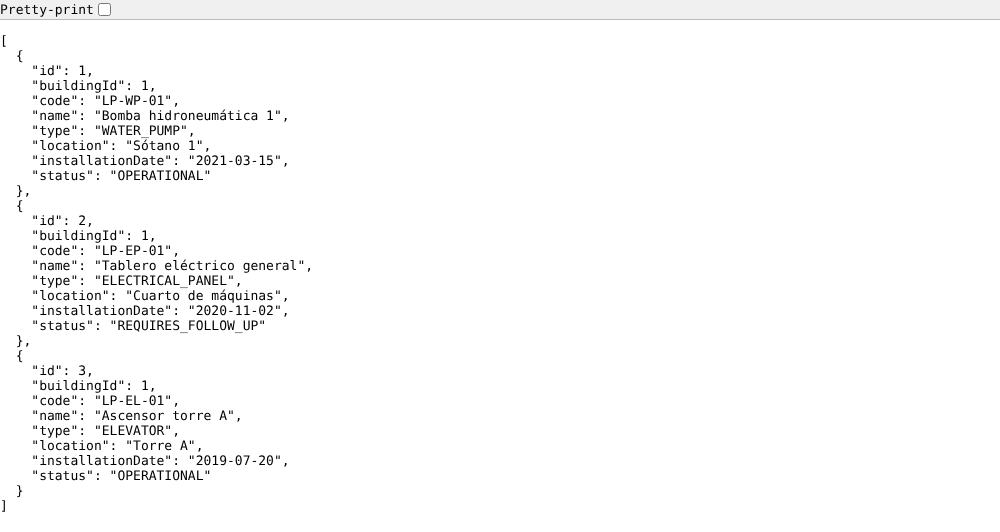

`GET /api/v1/alerts?status=ACTIVE` devuelve solo las alertas activas:

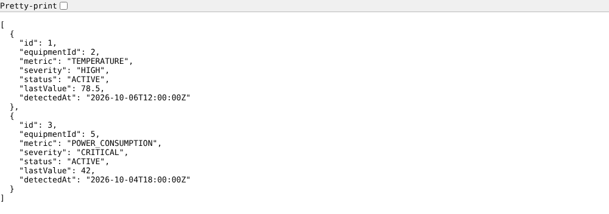

`GET /api/v1/sensor-readings?equipmentId=1&_sort=recordedAt&_order=desc&_limit=3` devuelve las tres lecturas más recientes de un equipo:

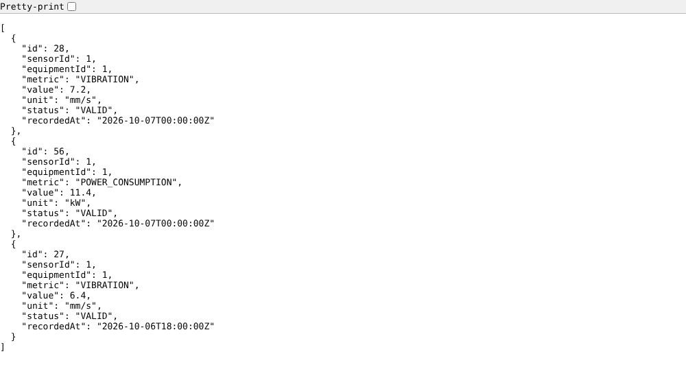

#### 5.2.2.7. Software Deployment Evidence for Sprint Review

En este sprint desplegamos tres cosas: el fake API, la Web Application y la nueva versión del Landing Page.

**Fake API en Render.**

1. Crear una cuenta en Render con GitHub.
2. Crear un *Web Service* conectado al repositorio `Frontend`.
3. Configurar `server` como *Root Directory*, `npm install` como *Build Command* y `npm start` como *Start Command*.
4. Elegir el plan gratuito y desplegar.
5. Probar `https://vigilia-fake-api.onrender.com/api/v1/buildings` en el navegador.

El plan gratuito apaga el servicio cuando no recibe tráfico. La primera solicitud después de un rato tarda unos segundos en responder.

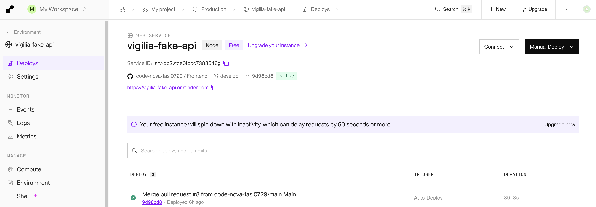

**Web Application en Vercel.**

1. Crear una cuenta en Vercel con GitHub.
2. Importar el repositorio `Frontend`. Vercel reconoce el proyecto Angular y usa `ng build`.
3. Elegir `main` como rama de producción.
4. Agregar `vercel.json`, que redirige todas las rutas a `index.html`. Sin este archivo, recargar una ruta como `/asset-monitoring/equipment` da error 404.
5. Hacer el merge de `develop` a `main`. Vercel compila y publica la aplicación.

URL de la Web Application: <https://vigilia-frontend.vercel.app/>

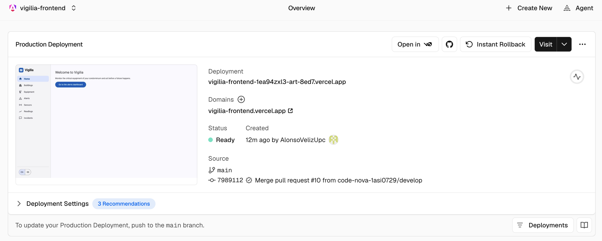

**Landing Page en GitHub Pages.** La nueva versión se publicó con la misma configuración del Sprint 1 (sección 5.2.1.7). Ahora los botones "Go to app" y "Get started" llevan a la Web Application. También quitamos el modal de "Request a demo": quien quiera hablar con el equipo usa el formulario de contacto, que cubre US49.

URL del Landing Page: <https://code-nova-1asi0729.github.io/landing-page/>

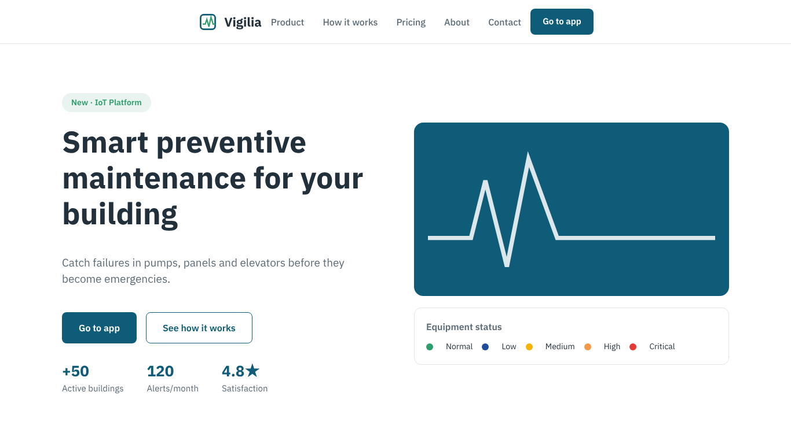

#### 5.2.2.8. Team Collaboration Insights during Sprint

Este sprint fue el primero con GitFlow en todos los repositorios. Arturo creó la base del proyecto (clases base, layout, i18n, fake API y la vista de edificios) para que sirviera de ejemplo. También dejó en el repositorio una guía de tareas (`docs/sprint-2-tasks.md`) con los diagramas de clases de cada parte.

La parte más difícil fue que varias tareas tocaban los mismos archivos: el store, el API y las rutas de Asset Monitoring, el menú y los archivos de traducción. Para evitar conflictos acordamos un orden de merge. Primero entró el modelo de equipos, porque las alertas y los sensores lo usan. Antes de abrir cada Pull Request, cada uno actualizaba su rama con `develop` y revisaba que `npm run build` terminara sin errores.

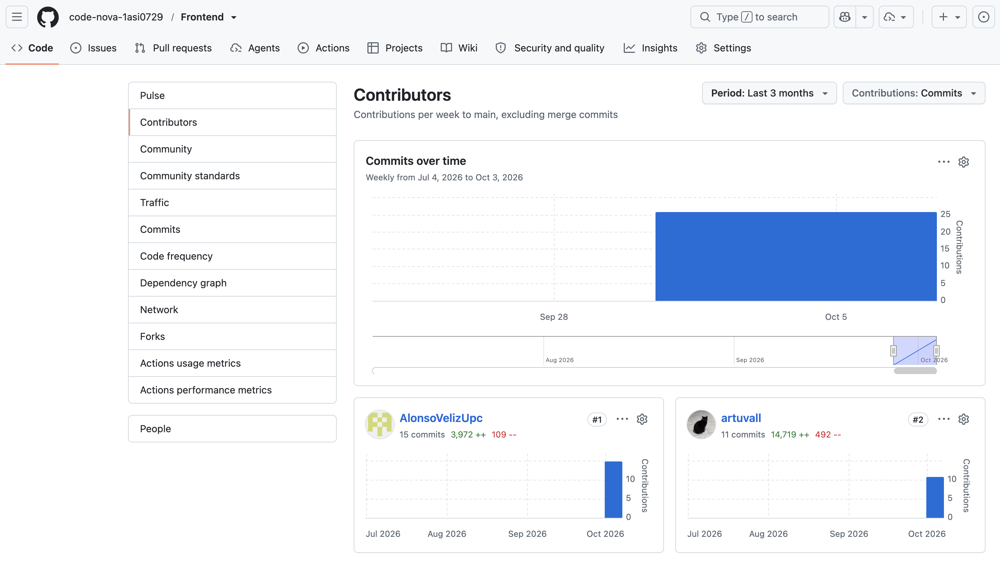

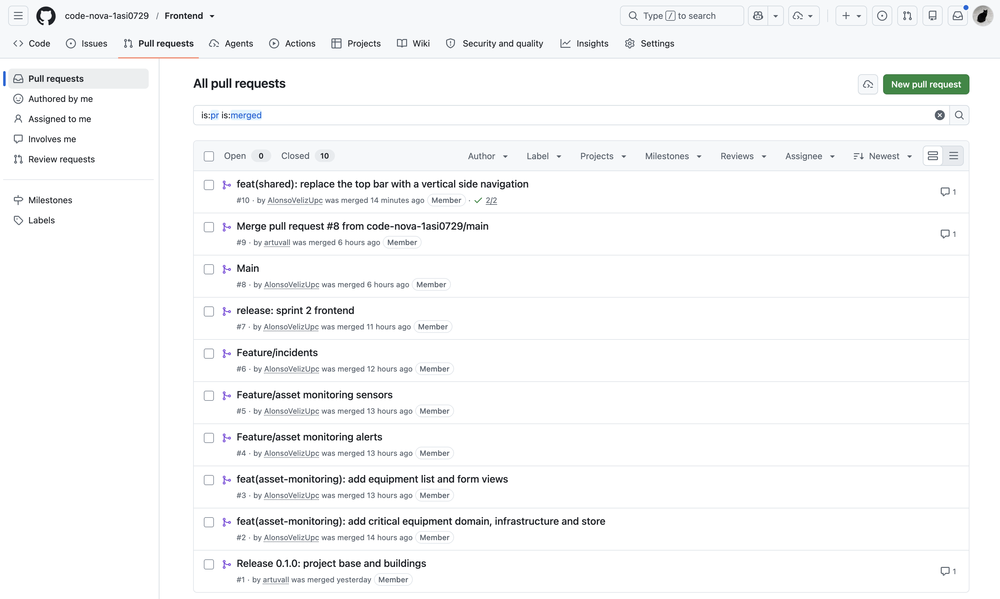
